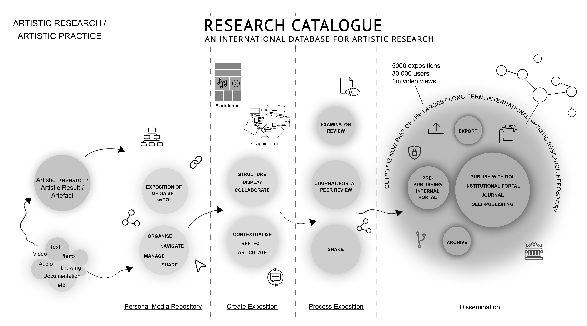

# About this guide

This is the extended guide. It tries to be as complete as possible manual for
all features of the RC. If you just want to get started quickly with creating an
exposition, be sure to check the [quick start
guide](https://www.researchcatalogue.net/RC%20Quick%20Start%20Guide.pdf "quick
start pdf") or the [video
tutorials](https://www.researchcatalogue.net/view/273532/1685164 "video
tutorials") first.

# About the Research Catalogue

The Research Catalogue (RC) is a non-commercial, collaboration and publishing
platform for artistic research provided by the <a
href="https://societyforartisticresearch.org" title="SAR website"
target="_blank">Society for Artistic Research</a>. The RC is free to use and
access for artists and researchers. It serves also as a backbone for teaching
purposes, student assessment, peer review workflows and research funding
administration. It strives to be an open space for experimentation and exchange. 

Research Catalogue (RC) content presented through some of our portals is peer
reviewed, while the remaining expositions and other information are quality
controlled by the individual author(s) themselves. As a result, the RC is highly
inclusive. 

The open access and open source spirit of the RC is essential to its nature and
serves its function as a connective and transitional layer between academic
discourse and artistic practice, thereby constituting a discursive field for
artistic research.

The Research Catalogue is provided by the [Society for Artistic
Research (SAR)](https://www.societyforartisticresearch.org "Society for Artistic Research").

## What is the RC used for?

Research Catalogue can be used for creating research documentation, editing
articles, reports, collaborative writing, thesis/dissertation works, peer
reviewed journal publications and class logbooks. 

It can also be used to present research data in a human friendly layout.

<figure>
<a href="images/rc-workflow.jpg">

<figcaption aria-hidden="true">RC functionality overview</figcaption>
</a>
</figure>

<!-- ## Why Use RC ?

The RC creates a link between:

1. elaborated documentation of artistic work,
2. expositions and comments that engage with the contribution of the work as research
3. creation of individual profiles that present the researchers work.

It is believed that the reflective space provided by the RC
constitutes an essential part of the research process by providing a
suitable structure in which to develop the relationship between
documentation and presentation, whilst also retaining congruence with
art itself. -->

## What is an RC Exposition?

Unlike traditional research repositories, which present data as PDF documents or
folders of files, the RC employs a unique format: a free form,
flexible and media-friendly webpage, called an *exposition*.

This format is particularly well-suited for merging different forms of media and
text into a single highly customizable presentation. The flexibility in
structure accommodates the diverse, context-specific needs of organizing
materials produced in artistic research. 

If you want to know more this may be a good starting point:  
[Expositionality in Action (Michael Schwab 2024)](https://www.researchcatalogue.net/view/1024139/1029718)

## Connection Between RC and JAR

The RC forms the technical backbone of the Journal for Artistic
Research (JAR): potential JAR expositions emerge from the range of the
artistic research activities taking place in the RC. Moreover,
submissions and peer-reviewing for JAR takes place in the RC. Expositions published in JAR are either nominated by authors, or directly selected by JAR editorial board.

# Setting up a New Account

When you register an account in the RC, you will first just have a __basic account__. This will allow you to be a supervisor, review expositions, and leave comments. Some application calls may also accept limited user accounts to submit forms. 

Limited accounts do not have the option to create expositions or publish work. Due to copyright laws, if you are interested in making your content public in the Research Catalogue, you need to register as author by upgrading your limited account to a full account. 

Important: if you are a student or staff member of an institution
that has a portal within the RC, you should contact your <a
href="https://www.researchcatalogue.net/view/1369076/1369075">local portal admin</a> for receiving the full account.

## Upgrading to full account

If you have a limited account (this includes all SARA subscribers):
 you can upgrade it via [the upgrade page](https://www.researchcatalogue.net/portal/upgrade).

The account upgrade is free of charge. You can upgrade your limited account by logging in, and clicking "request
upgrade", where you will be instructed to send in a proof of identity to
support@researchcatalogue.net. Please read about "safe upgrade" below, to make sure
you send this information safely.

| **Limited account**           | **Full Account**         |
|-------------------------------|--------------------------|
| comment                       | comment                  |
| review                        | review                   |
| create applications (not all) | create applications      |
|                               | create expositions       |
|                               | use the media repository |
|                               | collaborate              |

## Safe Upgrade 

[support@researchcatalogue.net](mailto:support@researchcatalogue.net "mail user support") supports OpenPGP email signing to prevent
sensitive information from going lost. If you have never used OpenPGP, by far,
the easiest way is to use Mozilla's Thunderbird application, which has OpenPGP
built-in, is free and well documented.

You may find this resource by Mozilla useful:
[Mozilla Help: I have never used OpenPGP before](https://support.mozilla.org/en-US/kb/openpgp-thunderbird-howto-and-faq#w_i-have-never-used-openpgp-with-thunderbird-before-how-do-i-setup-openpgp)

## Institutional Portals, Journals and Project Portals

It is possible for institutions to open their own Institutional Portal in the Research Catalogue. 
Having a portal will allow institutions to:

- Publish research to a highly relavant audience (there are 30000 registered users in the RC, all specific to the Artistic Research field).
- Use the RC to manage, edit, review and publish a rich media online journal.
- Use RC as a teaching platform for students.
- Organize researchers in portal subgroups, for easy collaboration of a small group of authors.
- Publish and share research resources interally to only the users connected to the portal.
- Use the RC as a closed archive.
- Be listed as an official portal partner in the institutional portal page.

There is also an option for a more temporary __project portal__, this has similar functionality to a normal portal, but is assumed to only be active for a limited amount of time.

For more information, please contact Society for Artistic Research (SAR).

More on portals and portal administration can be found in the [admin section](#admin-section "portal administration") of this manual. 
