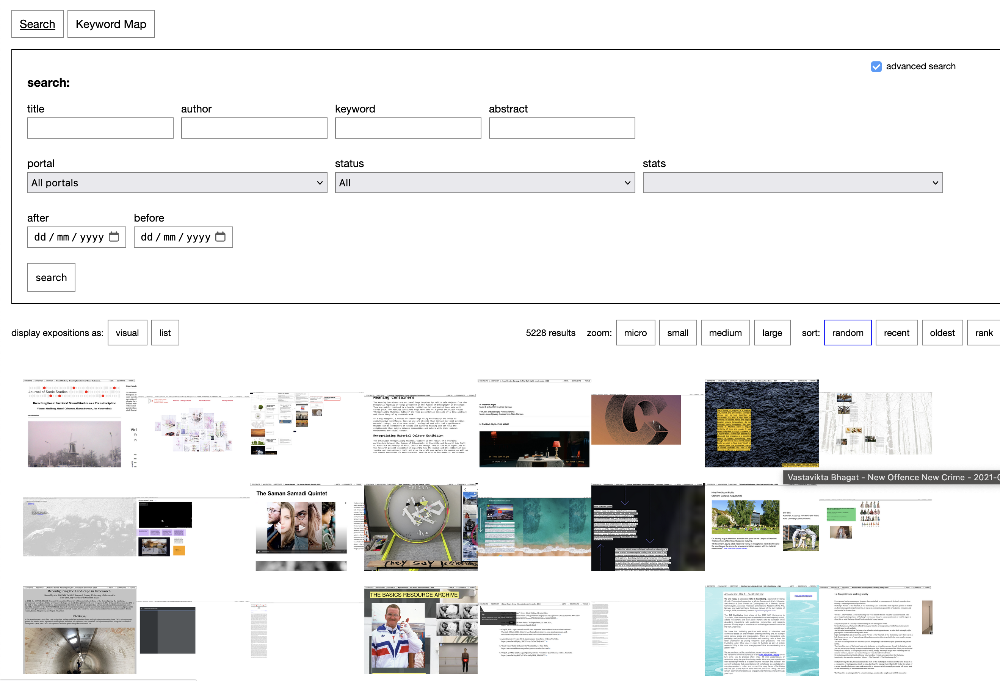
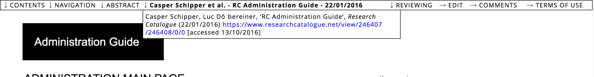

# Search and Discovery

This chapter discusses various ways of navigating the content of RC.

## Visual Search

This allows you to browse all expositions within RC, by making searches and
seeing a miniature of the exposition front page. Typing queries will immediately update results.
[https://map.rcdata.org](https://map.rcdata.org "a visual map of the RC"). You
can also browse by keywords and sort results by date or even topology.

## Search

You can search the RC by using the search field in the top right
corner. Moreover you can use the "advanced search" functionality,
which allows for filtered searches and searches according to
specific criteria such as object type, keywords, authors, etc.

## Researchers

You can find all researchers with public content of the RC here:
<https://www.researchcatalogue.net/portal/researchers?publicObjects=1>

## Journals

<https://www.researchcatalogue.net/portal/journals> All journals listed here are
open for submissions, but do visit their portal first to see specific
requirements/calls.

## Institutional Portals

<https://www.researchcatalogue.net/portal/institutions>

## Projects

These are for (time limited) Research Projects.

## Follow 

It is possible to "follow" other users, portals, and objects such as
expositions and works.  Once you are logged in you will see "follow"
links in the bottom right corner of objects displayed on the front
page, other user's pages and other places on the RC. "Follow" links
also appear on user and portal profile pages. Once you follow a user,
portal, or object new publications, edits, comments etc. will be
displayed on the "FEEDS" page. Clicking the wrench icon opens up a
dialog in which you can adjust the precise information you want to see
for each user, portal or object you follow.

<!-- TODO: Insert links to other parts of the documentation -->

# Navigation while reading expositions

## Navigation Bar

When one moves the mouse cursor to the top of an exposition, a menu bar
appears. 

  

The navigation bar contains, from left to right:

* __Content__\
This contains the table of contents and links to the authors. Please see the help section on [table of contents](#table-of-content).

* __Navigation__ (graphical expositions only)\
Navigation is a graphical map of all the exposition's
content on the current weave. You can click within it to jump to a location. 

* __Abstract__\
Abstract, this can be changed by clicking title in the editor or ☰ > __edit details__ on your profile.

* __Title / citation info__\
By moving the mouse pointer the title of
your research, a little window with citation info will appear. The link
(URL) of the current page is shown, including the current scrolling
location. This URL can thus be used to generate the [hyperlink](#hyperlinking) for
internal linking. You can also use this link to cite a specific
location within an exposition.

* __Meta__ 

Takes you to the metadata page, which shows the full set of metadata
related to the exposition: author(s), keywords, abstract, creation
date, publication date and copyright & licenses of all used media
files.

* __Reviewing__ (graphical expositions only)\
Reviewing is connected to the note tool (the yellow "post-it" notes)
and is intended for the communication between the author(s) and the
reviewer during the reviewing-process. This option is only available for expositions that have not been published yet. Notes can also be used for approving expositions in educational contexts.

 
There are a couple of functions available:
 
	- hide notes 			(hide all notes)
	- show open notes 		(show only notes that are open)
	- show resolved notes 	(show the resolved notes)
	- add new note 			(open a note tool)
	- previous note         (jump to previous note)
	- next note             (jump to next note)
	

### Comments

Shows the latest and previous comments on your exposition from the RC
community.

### Terms of Use

This displays the terms of as set by the Society for Artistic Research (SAR).

# Metadata in the RC

The RC supports the following metadata for expositions

<table>
    <tr>
        <th>Field</th>
        <th>Description</th>
        <th>Optional?</th>
    </tr>
    <tr>
        <td>Author and Co-author(s)</td>
        <td>Work may also be published under a pseudonym. But the original author(s) will always be listed as well.
            The order of authors can be decided by the owner role. There is no separation of first and last name.</td>
        <td>Required</td>
    </tr>
    <tr>
        <td>Title (may be provided in multiple EU languages)</td>
        <td>The title of the exposition</td>
        <td>Required</td>
    </tr>
    <tr>
        <td>Abstract (in multiple EU languages)</td>
        <td>A summary of its contents</td>
        <td>Required</td>
    </tr>
    <tr>
        <td>Copyright</td>
        <td>The copyright owner of the exposition as such 
         Note: individual media elements within an exposition may each have their own copyright and license.
            All of these can be found under copyrights on the META page</td>
        <td>Required</td>
    </tr>
    <tr>
        <td>License</td>
        <td>We provide "all rights reserved", the "creative commons" variants and "public domain" 
        More info under <a href="#licenses">licenses</a></td>
        <td>Required</td>
    </tr>
    <tr>
        <td>Language</td>
        <td>The primary language of the exposition as chosen by the author</td>
        <td>Optional</td>
    </tr>
    <tr>
        <td>Keywords</td>
        <td>An open vocabulary</td>
        <td>Optional</td>
    </tr>
    <!-- <tr>
        <td>Date</td>
        <td>An arbitrary date that may be associated with the exposition</td>
        <td>Optional</td>
    </tr> -->
    <tr>
        <td>Date of creation</td>
        <td>When the exposition was created</td>
        <td>Automatic</td>
    </tr>
    <tr>
        <td>Last modification</td>
        <td>When the exposition content was last changed</td>
        <td>Automatic</td>
    </tr>
    <tr>
        <td>Affiliation</td>
        <td>External link</td>
        <td>Optional</td>
    </tr>
    <tr>
        <td>Published in</td>
        <td>In which portal/project/journal the exposition was published</td>
        <td>Automatic (when exposition is published)</td>
    </tr>
    <tr>
        <td>Issue</td>
        <td>In which issue the publication was made</td>
        <td>Automatic (when exposition is published)</td>
    </tr>
    <tr>
        <td>Publication date</td>
        <td>The date of publication 
         The publication date will be equal to last change date, as a publication cannot be modified after publication.</td>
        <td>Automatic (when exposition is published)</td>
    </tr>
  <tr>
        <td>Connected to</td>
        <td>Only when an exposition was connected to a portal (requires portal admin confirmation)</td>
        <td>Optional</td>
    </tr>    
    <tr>
        <td>DOI</td>
        <td>Expositions that are published are registered at Crossref to receive a DOI. All DOI's in RC start with 10.22501.</td>
        <td>Automatic (when exposition is published)</td>
    </tr>
      <tr>
        <td>ORCID</td>
        <td>Authors can be specified including a [ORCID](https://orcid.org/), which is also included in any DOI deposits made by the RC.</td>
        <td>Optional</td>
        </tr>
    <tr>
        <td>Alt-text (alternative text)</td>
        <td>All media tools within expositions may be described by means of an alt-text, meant to used for increasing accessibility of content for visitors using screenreaders.</td>
        <td>Optional</td>
    </tr>
</table>

## META page

The meta page provides information on the contents of the exposition in a formalized list.

It consists of

* Title
* Author names
* Abstract, dates and license info
* Copyrights (a list of all media files, their copyright and license info and where they have been used in the exposition)
* References (if the author used the RC reference system).

