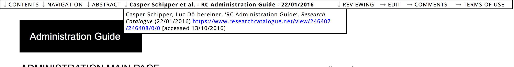

# How to Find Expositions and Research ? 

## Search

You can search the RC by using the search field in the top right
corner. Moreover you can use the "advanced search" functionality,
which allows for filtered searches and and searches according to
specific criteria such as object type, keywords, authors, etc.

## Experimental Map

There is also a visual map of the RC in development:
[https://map.rcdata.org](https://map.rcdata.org "a visual map of the RC")

## Researchers

You can find all researchers with public content of the RC here:
<https://www.researchcatalogue.net/portal/researchers?publicObjects=1>

## Journals

<https://www.researchcatalogue.net/portal/journals>

## Institutional Portals

<https://www.researchcatalogue.net/portal/institutions>

## Follow 

It is possible to "follow" other users, portals, and objects such as
expositions and works.  Once you are logged in you will see "follow"
links in the bottom right corner of objects displayed on the front
page, other user's pages and other places on the RC. "Follow" links
also appear on user and portal profile pages. Once you follow a user,
portal, or object new publications, edits, comments etc. will be
displayed on the "FEEDS" page. Clicking the wrench icon opens up a
dialog in which you can adjust the precise information you want to see
for each user, portal or object you follow.

<!-- TODO: Insert links to other parts of the documentation -->

# Navigation while reading expositions

[navigation](#navigation)

## Navigation Bar

When one moves the mouse cursor to the top of an exposition, a menu bar
appears. 

  

The navigation bar contains, from left to right:

* __Content__\
This contains the table of contents and links to the authors. Please see the help section on [table of contents](#table-of-content).

* __Navigation__ (graphical expositions only)\
Navigation is a graphical map of all the exposition's
content on the current weave. You can click within it to jump to a location. 

* __Abstract__\
Abstract, this can be changed by clicking title in the editor or ☰ > __edit details__ on your profile.

* __Title / citation info__\
By moving the mouse pointer the title of
your research, a little window with citation info will appear. The link
(URL) of the current page is shown, including the current scrolling
location. This URL can thus be used to generate the [hyperlink](#hyperlinks) for
internal linking. You can also use this link to cite a specific
location within an exposition.

* __Meta__ 

Takes you to the metadata page, which shows the full set of metadata
related to the exposition: author(s), keywords, abstract, creation
date, publication date and copyright & licenses of all used media
files.

* __Reviewing__ (graphical expositions only)\
Reviewing is connected to the note tool (the yellow "post-it" notes)
and is intended for the communication between the author(s) and the
reviewer during the reviewing-process. This option is only available for expositions that have not been published yet. Notes can also be used for approving expositions in educational contexts.

 
There are a couple of functions available:
 
	- hide notes 			(hide all notes)
	- show open notes 		(show only notes that are open)
	- show resolved notes 	(show the resolved notes)
	- add new note 			(open a note tool)
	- previous note         (jump to previous note)
	- next note             (jump to next note)
	

### Comments

Shows the latest and previous comments on your exposition from the RC
community.

### Terms of Use

This displays the terms of as set by the Society for Artistic Research (SAR).

