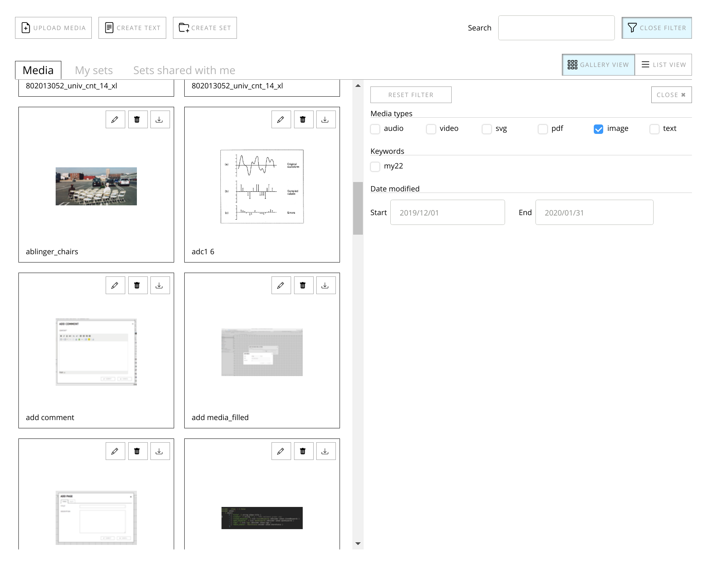

# Media Repository

The media repository allows RC users to navigate, organize and manage
their media. Each user can browse the media that is used in their
expositions (the [simple
media](https://guide.researchcatalogue.net/#simple-media)) or collect
media files and texts to be used in an exposition. Beyond
organizing media, you can share it with other users of the RC. You can
upload media, organize them into [__sets__](#sets) and share it with
other users of the RC.

## Browsing

The media browser contains three tabs:

* __Media__

	The complete list of all media.

* __My Sets__

	Your media sets.
	
* __Sets Shared with You__

	Media sets that have been shared with you.
	
	
There are two ways of displaying the media or sets:

* The __gallery view__ displays a preview image for each element.
* The __list view__ displays media as a list. It is better suited for sorting media or sets.  Click
  on a column to sort a list by a certain property.

## Filter and Search

The filter can be used to only show certain types of media. You can filter by 
[__tags__](#tags), [__keywords__](#keywords), date and media type.

## Creating New Media

There are various ways to create new media:

## Upload

Click "__Upload media__" to add a new file. Once you have select one or
more files, you will be asked to provide at least copyright
information. If you are the creator, you can fill in your own name
here.

Accepted types:

* Video (most common formats)
* Audio
* PDF
* Text files: plain / html / markdown
* Images : .png .gif .jpg .svg .tiff

__Transcoding Audio and Video files:__

The Media Repository accepts all common audio and video formats and
will automatically convert them to web compatible format.  Audio is
transcoded to 256 kbps mp3, video to mp4 with the original resolution.

### Multi-Upload

You can select multiple files to upload at once or a folder containing
several files. You will be presented with a form block for each
file. 

### Text

Text is a media type in the media repository.

You can also create snippets of text by using the "__create text__" button.
You can select between three different types:

* Plain text
* HTML
* Markdown 

## Metadata

Every album and media entry is linked to set of metadata that include
copyright and licensing information as well as a title and the
following fields:

### Description

The description is not typically displayed for a reader of an
exposition but allows the author to provide additional information.

## Tags

Tags are meant for personal organization. Typical examples would be
"todo", "old", "archive", "new", or "in progress". They are private to
your RC account, so no other users will see them.

## Open Keywords

Open keywords are shared with the entire RC, any user can add any new
term to the global namespace.

You can either search for existing open keywords or create your own,
if the term has not been used before.

To prevent duplicates, the RC does not differentiate between upper and
lower case, for example: "Art" and "art" are understood to be the same
thing.

### Closed Keywords

Closed keywords are part of a closed and controlled vocabulary
administered and continuously extended by the RC. They are chosen so
that we can more easily interact with other repositories. They cannot
be extended by individual users.

### License Picker

Please consult [licenses](#licenses).

## Sets and Sharing

Media can be organized in sets. Media can belong to multiple sets at
once. You can create a new set and by clicking "select" you can
choose the media belongs to a set.

Media sets can be shared with other users and in portals. Click
__share__ to open the share form. There are three sections in this
form:

* The top section of this form allows you to control the visibility of
  the set on your profile.
* The middle section allows you to invite collaborates. These users
  will only have read access (default) or they have write access,
  which allows them to remove or change metadata and media belonging
  to the set.
* The bottom section allows you to share a set in portals. Other
  members of the portal in which you share a set will see the set on
  your profile even if you don't publicly share it.
