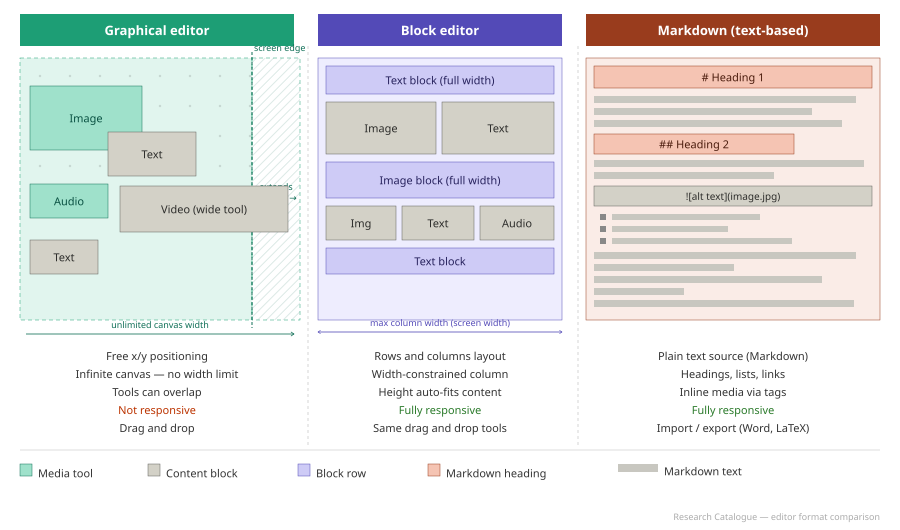
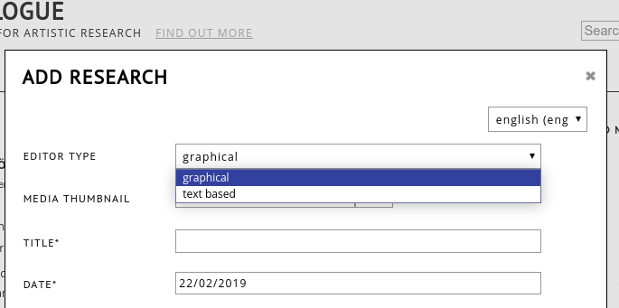

<a id="comparison">&nbsp;</a>

# Creating Expositions

You can start a new exposition from your [profile
page](www.researchcatalogue.net/profile) page, by clicking __Create Exposition__. You will need to provide a title, abstract and copyright as minimum. If you
are the creator of an exposition, the copyright is typically your own name. All
of these may be changed later.

If you do not see \[ create exposition \], you may have to arrange a [full
account](#upgrading-your-account) first. 

## Choosing an Editor 

The Research Catalogue offers two general-purpose editors:

- **graphical** editor
- **block** editor

*Users can combine both __graphical__ and __block__ pages in a single exposition.*

And two additional specialized formats (cannot be combined):

- **text-based**  
- **HTML** import

When creating a new exposition you are asked to choose which editor you want to
start with. Graphical and block pages are part of the same format and can be
mixed, but text and HTML are separate formats. This makes it important to choose
the right format. Most beginners will want to use the block or graphical editor.

Most journals (and some of the portals) will not accept HTML imported
submissions. Please consult the portal beforehand, in case you are planning to
submit and want to use the HTML import feature.

<figure class="full-width">

<figcaption aria-hidden="true">visual comparison of the
editors</figcaption>
</figure>

### Graphical Editor

The [**graphical editor**](#workspace-editor-for-graphical-expositions), allows the author to
set the position of each element in the page. This makes it easy to
build rich graphical pages in which text and media, such as
images, video and audio files, are freely positioned in an infinite canvas. However, due to their non-linear nature, graphical expositions are not
["responsive"](https://en.wikipedia.org/wiki/Responsive_web_design). If
you want readers to be able to read your exposition on mobile devices, then
either the block editor or the text-based editor might be more suitable for your project.

### Block Editor

The [**block editor**](#block-editor-mode), uses the same tools and the
drag-and-drop interface of the graphical editor, but positioning is relative. As
a result, block pages are fully
["responsive"](https://en.wikipedia.org/wiki/Responsive_web_design). Instead of
an absolute grid and an infinite canvas, the block editor uses a more
newspaper-like rows-columns structure. It is suitable for editing pages that
have a lot of "inline" content, where media is inserted between or beside blocks
of text, or media has to be positioned in relation to certain elements in a
text. It is less flexible for creating diagrams, maps, or for overlaying
materials.

### Text-Based Editor

The [**text-based editor**](#text-based-editor-1) allows creating blog-like
pages through writing and editing text. Pages using the text-based editor
cannot be combined with block or graphical editors. The editor is optimized for
writing (and importing) texts, while still supporting the embedding of inline media.

You can structure and format the text using the commonly used
[Markdown](https://en.wikipedia.org/wiki/Markdown) notation. Content can
be automatically imported and exported from and to various external formats, for
example Word, Open Office and LaTeX documents. Styling can be
customized extensively using standard [CSS](https://www.w3schools.com/css/ "more
information on CSS"). Text-based expositions are *responsive* and thus mobile-friendly.

### HTML Import

For even more customization, you can [import a static HTML](#html-import) website as a
whole. JavaScript is not supported.

### Comparison of RC Exposition Formats

| Graphic                                                        | Block                                 | Text-based                                                             | Html-based                                 |
| -------------------------------------------------------------- | ------------------------------------- | ---------------------------------------------------------------------- | ------------------------------------------ |
| non-linear                                                     | linear                                | linear                                                                 | linear and non-linear                      |
| page can have any dimension                                    | vertical column with rows             | vertical column                                                        | hypertext                                  |
| static                                                         | responsive                            | responsive                                                             | static and responsive                      |
| slideshow, 3d-object, synchronized playback of different media | limited to images, video, audio & pdf | limited to images, video, audio & pdf                                  | HTML5 media tags, No javascript            |
| similar to Powerpoint or Dreamweaver                           | similar to a structured blog post     | similar to a blog post                                                 | webpage                                    |
| only editable in RC                                            | only editable in RC                   | input is plain text, can be imported and exported to different formats | not editable in RC, not editable by admins |
| can have multiple pages                                        | can have multiple pages               | single page                                                            | can have multiple pages                    |
| position and tool-based links                                  | tool-based links                      | table of content generated from headers                                | edit yourself in table of contents dialog  |
| drag and drop, mouse based                                     | drag and drop, mouse based            | Expositions are written by typing                                      | External code editor, static generator     |
| reviewers can leave comments and notes                         | no commenting functionality           | no commenting functionality                                            | no commenting                              |

As HTML format is not editable in RC, most journals will not accept it. So always consult with a portal if you are planning to submit it.
