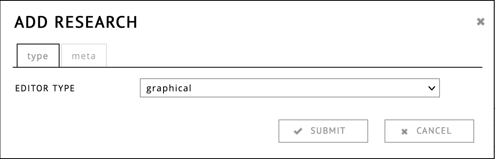

# Choosing an Editor
  
There are two types of editors in RC, the **graphical** editor and the
**text-based** editor. Both editors can be used to create expositions
that can be published, reviewed and submitted for
publication. However, the design, the writing process as well as the
way in which exposition can be read are significantly different. 

When creating a new exposition you are asked to choose a format to
use. After the exposition has been created, one cannot change the
format anymore. It is therefore important to make the right choice for
a particular project at the outset.
 

The **graphical editor**, which is documented
[here](#workspace-editor), allows the author to set the position of
each element in the page. This makes it easy to have non-linear
formats or presentations in which the media, such as images, video and
audio files, are as important, if not more important, as the text. The
editor works by dragging and dropping. There is no predefined style or
template and its possible to have the reader go through the content in
a non-linear fashion. However, a consequence of absolutely positioning
all elements is that the exposition cannot adjust to the size of a
particular device, that is, these expositions are not "responsive". If
you want readers to be able to read your exposition on mobile device
the text-based editor may be more suitable for your project.

The **text-based**, which is documented [here](#text-based-editor),
editor is designed for writing (and importing) texts, while supporting
the embedding of media. The input is plain text, which is translated
into HTML. The author can express the structure of the text using
[Markdown](http://https://en.wikipedia.org/wiki/Markdown)
notation. Because the input is plain text, it can also be
automatically imported and exported from and to various external
formats, for example MS Word documents, Open office documents and
LateX. Styling is applied using standard CSS. By default the structure
of the exposition is maintained, while the sizes of the text will
adjust for readability on different screen sizes. Text-based
expositions are *responsive*.

Finally, there is an option to import static HTML website as a
whole. The RC does not provide editors for HTML, so for that option an
external editor is to be used. JavaScript is not supported.

## Comparison of RC Exposition Formats

| Graphical format  														| Text-based |
|-----------------------------------|----------------|
| non-linear                                        | linear |
| page can have any dimension                        | vertical collumn |
| static                              |  responsive    |
| slideshow, 3d-object, synchronized playback of different media | limited to images, video, audio & pdf |
| similar to Powerpoint or Dreamweaver												| similar to a blog post |
| only editable in RC											| input is plain text, can be imported and exported to different formats  |
| can exist of multiple pages | single page |
| position-based links | table of content generated from headers |
| drag and drop, mouse based       | Expositions are written by typing |
| reviewers can leave comments and notes       | no commenting functionality |

