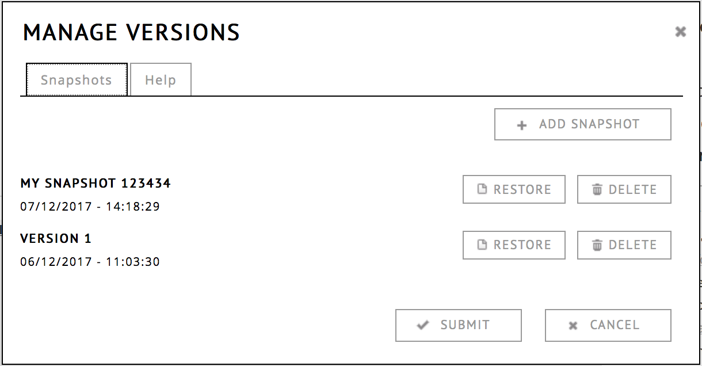

# My Profile Page

The RC profile page is both the central hub for your activities on the
RC and a public presentation of your research activities. The RC
allows you to create a detailed public profile containing biographical
data, information on projects and events as well as a list of your RC
objects such as works and expositions. The profile is divided into two
sections, the upper sections contains an artist biography as well as
information of research interests and the lower part, which is titled
"Research" contains a list of RC works and exposition.

## Profile Section

### View Public Profile

You can switch between your profile's editing mode (private) and your
public profile, which is the profile as other users see it. Click on
"my profile" for the editing mode and - below your image - click "view
public profile" to hide all controls, grouping options and private
research. You can thus control the public visibility of your RC
objects.

### Description 

You can add a short text (for example a biography), that other RC
users will see when they visit your profile. To edit this text, click
"edit profile", on your profile page and scroll down. Here you can
also add a tagline, set your country of residence, and list your
research interests.

### Uploading a CV

In addition to the profile description, it is possible to upload a
more extended CV as a PDF.  To do so, click "upload cv" below your
profile picture.

<!-- ### Degrees -->

<!-- You can also add your __degrees__ to your profile. Enter the name, the level, the dates and the institution of your degree and link it via the __relations-tab__ to projects, expositions or works that you created in support for your degree. -->

### Member of

As a user you can request membership of (some of the) RC portals. Certain actions can only be done if one is a member of the portal. For example: for some application programs, it may be required that you are member of the portal before you are able to submit an application for a program.

In most cases however, it is the task of the portal admin to make you a member of their portal, most portals do theirfore not allow users to request membership themselves.

Click edit to ask for a request to become a portal member, or remove yourself from a portal.

## Research Section

### Grouping

When you create a new work or exposition the newly created objects
appear in default groupings ("Works" and "Expositions").  By using the
"add grouping" button you can create custom groupings. You can arrange
objects according to freely created categories. To add a new group
click "add grouping" and enter the name of the grouping. You can sort
your objects within a group, arrange the groups themselves and move
object between groups via drag and drop. Click and drag a grouping to
change the order of the groups. On the right-hand side of a grouping's
title, there are a series of icons displayed. Here you can edit and
delete the grouping and control its public visibility (using the
circle icon). Only custom grouping can be deleted. If you have only
one grouping containing content, its title will not be shown on your
public profile. Empty groups will also not be displayed on your public
profile page.
 

### Create Exposition

By clicking "Create exposition" you can create a new exposition object which will be opened in the RC exposition workspace editor. The title and abstract fields are obligatory.
You can change these details later by choosing ☰ > __edit details__, or in the __workspace editor__ by clicking the title of your research (at the top of you screen).

### Add Work

A __work__ in the RC can be used to represent self-sufficient artistic
creations existing outside the RC, such as objects, compositions,
recordings, videos, installations, paintings, photographs, books etc,
but can also be used to represent events, presentations or
expositions. You can add metadata such as the place of your work, the
country or the material, technique or format. Moreover, the work can
contain a collection of media files, which can later be accessed in
used in expositions.

You can collaborate on works by inviting co-authors, contributors and
supervisors. Moreover, you can relate works to other works and
expositions by using the "relations"-tab in the "edit
details"-dialogue window. 

### Add Project 

A __project__ is a container within which works or expositions may be
produced. It is intended to represent academic research projects and
degrees. Using the relations-tab, works or expositions can be linked
to the project.

In case your project belongs to a degree, you can add ECTS-points.

### Visibility Of Groupings

You can decide if you want a grouping to be visible in your public profile.

By default, new groupings are visible in your profile as soon as they
contain an RC object. To hide groupings from your public profile click
the small circle icon on the right hand side of the grouping's
name. If the circle is thin, the grouping will not be shown on your
public profile.

### Open Exposition

The button "open exposition" opens the first page (or "weave") of your exposition. 
This is equivalent to the __preview__ version in the exposition workspace.

### Exposition Details Menu

To access the menu, click on the ("hamburger") menu icon, located in
the bottom right corner of an object (expositions or works). Some
options are only available to the author of the object.

* __Change layout__ Change the size of an object on the profile.

* __Edit workspace__ Go to the workspace editor of this exposition.

* __Edit details__ Change the meta data of your exposition, and control collaboration with other users. See [edit research](#edit-research)

* __Share__ Change who can see and access this item.

* __Self-publish__ Turn an exposition into a fixed state.
 Please note that publishing is a one-way action, *once published one can not unpublish*. If you want to keep the option of removing an exposition, do not use this option.

* __Add to shortcut__ Add a compact link to this object on the top of your list. 

* __Submit for publication__ Submit an exposition to a portal for publication.

* __Add to shortcut__ Make a shortcut add the top of your profile.

* __Connect to portal__ Send a connection request to a portal.

* __Manage versions__ Create or restore snapshots, see [versions](#manage-versions).

* __Export__ This function downloads a zip file, containing a HTML Export of the exposition. These HTML files can be opened on any computer with a browser, also offline. The start page is named __index.html__ .

* __Delete__ Delete an exposition or work from the RC.

### Change Layout

This dialogue gives you the option of choosing the size of an object
in your profile.

Depending on the length of the content, the abstract and additional
information may be reduced or even hidden. Sizing objects differently
allows to focus a reader's attention to important objects as well as
to improve the overall readability of your profile page.

Four layout-templates are possible: 

1. tall and across both columns

2. tall but only one column wide

3. short and only one column wide, the smalles possible size

4. short and across both columns

## Manage versions

It is possible to create a snapshot of your exposition, which you can restore later.

A snapshot is created by going to ☰ > __versions__ and clicking __add snapshot__.

When you restore a snapshot, the original is not overwritten, instead a new exposition will be created from the snapshot.

There are three options for how to deal with the [collaboration](#collaborating-on-research) settings of a restored snapshot:

* __private__ remove all collaborators (only you can see the restored exposition snapshot).
* __restore__ the collaboration will be as it was when the snapshot was taken.
* __keep__ the collaboration as it is in the current version of the exposition.

One can also restore as private and change the settings afterwards of course, through the collaboration and share menus.

### Versions of published expositions

Published expositions cannot be changed in the RC (this is per definition, to allow referencing content within these expositions by other researchers), but duplicates can !

To get an editable duplicate of a published exposition one has to:

1. make a snapshot of the published exposition.
2. restore the snapshot. 

This duplicate can now be edited, without the changes having effect on the original published exposition.

## Edit Research

This dialog can be opened by __☰ > edit details__ or clicking the title of the exposition in the workspace editor.

* __Meta data__ Change the __title__, __date__, __abstract__, __keywords__, __affiliation__ and __external link__ fields for your exposition.  
A __title__ and __abstract__ are obligatory.
 
__entry page__ This is the page readers see when they first open the exposition.

* __Table of content__ Change the content menu, which controls which pages are visible for the reader.
See [table-of-content](#table-of-content).

* __Collaboration__ Add co-authors, editors and supervisors.
See [collaboration](#collaborating-on-research)

* __Relations__ Create relationships with other objects on your profile, which will result in them being listed on the Research page. This page is shown when somebody clicks the title of the research on your profile.

 

 

 
