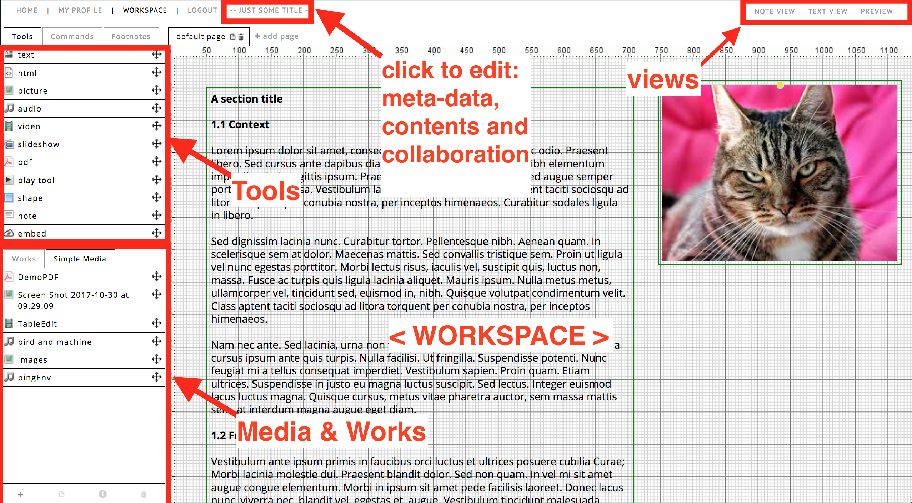

# Views
 
## Exposition View or PREVIEW

The exposition view is the final result that the reader will see when
he/she opens your exposition, for example by opening the exposition
URL or when a user clicks "OPEN EXPOSITION" anywhere on the RC.
All expositions have [a navigation bar](#navigation) that shows if the user moves his/her mouse to the top.
It contains a table of contents, abstract and other information.

While you are editing your exposition in the workspace editor, the
PREVIEW button (right top corner) shows what the page will look like
to the reader. If you already have a preview tab open, the second time
you click PREVIEW, it will simply refresh, instead of opening a new
tab.

<!-- THIS SHOULD BE IN VIDEO AND AUDIO TOOLS ?
Note, that the video player, the audio player, the slideshow and object tool are only displayed fully in this PREVIEW view. 
-->

While the EXPOSITION VIEW will always open the default entry page
of your exposition, PREVIEW shows the page (or "weave") that you
currently are working on in your workspace. Thus, you can also PREVIEW
pages that are not yet listed in the table of contents. 

 
## Workspace View

The __workspace editor__ is the editor of content on the RC. It can be opened by clicking __☰ > edit workspace__ on an exposition listed on your profile. Of course you can only edit expositions of which you are a (co)author, editor or contributor. 

### Edit exposition settings

When you are in the exposition editor, you can click the title to open a dialog to change the settings of the exposition. It is the exact same menu as you get using ☰ -> edit details on your profile.
See [edit research](#edit-research)

Within the workspace view, one can enable one of these two subviews:

### Note view
 
The note-view is to be used in conjunction with the note-tool of the
RC. Notes are meant to be used to communicate between author and
reviewers or supervisors and authors. The note-view displays a list of
all the notes that are within an exposition. One can filter this list
based on the author, assignee and depending on its status (resolved,
unresolved). You can also change these parameters in this view.

### Text view

The text-view displays the text content of your exposition. You can
activate the text-view by clicking on the button on the
view-options. You have the opportunity to show or hide changes. You
can also sort the items and open the html-editor to directly edit the
content in the text-view.
 
You can close both views by clicking on "close note view" or "close
text view" in the top-right.

For more info on specific tools, see [workspace](#research-catalogue-workspace-tools).
