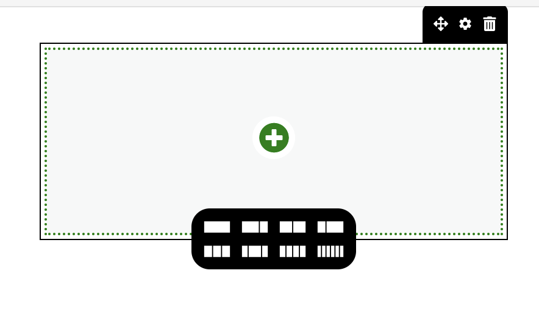
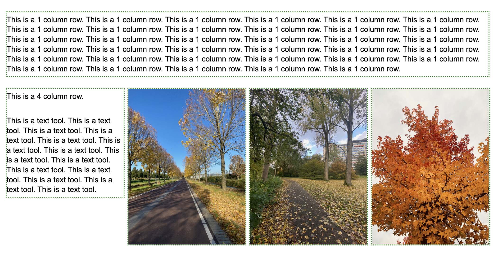
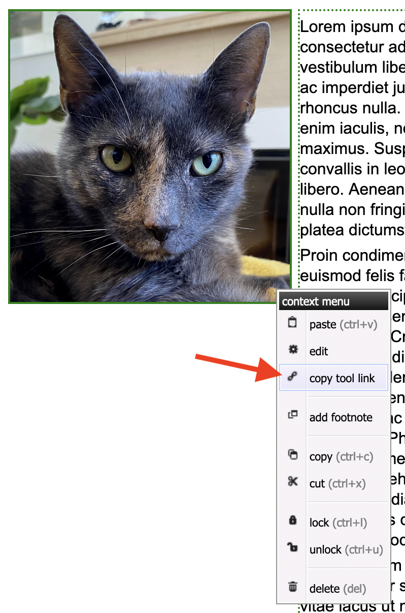
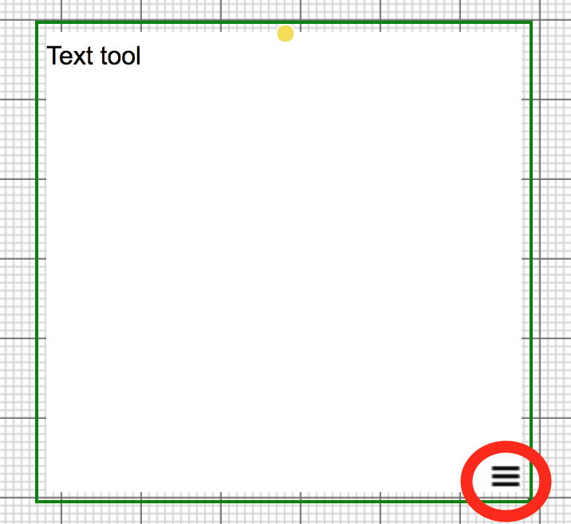
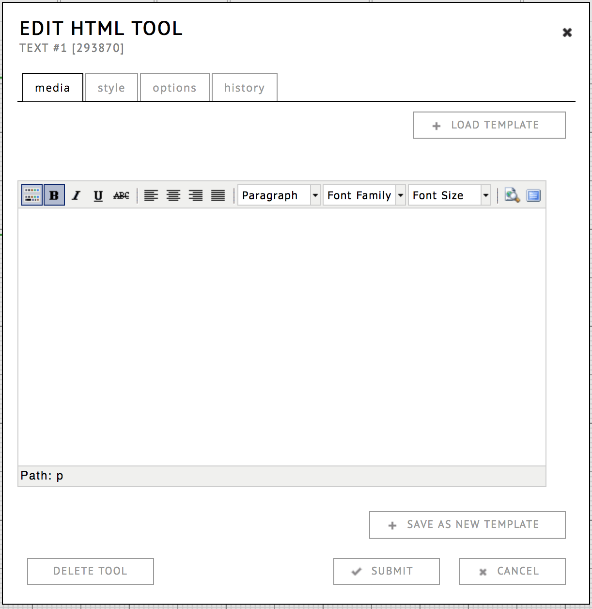
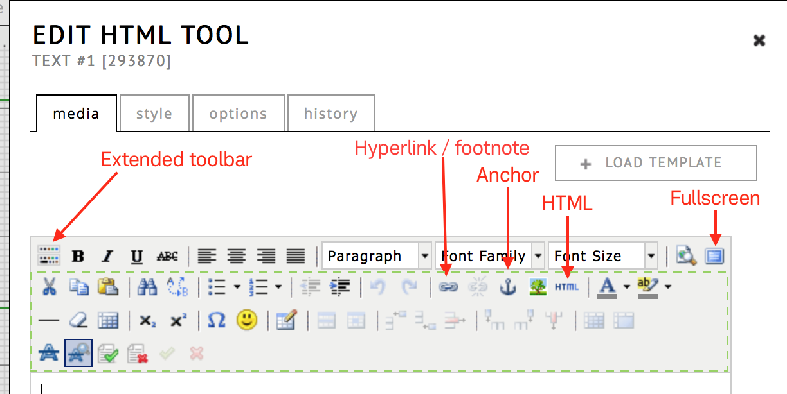
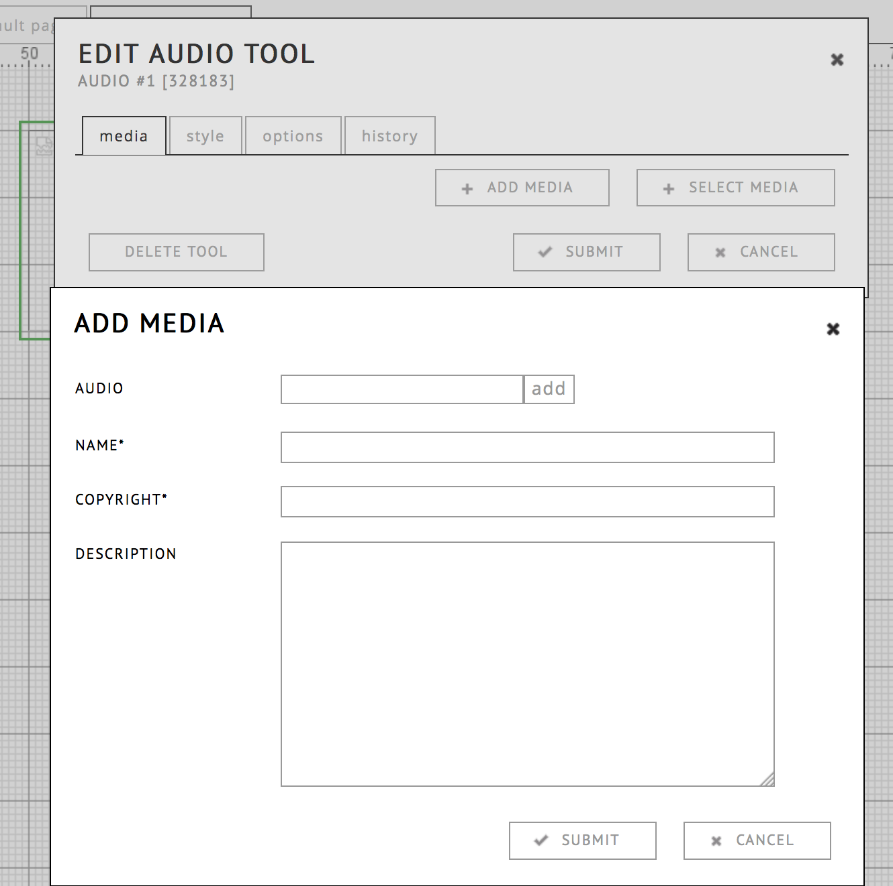
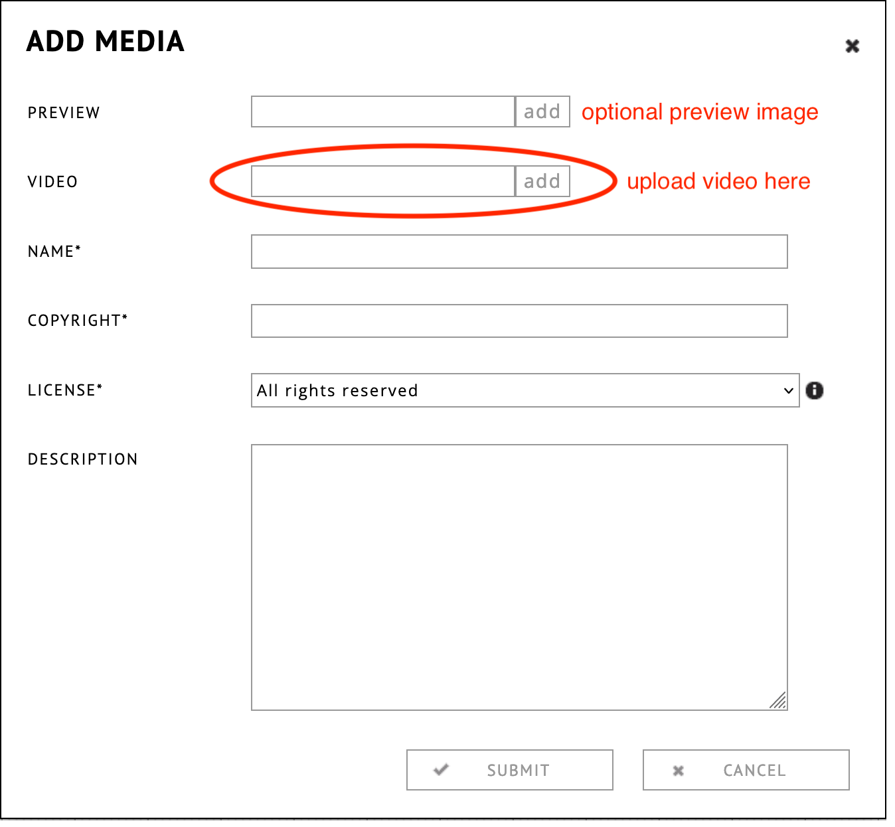
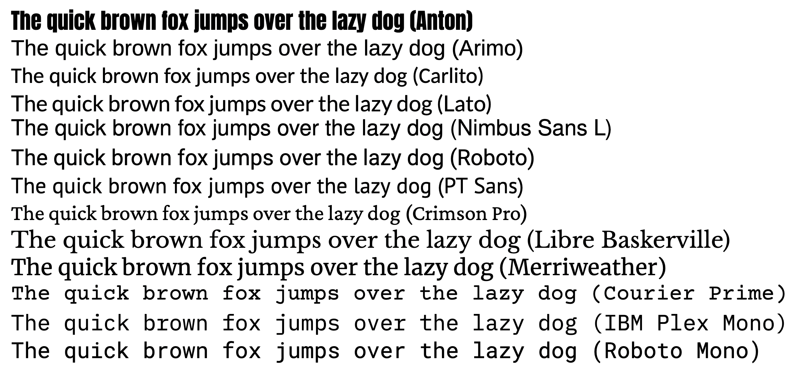

## Editor Basics

When you open the editor you will see math-paper like area in the center. This is called the grid. 
Content is added by dragging-and-dropping "tools" from the toolbar onto the grid. You can preview what the exposition looks like to the reader by clicking the "preview" button:
This preview button is located at the top right.

The position of content in graphical expositions is determined by the author and is always absolute. This implies:

* Tools are not positioned relative to each other, (re)moving one will not affect the others.
* The canvas size is unlimited: it will grow automatically when you add tools.
* Tools can be placed on top of each other.
* Layout will not change depending on the screensize of the viewer (content is not ["responsive"](https://en.wikipedia.org/wiki/Responsive_web_design) ).

All of the above results in the graphical editor being most suitable
for non-linear layouts. For simpler expositions, it can be worthwhile to consider using the block editor or the text based editor ( see [choosing an
editor](https://guide.researchcatalogue.net/#choosing-an-editor) ).

On the right you will find the content manager, consisting of four tabs:

| Tab                                                 | Function:                                |
| --------------------------------------------------- | ---------------------------------------  |
| [map](#overview-1)                             | map and list overview                    |
| [media](#simple-media)                              | view previously uploaded media files     |
| [popup](#footnotes-and-popovers)                | manage popovers                         |
| [ref](#references)                                 | manage references / bibliography  |
| [pages](https://guide.researchcatalogue.net/#pages) | manage pages                             |

## Graphical Editing Mode (adding a tool)

A tool is created by [dragging](https://en.wikipedia.org/wiki/Drag_and_drop) the icon onto the canvas.

If you click a tool once, it will open the default setting dialog.

Tools can be resized by clicking and dragging the green borders with the mouse.

Tools can be rotated by clicking and dragging the yellow dot.

The size of the current weave will automatically grow when tools are added or dragged over the current limits.

## Block Editing Mode 

The block editor is an alternative method of creating exposition pages.
It allows the author to use the same media tools as the graphical
editor, but instead of exact positions, the page is built up using blocks.

Block-page content is organized using rows and columns. The main
structure is a single stack of rows. Each row can either be a single block, or a
custom division in columns.

An important aspect (and advantage) is that the height and vertical position
will automatically fit the content: the bottom of the previous tool determines
where the next one starts. The blocks are thus stitched together end to end, never
overlapping. This means it easier to work with text content.

Using relative sizes like this is often associated with the concept of [responsive web
design](https://en.wikipedia.org/wiki/Responsive_web_design).

### When to use

The block editor is most suitable for:

* exposition content that you want to be readable on all screens.
* expositions where the content forms a block:
  - text with inline media
  - text with media that should be next to a certain position in the text

The block editor is less suited for:

* free-form layouts
* diagrams
* maps
* timelines

Certain tools (Sync, Shape) for example, can only be used in graphical
pages, although more will become available in the future.

The __block editor__ provides functionality similar to __text-based editor__ 
(which is also responsive), but the
difference is that you can more easily create horizontal rows of
content and the editing is drag and drop, using the same tools as the graphic editor.
This also means that both type of page can be used in a single exposition.

### Basic usage

You can choose the block editor when creating a new exposition or when
creating a new page within an existing exposition.

A block page is organized as a list of boxes which are called
__rows__. A row is created by clicking the black __+__ at the bottom of the previous block.

You can then choose a column layout for this block:

Within each __row__, you can have one or more __columns__
of __cells__ dividing the content in that row. You can think of it as
a table, except that the number of columns is allowed to be different
for each row. Within a __column__ you can drag-and-drop any number of tools,
although it is probably a good idea not too have too many in one
column, since this will make it harder to change layout afterwards.

You can add tools by clicking the green "+" sign, or dragging them from the toolbar:

The default is 1 column in the row, in which you are basically just
editing a list of tools. When you create or drag and drop new tools in
the column, they will be added to bottom of that column.

You can change the layout, move or delete the row by using the black controls on the right top:

### Optional breaking point for smaller screens

On small screens, a high number of columns can become problematic. For these situations, you can set a breaking point. If the screen width is below this point, any multicolumn row will be displayed as a single column.

### Editing

You can move tools by dragging and dropping them from one cell to the
other. Dropped tools will never replace tools, they will insert at
the bottom of the current cell.

You can also move an entire row by dragging it from the "compass" icon
visible at the top right corner of a row.

### Hyperlinks in the block editor / Table of Contents

__Hyperlink__

It is possible to construct a hyperlink to a specific tool within a block page. To retrieve such a tool link, right click the tool and choose "copy tool link". This will copy the tool url to your clipboard, so you can use it to create a hyperlink elsewere. 

__Table of contents__

To link to a specific tool in your "CONTENTS" menu, open the menu "options", choose "edit table of contents". This will open a list of entries, where you can choose a page and a tool within your page to link to. 

")

### Viewing

On screens that are very narrow, the content will automatically break
into a single list again, without objects next to each other.

### Styling 

You can globally control the styling of your page, through the page style dialog, available in your pages tab.

")

### Future

It will become possible to make two versions of the same content, a 2D
graphic and a linear block-like layout. This way the exposition content can
automatically select the right format for the screen it is being
viewed on.

## Tools for Text, Video, Image and Audio

Note: The tools are described as they work in the graphical editor. When using the 
block editor, some of the tools are not available or there may be limitations 
in tool options.

### Context Menu

The context menu of a tool is reached by clicking on the menu icon (see below), or right clicking (Apple: CTRL+click) inside a tool. The only exception is the text tool, see text tool.

* __Edit__ (open edit dialog)  
Open edit dialog

* __Copy__/__Paste__  
Copy/paste objects <a href="#copy-paste-footnote">(*)</a>

* __Bring to front__/__Bring to back__  
Organise which object is in front of another.

* __Lock__/__Unlock__  
Lock means that one cannot make any changes until unlocked again.

* __Delete__  
Delete a tool

### Key Commands

There are a few useful key commands in the editor. Selected tools have a green border.

| __Key command:__                                              | __Action:__                                                                |
| ------------------------------------------------------------- | ---------------------------------------                                    |
| __ctrl + c__                                                  | copy selected tools  	<a href="#copy-paste-footnote">(*)</a>    |
| __ctrl + v__                                                  | paste                                                                      |
| __&#8984;(Mac) + a__ or __ctrl + a__                          | select all tools on current weave                                          |
| __&#8984;(Mac) + click__ or __ctrl + click__ on object        | select multiple objects one by one                                         |
| __backspace, delete__                                         | remove selected tools                                                      |

<a id="copy-paste-footnote">__* = Important: the object you copy, is duplicated at the moment you paste__. This means that if you change an object after copying, the pasted object will also have these changes (!)</a>

### Defaults

Defaults for styling and options can be set for a tool, by clicking it in the toolbar.

### Text Tool

[Watch the video tutorial.](https://www.researchcatalogue.net/view/273532/1685164#tool-1686820 "simple text tool tutorial")

The text tool is designed for quickly adding text. 

It has two states: when it is in *active state* you can change the
text, if you click outside of the tool, you can move the tool and
change its size. Double click inside of the tool to
start editing the text again. Content is saved as soon as you exit the
text editing state.

If you right-click the text tool, you can find some extra edit options
under __edit__.  You can also (while hovering over a text tool with
your mouse) click the (☰) menu icon and choose __edit__.

In comparison to the HTML-tool, the text tool allows you to edit your text
directly on the page. While the HTML-tool opens a new dialog window. If you need
more styling options, or want change the HTML source code of text, use the
HTML-tool. A text tool can be converted to an HTML-tool via the menu option
**convert to HTML tool**.

Regarding the availability of typefaces/fonts please read [fonts](#fonts).

#### Placing images on top of text tools

An important advice regarding text tools in the graphical editor is to __keep
them short__. As a rule of thumb, keep the height below 1-2 screenheights maximum. Taller
tools can result in positioning errors between the text content and other tools
and text in your exposition.

*The reason for this is that browsers are not identical when it comes to text-rendering, there are actually minute differences (a fragment of a pixel) that can add up and cause serious alignment issues if your tools are bigger. This risk is worsened by the fact that you as the author will not notice: because the magnitude of error is actually dependent on what browser your reader is using.* 

If you find your design requires taller text-tools with illustrations inline, use the specialized [block editor](#block-editor) instead, or split the text tools in smaller parts:

#### Scrollbars

If the text within a text tool is longer than the tool height, a scrollbar will appear and part of the text is cutoff. Therefore (especially when copying from external editors) it is important to check that the tool has a large enough size (unless you specifically want a scrollbar).

#### Style

See [style options](#style-options).

#### Options

If a text is longer than its frame on the weave, a scrollbar is
generated automatically. You can control the visibility of the
scrollbar in __options__. The default setting is *automatic*. Be
careful setting this to __never__: if a text tool is too small to display all
the text, it will be impossible for the reader to see all the text.

#### History

See [history](#history).

### HTML Tool

The HTML-tool is used for advanced text editing. It is a
*what-you-see-is-what-you-get* rich text editor. Unlike the text tool,
you can only edit its content in a dialog box. 

#### Media

Text is edited in the __media__ tab. You can style your text using the buttons.

*! important: If you copy-paste your text from Word, Pages,
   LibreOffice, Google Docs or any other text editor, note that not
   all fonts and styles will show the same on every computer.
   A safer practice is to import the text without any formatting, and format it within RC.
   This can be done either by exporting your text as plain text and copy pasting from that version, or importing your document using the [document import](#import-word-documents-using-simple-media-upload)*

To enlarge the palette of text styling options, click on the first
button, __show/hide toolbars__. Opening it will allow you to insert lists, enumerations, tables,
citations. Regarding the availability of typefaces/fonts please read [fonts](#fonts).

Another commenly used feature is the hyperlink button (it looks like a chain link). This can be used to insert [hyperlinks](https://guide.researchcatalogue.net/#hyperlinking) or [footnotes](https://guide.researchcatalogue.net/#footnotes) into your text.

The top right button opens the editor in fullscreen. Note: you will have to exit full screen mode to submit your changes, using the same button.

 

#### Anchors (Graphical/Block) 

You can use the anchor button to insert standard HTML anchors to a specific location in your HTML tool. 
When creating a hyperlink to your anchor, do not forget to prefix it with a '#'. So if you anchor is called "anchor1", the link should be to "#anchor1".

#### Tips using the HTML tool:

* Make sure the tool size matches the length of the text within. If the text is too long, it will result in __scrollbars__.

* It is possible to insert image or even iframes within an HTML tool, but it is not recommended in most situations. Preferably media is added to the catalogue using the appropriate tools, to avoid the of risk external content going missing when it is removed by the original source. Never copy a media link from a resource in the RC, since it has a timeout.

* Be careful making very large texts within a single HTML tool, this may result in unexpected overlap when your exposition is viewed with another browser. 3 or 4 paragraphs per tool is a good average. If you do make a large HTML tool, keep a large margin at the bottom bordor.

* You can also choose the colour or the background of the text using the colour tools,
insert symbols and tables, and control the edits with the __show
changes__ option.

#### Style

[> See style options](#style-options)

#### Options

If a text is longer than its frame on the weave, a scrollbar is
generated automatically. You can control the visibility of the
scrollbar in __options__. The default setting is *automatic*. Be
careful setting this to __never__: if a text tool is too small to
display all the text, it will be impossible for the reader to see all
the text.

#### Templates

If you want to reuse the content of an HTML-tool, you can create your
own templates. This function can be found in the __media__ tab. After
finishing the edit of your template, click __save__ __as__ __new__
__template__ and give the template a name in the dialog box that
appears. To load a template, click __load template__ and choose one
from the list in the dialog box.

#### Submit, Delete, Or Cancel

Finally, you need to exit the dialog window. If everything is the way
you want it, choose __submit__ and the text field will be loaded on
the weave. To discard changes to the content, cancel the dialog
box. If you want to delete the whole HTML field, including all content
in it, click __delete__. Unintended deletions can be restored via
__commands__ – __restore deleted tools__.
 

### Image Tool 

Also known as the *picture tool*

To add a picture, drag and drop the __image__ icon from the tool
palette onto the weave. As with all other tools, a pop-up dialog
appears automatically and gives you the choice between "selecting" or
"adding" an item.

You can upload image files in the following formats:
*jpg, png, tiff, gif, psd, tga, bmp.* For uploading PDFs, please use
the PDF-tool. At the moment, regardless of the format, the RC will convert the 
image to a PNG (a lossless format). It's dimensions will be optimized to the specific use in the tool.

To add an item, choose "add" and upload the object from your desktop
to the RC servers. Name the file and make a declaration of the
copyright holder. Once an image is uploaded it is also automatically
added to the simple media tab.

#### Style

[> see style options](#style-options)

#### Options

There are options available to change how images are resized in relation to the green border containing the image.
This is controlled by changing the size parameter, which can be set to:  

* __contain__ : make the image small enough to fit without changing the aspect ratio (__default__)
* __cover__ : crop part of the image that is not fitting (aspect ratio stays the same)
* __fit__ : stretch the image  (aspect ratio changes)
* __auto__ : let the browser decide which part should be cut off

You can also change the *position* within the border ie: top-left, right-bottom etc...

In __settings__ you are able to lock the aspect ratio. And you can allow readers to enlarge the image by
activating the checkbox "on click open image in popup.".

If you want to use a picture as a hyperlink, paste a URL into the field *on click
open link*. 

You can also set a *tooltip text* (a text that shows when the user 'hoovers' his mouse over the picture) for the image. Set the __show on hoover__ option to __plain text__ and enter your text in the box below.

You can also make the tooltip display the copyright info, by setting the __show on hoover__ option to __copyright__.

Please note, you can't change the copyright information in the "edit picture" window. To change the name or the copyright text, close the current dialog and go to the item in __simple media__ and click __edit__
(also double click) to open the __edit media__ dialog.

### Audio Tool

[> Audio tool tutorial](https://www.researchcatalogue.net/view/273532/1685164#tool-1687981)

As with the other tools, use the audio tool by dragging and dropping
the icon from the tool palette onto the weave. A pop-up dialog window
appears automatically and gives you the choice between "selecting" or
"adding" an item. Selecting is for previously uploaded media (either
through other audio tools or the media manager). Adding allows you to
upload a new file.

The following formats are supported: *ogg, wav, mov,
au, mp4 audio container formats; mp2, mp3, aac, pcm a-law, flac audio
codec* formats. All audio file formats will be transcoded to mp3s with
256kpbs.

To minimize loading times, audio files are automatically
compressed. During the transcoding process, the name will be grayed out in the
media list and a text will be shown in the preview.

RC encodes with a bitrate of 256 bits per second. For further information and technical questions see [FAQ
2.6](http://www.researchcatalogue.net/portal/faq "FAQ") or contact the
RC User Support.

 
#### Style

[> see style options](#style-options)

 

#### Options

The audio player has a number of settings:

* __loop__
Will loop the playback when it reaches the end of the file.

* __autoplay__ 
The player starts to play back the file as soon as the
page has been loaded.

* __stop other players__ 
If you are using multiple audio (or video)
players on the same weave and your page is quite big, visitors may
find it helpful if you prevent overlapping by defining which player is
playing. With this option selected, all players (video player, audio
player on slideshows, other audio players) will stop when the selected
player is playing back a file. When simultaneous playback is desired, it
may be helpful to use the [Play-tool](#play-tool "jump to play tool
help").

* __display minimal__ When selected, the player consists of only the
play button and bar.  You can also define some visual player
settings. You can hide the whole menu bar or you can set the
visibility of the volume or define if you want a player with as few
options as possible.

As in the picture tool, if it is necessary to give textual information
about the sound file, you can enter the text to be displayed when the
mouse cursor hovers over the item.

### Video Tool

[Video tutorial](https://www.researchcatalogue.net/view/273532/1685164#tool-1686872)

As with the other tools, you can use the video tool by dragging it from the tool bar and dropping it onto the weave or block.

In the dialog box that appears you have the possibility to add
(i.e. upload) items from your computer or select items from the
"simple media" or media sets. 

If you choose "add media", you will see the dialog below. This dialog contains both a __preview__ and __video__ field. The __preview__ field, which controls the image that is shown before playback, is optional: if you only provide a __video__, the preview image will be generated from the first frame. You can later also select different images to function as a preview image. In that case, these images have to be part of your __simple media__ or __media sets__.

 At the moment, the RC supports the following
formats: *avi, mov, mp4, mpg* video container formats; *dv1394, h.264,
mpeg2, mpeg1, mjepeg* video codec formats. Both VBR and CBR are supported.

The video tool currently supports resolutions up to 2048x1080. If the resolution is higher, transcoding will fail. Please keep this in mind while uploading videos shot on phones, which commonly provide up to 4k resolution.

All media will be compressed to a smaller size, this is
called 'transcoding'. This process takes time. During the
'transcoding' the file name is greyed out in your simple media. If you want, the RC can also sent you an email when transcoding has finished.
You can find that option under [__profile, settings__](https://www.researchcatalogue.net/settings).

For further information and technical questions see
[FAQ](http://www.researchcatalogue.net/portal/faq "FAQ") or
contact the RC User Support.

We highly recommend using smaller video files, for easier upload. If your file is extremely large, you may want to compress it before uploading using a program like Handbrake, FFMpeg or QuickTime (Mac).

#### Style

[> see style options](#style-options)

#### Options

The video player has a number of options:

- __loop__
Loops the video when it reaches the end.

- __autoplay__ 
The player starts to playback the file when the page is loaded. 

- __stop other players__ 
If you are using multiple video players on
the same weave and your page is quite big, visitors may find it
helpful if you prevent overlapping by defining which player is
playing. With this option selected, all players (video player, audio
player on slideshows, other audio players) will stop when the selected
player is running a file. When simultaneous playback is desired, it
may be helpful to use the [Play-tool](#play-tool "jump to play tool
help").

- __display minimal__ 
When selected, the player constists of only the
play button and the bar.

As in the picture tool, if it is necessary to provide textual
information on the video file you can choose to display plain text or
copyright information that will appear when the mouse cursor hovers over the
item.

You can also use the play tool to synchronize selected video and audio tools.

### Slideshow Tool

The slideshow tool allows you to create a gallery of images that can
be displayed in a loop. You can choose to start the slideshow
automatically and you can add an audio file to each picture of the
slideshow.

Drag and drop the slideshow icon onto the weave and the dialog window will appear.

Open the __slides__ tab to select the images. You can either upload an image
from your disk, by clicking __add media__, or you can select images from your
__media repository__ sets and __simple media__ clicking __select media__. 

Each image can also be joined with an audio recording, which will be
played in the background. Only audio files that have been previously uploaded to
your __simple media__ or __media repository__ can be selected to be used as
background. You can upload new audio files in your media list.

#### Style

[> see style options](#style-options)

#### Options

In "options" you can define the position of the image within the
frame. This is important when you are using images with different
sizes and proportions. In __settings__ it is possible to choose to
loop the slideshow. If the __loop__ option is enable, the slideshow
will continue with the first slide once it reaches its last slide. You
can choose to hide the navigation bar or give the reader the option to
enlarge the picture with a click on the picture in your weave.

In __automate__ you can set the autoplay options to:

* *run after click* : run automatically after the first click 
* *autoplay* 		: after loading the page

When choosing *autoplay* you need to define the speed with which the
slide will change. You can customise the duration of each slide
(*speed per slide*) or let each slide change at the default speed.

As mentioned before, you can append audio files to each slide. Please
note, you first have to upload the file into your __simple media__
folder. In __options__, __audio__ you can control the time of a
crossfade (when one audio file fades out while a second fades in at a
specified time). You can also choose the fade duration and the timeout
of an audio file.

### PDF Tool

The PDF tool gives you the possibility to add PDF documents containing
texts, graphics or scores. By default the PDF is displayed as a small
thumbnail showing a miniture of the first page. The reader of your
exposition can load this PDF in a new tab by clicking the
thumbnail. Alternatively, you can set the tool to display the PDF
content directly embedded in the page (see [options](#pdf-options
"link to pdf options")).

PDF is a suitable format for uploading (paper) based documents into
your exposition. The limitation is that PDF files, by nature, only
support static (printable) graphics and text, not video or
audio. Although Abobe has started to support rich media embedding in
their own PDF viewers, there is almost no support for this in other
PDF viewers (like the one in browsers). In case text from a word
processor needs to be combined with video and audio, use the [HTML
tool](#HTML-tool "link to html tool") for the text and add the media
separately using the other tools.

#### Uploading a pdf

After dragging the icon to the weave, a dialog will show.  
Click the button __ADD MEDIA__ to open the dialog for uploading a PDF.  
Be sure to upload the PDF itself in the __PDF__ field, not __PREVIEW__.
One is also requested to add copyright information.
When done, click submit and the file will begin uploading. 

The __PREVIEW__ field is for changing the image that represents the pdf in the exposition for the reader.
If no preview image is provided, a miniturised copy of the first page will be used. You can later change the preview image, by selecting one from your media list.

#### Changing the PDF preview image

If you have an existing PDF tool, you can update the preview image with any image from your [media list](#media-list).
If you want to use a completely new image, you will have to add it to your [media list](#media-list) first.

- Double click the tool 
- Click the "change preview image" button
- Select the image from the dropdown list
- Submit

#### A few notes

* __Never re-use the url__ of the pdf file that opens when you click the pdf tool in the preview.
For example: "https://media.researchcatalogue.net/rc/master/73723.pdf?t=2629205589&e=1510816850" 
These (timed) links are automatically generated by the PDF tool specifically for the user that views the tool and are automatically invalidated after use.

* On iOS devices, rotated PDF tools will not open when touched.
 
[> see style options](#style-options)

 

#### Options

- __Position__ 

  The _position_ options (*size*, *position*) are only there for legacy reasons. Likely to be removed in future versions of the editor.

- __Settings__ 

	* __Display in Browser__

	    Option to "embed" the pdf: display its content directly in the page using the browsers built in PDF viewer. 
		If the PDF is bigger than the box, scrollbars will appear.

        *Display in Browser* works best if:
		* your exposition page only contains a single PDF file and not much else.
		* your pdf is only 1 or 2 pages long and the tool is made large
		enough to fit the whole document.  Always check with the
		__preview__ how the PDF looks embedded.

		We recommend against putting other tools on top of a __"display in browser"__ PDF
		tool, since browsers have slightly different margins on their PDF viewers
		: this may result in disalignment of content.

		

		As in the picture tool, you can set a text that the reader sees when
		they hoover the object.  To do this, select one of the options in the
		"show on hover" pull-down menu. You can create a plain
		text to be displayed when the reader's mouse hovers over the PDF
		preview. To use this, choose "plain text" or "copyright & plain text"
		from the pull-down menu and write your text in the text field below.

### Sync Tool

*this was previously sometimes referred to as the "play tool"*

The Sync Tool is designed to synchronize the playback of selected video and
audio tools on the same page. You connect one or more tools to the sync tool,
and the tool itself is a button that allows the reader to start and stop
playback of all connected tools at once, with one click. This can, for example,
be used to document video installations with multiple screens and allows playing
back synchronized combinations of musical voices and audio tracks. 

#### Media

The Sync Tool itself functions as the start/stop button, but you have to upload your own icons or images in the tool's Media tab to make it visible. One is for the "play" state, starting the playback. The other image represents stopping the playback (in all connected tools).

#### Options

In the options tab you can sellect which tools need to be connected to this Sync
Tool. Only tools already present in the current weave may be selected. The
option “pause other players when playing” will ensure that only the selected
media files will be played back.

### Shape Tool

(Not available in the block editor)

The Shape tool is designed for placing simple graphic elements
such as arrows and lines in your exposition. You can generate forms to
structure your layout or to help navigation. You can create
rectangles, circles and lines. You can choose if they're filled or
not. You also have the possibility to specify the thickness of the
frame and control the opacity of the elements. There are also four
types of arrows (left, right, up, down). You can resize the elements
on the weave by resizing the green frame displayed around the
shape. By clicking and dragging the yellow point you can rotate an element.
 

### Note Tool
 
(Not available in the block editor)

The note tool allows you to organize your work on RC, comment on
sections, and communicate with co-authors. Drag the note icon from the
tool-pallett onto the weave. You can write directly into the note
without opening a new edit-window. Each note has a time-stamp which is
generated when the note is placed on the weave. 

It is possible to define who is responsible for the content (a
change or revision, correction) of the note and you can set a date
for resolving the issue described in the note.

Notes are visible on the preview as well. Please check, that all notes
have been removed from the exposition when you intend to share or
publish it.

#### Notes and User Roles

If an exposition is submitted to a portal the notes created by the
different users involved (authors, portal admins, editor, reviewers)
have different visibilities. Notes left by the author are visible to
the admin and to the editor. Notes left by the reviewer are visible to
the admin (though not the author or editor) and notes left to the
editor are visible to the author and admin (though not to the review).

#### Text Style Options

You can use the buttons to directly add the basic stylings,
eg. highlight it with bold or italic font or structure it with
numerations or lists. You can change the font-family and increase or
decrease the indentation. You can also insert links.

#### History

"History" provides a log of all changes that have been made to the
tool. If you have unintentionally deleted a tool, you can restore it
using "restore deleted tools" in the commands.

### Embed tool

(Not available in the block editor)

The embed tool allows the integration of external content, such as
videos or sounds, into RC expositions. Currently, the RC supports the
following external content providers:
[Madek](https://www.zhdk.ch/madek), Youtube, Vimeo, Soundcloud and
Sketchfab. 

The embed tool can be used by pasting the link from the page you want
to embed in the URL field and clicking submit twice.  The first submit
initiates the processing of the link. How to retrieve the correct
embedding link depends on the service. The main URL visible when
opening the media content that is to be embedded can be used by the RC
for the above mentioned services. Please contact
[support](mailto:support@researchcatalogue.net) if you have trouble or
questions regarding the necessary URL.

Content from Youtube and Soundcloud can be used in the play tool and
the playback can be synchronized with native RC tools.

Content from Madek needs to have been made publicly visible before
embedding is possible. Please copy the sharing link from Madek into
the URL field of the embed tool.

Important: Some RC-based journals/portals do not allow the use of
externally hosted materials. If you are making an exposition to be
published in such a portal, please check their policy first.

<!-- ## Object Viewer

The object viewer tool is a designed for displaying three-dimensional
images. Is is based on the
[3DNP library](http://thoro.de/page/3dnp-introduction-en "3dnp").  By
dragging the object with the mouse cursor it can rotated around two
axis, i.e. the object can be turned around its centre and tilted back
and forth.  It is necessary to upload a series of images as a zip
file. These images need to be numbered (i.e. image001.jpg,
image002.jpg etc). Each image must the object from a different
angle. You can imagine the creation of the images as the following
process: the object rotates around a vertical axis in a number of
steps, then moving slightly around a horizontal axis and rotating
around the vertical axis in a number of steps again. This is repeated
until an image of every combination of vertical and horizontal
positions has been created. The number of different angles (steps of
rotation around the horizontal axis) is defined by the setting
"levels" in the dialog window. The number of steps of the rotation
around the vertical axis is implicitly defined by "levels" and the
total number of images. -->

#### Style Options

The style tab allows you to set the way a tool looks on the outside.
There are two ways of reaching the style tab:

* hoovering with your mouse over the tool
* click ☰ -> __edit__.
* open __style__ tab in the dialog.

For all tools except the simple text tool, one can also open style:

* by double clicking on a tool in the editor
* click __style__ in the tabbar

Click on the small ">" to open one of these sections:

- __position__
   * __left & top__ : set the position of the tool in pixels.
   * __width & height__ : set the dimensions of the tool in pixels. Image, pdf, video, audio tools will keep their aspect ratio fixed.
   * __rotation__ : set the overal rotation of the tool. You can also change the rotation in the editor directly by dragging it by its yellow dot.
- __padding__ : this adds spacing inside of the border box defined by width and height. This means adding padding will not increase the size of the tool.
- __border__ : make the border defined by width and height visible. 
  * _style_ : choose a certain visual style of the border (solid, dashed, dotted etc..)
  * _strength_ : set the width of the border in pixels
  * _color_ : set the color
  * _radius_ : this creates rounded corners, with a radius defined in pixels <a id="style-shadow">
- __shadow__ : this creates a shadow behind the box defined by __width__ & __height__. This can be used to create the illusion of depth.
  * __margin-left & margin-right__ : this will set the size off the solid part of the shadow.
  * __unschaerfe__ : this will set how wide the fuzzy part of the shadow is. You can also use this when margins are 0, resulting in a completely fuzzy shadow around the object.
  * __color__ : set the color of the shadow.
- __opacity__ : smaller values will make the tool more transparent.
  

The style tab only sets the external style of the
tool, text markup is done within the text or html tools.

#### Change tool defaults

It is possible to change the default styling settings for any tool, by double clicking the tool in the toolbar.
After the default is changed, every newly created tool will initially use these new settings.

#### History

The *history tab* gives you the posibility to change the content
__within the tool__ to an older version.  The versions of a text
object are created each time you have clicked outside it (and the
three animated dots show inside). With the html tool, a version is
created each time you click submit.

## Fonts

The research catalogue currently provides the following fonts:

__Sans-serif:__

- Anton (similar to __Impact__)
- Nimbus Sans L (similar to __Helvetica__)
- Arimo (similar to __Arial__)
- Carlito (similar to __Calibri__)
- Open Sans
- Lato
- PT Sans (used in the Research Catalogue logo)
- Roboto

__Serif:__

- Crimson Pro
- Libre Baskerville
- Merriweather

__Monospace:__

- Courier Prime
- IBM Plex Mono
- Roboto Mono

If you have an older exposition (created before April, 2022), you will also be
able to select additional fonts. The reason for this is that Research Catalogue
used to allow users to select these in the past. A majority of these fonts were
only available in Windows and/or MacOS. The licensing around these proprietory
fonts prevented Research Catalogue from self-hosting them. When a font was not
available locally, the browser would switch to an alternative and this resulted
in smaller or bigger visual differences and a warning message to the user.

The current solution to this problem is that Research Catalogue now provides a
set of fonts that we can host ourselves. This guarentees that a font chosen in
the text & html tools can never be missing. To ease the switch, we have included
replacements that are designed to closely match the common fonts like Arial,
Calibri and Helvetica and Impact. Older expositions will keep their current
fonts but allow you to also use the new ones. Published expositions expositions
cannot be changed, but you can create a new version of the exposition.

## Migration of fonts in your expositions

In existing expositions (that have not been published), you can replace all
current fonts to using the RC-safe set. One way would be to do this by hand, but
for convenience we also provide an automatic option.

If you have a simple exposition, it is recommended to first do some small test
switching the font in a selection of tools within your exposition by hand. If
you like the result, you can then use the migration option, which can be found
in the menu: __Options > Edit metadata > compatibility__. Due to technical limitations, 
this option is not available if the exposition is "in revision" or "in review". If you want to apply the font migration to an exposition in such state, please follow the instructions __"Safely trying a migration"__ below.

The font compatibility dialog will automatically detect which fonts are used in
your exposition. You will then be asked to select a replacement font for each
one.

### Safely trying a migration:

If you have a very complex exposition with many tools, we highly recommend to
first try the font migration on a copy instead of the original exposition (!).
You can make a copy by:

1. go to your profile page
2. click the ☰ -> "manage versions" option on the exposition
3. create a snapshot
4. restore the snapshot, this will appear as a separate exposition on your profile.
5. open ☰ -> edit workspace, and go to __options > Edit metadata >
   compatibility__ to apply the migration.

If you do not like the result, you can just delete the exposition and start at step 1.

