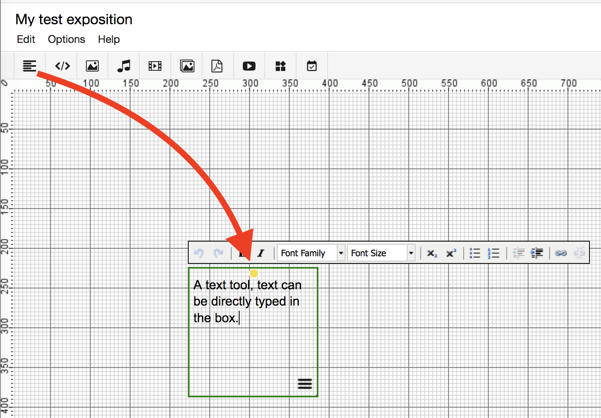

<!--pandoc -s tools.md -o tools.html -c style.css-->

# Workspace editor

## The workspace grid

The gridded area, called canvas, is where you create and edit your content. There are a number of *tools* for adding different types of content (text, video, images etc..). A tool is created by *dragging* the icon (keeping the mouse button pressed) from the toolbar to the desired location on your canvas.

The alignment grid itself can be switched off or resized in the options menu.

The canvas area size is automatically adjusted: adding content will make it grow just enough for everything to fit.

Some tools look slightly different when editing, than in the final result. For example: an audio tools' control buttons only show up in the __Preview__. Use the __preview button__ (the eye symbol on the top right) to see what the final result will look like to the reader.

# Workspace Tools

## Adding a tool

A tool is created by [dragging](https://en.wikipedia.org/wiki/Drag_and_drop) the icon onto the canvas.

Tools can be resized by clicking and dragging the green borders with the mouse.

Tools can be rotated by clicking and dragging the yellow dot.

### Context menu

The context menu of a tool is reached by clicking on the menu icon (see below), or right clicking (Apple: CTRL+click) inside a tool. The only exception is the text tool, see text tool.

* __Edit__ (open edit dialog)  
Open edit dialog

* __Copy__/__Paste__  
Copy/paste objects

* __Bring to front__/__Bring to back__  
Organise which object is in front of another.

* __Lock__/__Unlock__  
Lock means that one cannot make any changes until unlocked again.

* __Delete__  
Delete a tool

## Key commands

There are a few useful key commands in the editor. Selected tools have a green border.

| __Key command:__                                         			| __Action:__						      |
| ------------------------------------------------------------- 	| --------------------------------------- |
| __ctrl + c__ 				 							   			| copy selected tools  					  |
| __ctrl + v__             								   			| paste 								  |
| __&#8984;(Mac) + a__ or __ctrl + a__ 				   				| select all tools on current weave   	  |
| __&#8984;(Mac) + click__ or __ctrl + click__ on object 			| select multiple objects one by one      |
| __backspace, delete__    		                           			| remove selected tools                   |

### Defaults

Defaults for styling and options can be set for a tool, by clicking it in the toolbar.

## Text Tool

A video tutorial about the text tool is found [here](https://www.researchcatalogue.net/view/273532/273533/0/937 "link to video tutorials")

The text tool is designed for quickly adding text. 

It has two states: when it is in *active state* you can change the
text, if you click outside of the tool, you can move the tool and
change its size. Double click inside of the tool to
start editing the text again. Content is saved as soon as you exit the
text editing state.

If you right-click the text tool, you can find some extra edit options
under __edit__.  You can also (while hovering over a text tool with
your mouse) click the (☰) menu icon and choose __edit__.

In comparison to the HTML-tool, the text tool allows you to edit your
text directly on the page. While the HTML-tool opens a new dialog
window. If you need more styling options, or want change the HTML source code of text, use the HTML-tool. A text tool can be converted to an HTML-tool via the menu option **convert to HTML tool**.

### Placing images on top of text tools

**Never place other tools (like images) directly on top of long text tools**. Because of small differences in how fonts are displayed within major browsers, and the fixed position of RC tools, this can result in text overflowing into those tools if the reader uses a different browser than the author that made the exposition. 

The issue is easily avoided by keeping to this rule: always start a new text tool below an inline image or tool:

### Scrollbars

 If the text within a text tool is longer than the tool height, a scrollbar will appear and part of the text is cutoff. Therefore (especially when copying from external editors) it is important to check that the tool has a large enough size (unless you specifically want a scrollbar).

### Style

See [style options](#style-options).

### Options

If a text is longer than its frame on the weave, a scrollbar is
generated automatically. You can control the visibility of the
scrollbar in __options__. The default setting is *automatic*.

### History

See [history](#history).

## HTML-Tool

The HTML-tool is used for advanced text editing. It is a
*what-you-see-is-what-you-get* rich text editor. Unlike the text tool,
you can only edit its content in a dialog box. 

You add the HTML Tool like any other tool: drag it with your mouse from the toolbar onto your canvas.

### Media

Text is edited in the __media__ tab. You can style your text using the buttons.

*! important: If you copy-paste your text from Word, Pages,
   LibreOffice, Google Docs or any other text editor, note that not
   all fonts and styles will show the same on every computer.
   A safer practice is to import the text without any formatting, and format it within RC.
   This can be done either by exporting your text as plain text and copy pasting from that version, or importing your document using the [document import](#import-word-documents-using-simple-media-upload)*

To enlarge the palette of text styling options, click on the first
button, __show/hide toolbars__. Opening it will allow you to insert lists, enumerations, tables,
citations. 

Another commenly used feature is the hyperlink button (it looks like a chain link). This can be used to insert [hyperlinks](https://guide.researchcatalogue.net/#hyperlinking) or [footnotes](https://guide.researchcatalogue.net/#footnotes) into your text.

The top right button opens the editor in fullscreen. Note: you will have to exit full screen mode to submit your changes, using the same button.

 

A few tips:

* Make sure the toolsize matches the length of the text within. If the text is too long, it will result in __scrollbars__.

* It is possible to add pictures or even iframes, but it is not recommended in most situations. Preferably media is added to the catalogue using the appropriate tools, to avoid the of risk external content going missing when it is removed by the original source.

* Be careful making very large texts within a single HTML tool, this may result in unexpected overlap when your exposition is viewed with another browser. 3 or 4 paragraphs per tool is a good average. If you do make a large HTML tool, keep a large margin at the bottom bordor.

* You can also choose the colour or the background of the text using the colour tools,
insert symbols and tables, and control the edits with the __show
changes__ option.

### Style

[> See style options](#style-options)

### Options

If a text is longer than its frame on the weave, a scrollbar is
generated automatically. You can control the visibility of the
scrollbar in __options__. The default setting is *automatic*.

### Templates

If you want to reuse the content of an HTML-tool, you can create your
own templates. This function can be found in the __media__ tab. After
finishing the edit of your template, click __save__ __as__ __new__
__template__ and give the template a name in the dialog box that
appears. To load a template, click __load template__ and choose one
from the list in the dialog box.

### Submit, Delete, Or Cancel

Finally, you need to exit the dialog window. If everything is the way
you want it, choose __submit__ and the text field will be loaded on
the weave. To discard changes to the content, cancel the dialog
box. If you want to delete the whole HTML field, including all content
in it, click __delete__. Unintended deletions can be restored via
__commands__ – __restore deleted tools__.
 

## Picture Tool

To add a picture, drag and drop the __picture__ icon from the tool
palette onto the weave. As with all other tools, a pop-up dialog
appears automatically and gives you the choice between "selecting" or
"adding" an item.

You can upload image files in the following formats:
*jpg, png, tiff, gif, psd, tga, bmp.* For uploading PDFs, please use
the PDF-tool.

To add an item, choose "add" and upload the object from your desktop
to the RC servers. Name the file and make a declaration of the
copyright holder. Once an image is uploaded it is also automatically
added to the simple media tab.

### Style

[> see style options](#style-options)

### Options

There are options available to change how images are resized in relation to the green border containing the image.
This is controlled by changing the size parameter, which can be set to:  

* __contain__ : make the image small enough to fit without changing the aspect ratio (__default__)
* __cover__ : crop part of the image that is not fitting (aspect ratio stays the same)
* __fit__ : stretch the image  (aspect ratio changes)
* __auto__ : let the browser decide which part should be cut off

You can also change the *position* within the border ie: top-left, right-bottom etc...

In __settings__ you are able to lock the aspect ratio. And you can allow readers to enlarge the image by
activating the checkbox "on click open image in popup.".

If you want to use a picture as a hyperlink, paste a URL into the field *on click
open link*. 

You can also set a *tooltip text* (a text that shows when the user 'hoovers' his mouse over the picture) for the image. Set the __show on hoover__ option to __plain text__ and enter your text in the box below.

You can also make the tooltip display the copyright info, by setting the __show on hoover__ option to __copyright__.

Please note, you can't change the copyright information in the "edit picture" window. To change the name or the copyright text, close the current dialog and go to the item in __simple media__ and click __edit__
(also double click) to open the __edit media__ dialog.

## Audio Tool

[> Audio tool tutorial](https://www.researchcatalogue.net/view/249652/249653)

As with the other tools, use the audio tool by dragging and dropping
the icon from the tool palette onto the weave. A pop-up dialog window
appears automatically and gives you the choice between "selecting" or
"adding" an item.

You can upload audio files in the following formats: *ogg, wav, mov,
au, mp4 audio container formats; mp2, mp3, aac, pcm a-law, flac audio
codec* formats. All audio file formats will be transcoded to mp3s with
256kpbs.

To select media they must first have been uploaded into "simple
media." To add an item, choose "add" and upload the object from your
desktop to the RC servers. Name the file and make a declaration
of the copyright holder. After adding the file, you can edit the style
of the audio player with the html style standards and choose between
different play and display options.

Please note, to be used on our server, all media will be transcoded by
the RC. This takes some time. During the transcoding process, the file
name is greyed out in simple media. After the transcoding process has
been finished you will receive an email notification that your media
is transcoded and ready for use. For further information and technical
questions see [FAQ 2.6](http://www.researchcatalogue.net/portal/faq "FAQ") or
contact the RC User Support.

 
### Style

[> see style options](#style-options)

 

### Options

The audio player has a number of settings:

* __loop__
Will loop the playback when it reaches the end of the file.

* __autoplay__ 
The player starts to play back the file as soon as the
page has been loaded.

* __stop other players__ 
If you are using multiple audio (or video)
players on the same weave and your page is quite big, visitors may
find it helpful if you prevent overlapping by defining which player is
playing. With this option selected, all players (video player, audio
player on slideshows, other audio players) will stop when the selected
player is playing back a file. When simultaneous playback is desired, it
may be helpful to use the [Play-tool](#play-tool "jump to play tool
help").

* __display minimal__ When selected, the player consists of only the
play button and bar.  You can also define some visual player
settings. You can hide the whole menu bar or you can set the
visibility of the volume or define if you want a player with as few
options as possible.

As in the picture tool, if it is necessary to give textual information
about the sound file, you can enter the text to be displayed when the
mouse cursor hovers over the item.

## Video Tool

[Video tutorial](https://www.researchcatalogue.net/view/273532/273533/623/1369)

As with the other tools, you can use the video tool by dragging it
from the tool bar and dropping it onto the weave.

In the dialog box that appears you have the possibility to add
(i.e. upload) items from your computer or select items from the
"simple media" folder.  At the moment, the RC supports the following
formats: *avi, mov, mp4, mpg* video container formats; *dv1394, h.264,
mpeg2, mpeg1, mjepeg* video codec formats. Both VBR and CBR are supported.

The video tool currently supports resolutions up to 2048x1080. If the resolution is higher, transcoding will fail. Please keep this in mind while uploading videos shot on phones, which commonly provide up to 4k resolution.

To add an item, choose "add" and upload the file from your desktop to
the RC servers. All videos uploaded in this way will also be added to
the simple media tab. Name the file and make a declaration of
the copyright holder. 

After adding a video, the player will not appear in the workspace editor, to view it, please click PREVIEW at the top right corner of the editor.

All media will be compressed to a smaller size, this is
called 'transcoding'. This process takes time. During the
'transcoding' the file name is greyed out in your simple media. If you want, the RC can also sent you an email when transcoding has finished.
You can find that option under [__profile, settings__](https://www.researchcatalogue.net/settings).

For further information and technical questions see
[FAQ](http://www.researchcatalogue.net/portal/faq "FAQ") or
contact the RC User Support.

We highly recommend using smaller video files, for easier upload. If your file is extremely large, you may want to compress it before uploading using a program like Handbrake, FFMpeg or QuickTime (Mac).

### Style

[> see style options](#style-options)

### Options

The video player has a number of options:

- __loop__
Loops the video when it reaches the end.

- __autoplay__ 
The player starts to playback the file when the page is loaded. 

- __stop other players__ 
If you are using multiple video players on
the same weave and your page is quite big, visitors may find it
helpful if you prevent overlapping by defining which player is
playing. With this option selected, all players (video player, audio
player on slideshows, other audio players) will stop when the selected
player is running a file. When simultaneous playback is desired, it
may be helpful to use the [Play-tool](#play-tool "jump to play tool
help").

- __display minimal__ 
When selected, the player constists of only the
play button and the bar.

As in the picture tool, if it is necessary to provide textual
information on the video file you can choose to display plain text or
copyright information that will appear when the mouse cursor hovers over the
item.

You can also use the play tool to synchronize selected video and audio tools.

## Slideshow Tool

The slideshow tool allows you to create a gallery of images that can
be displayed in a loop. You can choose to start the slideshow
automatically and you can add an audio file to each picture of the
slideshow.

Drag and drop the slideshow icon onto the weave and the dialog window will appear.

To be able to select media you first have to upload an item into
__simple media__ or select media files from your works. To add an
item, choose __add__ and upload the object from your desktop to the RC
servers. Name the file and make a declaration of the copyright
holder. After adding the file, you can edit the style of the picture
with the html style standards. To add a sound file to the slide, the
file first needs to be uploaded to simple media.

### Style

[> see style options](#style-options)

### Options

In "options" you can define the position of the image within the
frame. This is important when you are using images with different
sizes and proportions. In __settings__ it is possible to choose to
loop the slideshow. If the __loop__ option is enable, the slideshow
will continue with the first slide once it reaches its last slide. You
can choose to hide the navigation bar or give the reader the option to
enlarge the picture with a click on the picture in your weave.

In __automate__ you can set the autoplay options to:

* *run after click* : run automatically after the first click 
* *autoplay* 		: after loading the page

When choosing *autoplay* you need to define the speed with which the
slide will change. You can customise the duration of each slide
(*speed per slide*) or let each slide change at the default speed.

As mentioned before, you can append audio files to each slide. Please
note, you first have to upload the file into your __simple media__
folder. In __options__, __audio__ you can control the time of a
crossfade (when one audio file fades out while a second fades in at a
specified time). You can also choose the fade duration and the timeout
of an audio file.

## PDF Tool

The PDF tool gives you the possibility to upload PDF documents containing texts, graphics or scores. 

The advantage of PDF is that the display of its content is platform independent and looks the same everywhere. 

The limitation is that PDF files, by nature, only support static (printable) graphics, not video or audio. In case text from a word processor needs to be combined with video and audio, use the [HTML tool](#HTML-tool "link to html tool") for the text and add the media separately using the other tools.

### Uploading a pdf

After dragging the icon to the weave, a dialog will show.  
Click the button __ADD MEDIA__ to open the dialog for uploading a PDF.  
Be sure to upload the PDF itself in the __PDF__ field, not __PREVIEW__.
One is also requested to add copyright information.
When done, click submit and the file will begin uploading. 

The __PREVIEW__ field is for changing the image that represents the pdf in the exposition for the reader.
If no preview image is provided, a miniturised copy of the first page will be used.

#### A few notes

* __Do not re-use the url__ of the pdf file that opens when you click the pdf tool.
For example: "https://media.researchcatalogue.net/rc/master/73723.pdf?t=2629205589&e=1510816850" 
These (timed) links are automatically generated by the PDF tool specifically for the user that views the tool and are automatically invalidated after use.

* On iOS devices, rotated PDF tools will not open when touched.
 
[> see style options](#style-options)

 
### Options

The RC gives you and your reader the possibility to read the pdf
directly in the browser if the browser supports this. To use this
option check "display in browser" in option > settings of the "edit
pdf" tool dialog box. 

You can also double click the PDF tool and then switch to the options tab.
Then click settings.

As in the picture tool, you can provide further
information using the hover option. To do this, select one of the
options in the "show on hover" pull-down menu. In addition, you can
create a plain text to be displayed when the reader's mouse hovers
over the PDF preview. To use this, choose "plain text" or "copyright &
plain text" from the pull-down menu and write your text in the text
field below.

## Play Tool

The play tool is designed to synchronize the playback of selected
video and audio tools on the same weave. With this tool one can create
a single control for playing back various media files at the same
time. This can, for example, be used to document video installations
with multiple screens and allows playing back synchronized
combinations of musical voices and audio tracks. The play tool
displays an image which can be clicked and functions as play and pause
button. Clicking the image will start the playback of the selected
audio and video files. While playing the tool another image will be
displayed instead. Clicking this image will pause the players.

### Media

In the media tab one can upload two image files. One image will be the
play­-placeholder, i.e.clicking the image will initiate the playback of
the selected files. The other image will be the pause­-placeholder,
i.e. clicking this image will pause the selected audio and video files
on the weave.

### Options

In the options tab one can select from among all audio and video files
on the weave. These must have been uploaded first with the audio and
video tools. The selected files will be controlled with the play
tool. The option “pause other players when playing” will ensure that
only the selected media files will be played back.
 

## Shape Tool

The Shape tool is designed for placing simple graphic elements
such as arrows and lines in your exposition. You can generate forms to
structure your layout or to help navigation. You can create
rectangles, circles and lines. You can choose if they're filled or
not. You also have the possibility to specify the thickness of the
frame and control the opacity of the elements. There are also four
types of arrows (left, right, up, down). You can resize the elements
on the weave by resizing the green frame displayed around the
shape. By clicking and dragging the yellow point you can rotate an element.
 

## Note Tool
 

The note tool allows you to organize your work on RC, comment on
sections, and communicate with co-authors. Drag the note icon from the
tool-pallett onto the weave. You can write directly into the note
without opening a new edit-window. Each note has a time-stamp which is
generated when the note is placed on the weave. 

It is possible to define who is responsible for the content (a
change or revision, correction) of the note and you can set a date
for resolving the issue described in the note.

Notes are visible on the preview as well. Please check, that all notes
have been removed from the exposition when you intend to share or
publish it.

### Text Style Options

You can use the buttons to directly add the basic stylings,
eg. highlight it with bold or italic font or structure it with
numerations or lists. You can change the font-family and increase or
decrease the indentation. You can also insert links.

### History

"History" provides a log of all changes that have been made to the
tool. If you have unintentionally deleted a tool, you can restore it
using "restore deleted tools" in the commands.

## Embed tool

The embed tool allows the integration of external content, such as
videos or sounds, into RC expositions. Currently, the RC supports the
following external content providers:
[Madek](https://www.zhdk.ch/madek), Youtube, Vimeo, Soundcloud and
Sketchfab. 

The embed tool can be used by pasting the link from the page you want
to embed in the URL field and clicking submit twice.  The first submit
initiates the processing of the link. How to retrieve the correct
embedding link depends on the service. The main URL visible when
opening the media content that is to be embedded can be used by the RC
for the above mentioned services. Please contact
[support](mailto:support@researchcatalogue.net) if you have trouble or
questions regarding the necessary URL.

Content from Youtube and Soundcloud can be used in the play tool and
the playback can be synchronized with native RC tools.

Content from Madek needs to have been made publicly visible before
embedding is possible. Please copy the sharing link from Madek into
the URL field of the embed tool.

Important: Some RC-based journals/portals do not allow the use of
externally hosted materials. If you are making an exposition to be
published in such a portal, please check their policy first.

<!-- ## Object Viewer

The object viewer tool is a designed for displaying three-dimensional
images. Is is based on the
[3DNP library](http://thoro.de/page/3dnp-introduction-en "3dnp").  By
dragging the object with the mouse cursor it can rotated around two
axis, i.e. the object can be turned around its centre and tilted back
and forth.  It is necessary to upload a series of images as a zip
file. These images need to be numbered (i.e. image001.jpg,
image002.jpg etc). Each image must the object from a different
angle. You can imagine the creation of the images as the following
process: the object rotates around a vertical axis in a number of
steps, then moving slightly around a horizontal axis and rotating
around the vertical axis in a number of steps again. This is repeated
until an image of every combination of vertical and horizontal
positions has been created. The number of different angles (steps of
rotation around the horizontal axis) is defined by the setting
"levels" in the dialog window. The number of steps of the rotation
around the vertical axis is implicitly defined by "levels" and the
total number of images. -->

## Style Options

The style tab allows you to set the way an object looks on the outside.
There are two ways of reaching the style tab:

* by double clicking on a tool in the editor
* click __style__ in the tabbar

or 

* hoovering with your mouse over the tool
* click ☰ -> __edit__.
* open __style__ tab in the dialog.

Click on the small ">" to open one of these sections:

* position & rotation
* padding
* border type, color and width
* background (color or image)
* shadow
* opacity

The style tab only sets the basic (mostly external) style of the
object, text markup is done within the text or html tools.

### Change tool defaults

It is possible to change the default styling settings for any tool, by double clicking the tool in the toolbar.
After the default is changed, every newly created tool will initially use these new settings.

## History

The *history tab* gives you the posibility to change the content
__within the tool__ to an older version.  The versions of a text
object are created each time you have clicked outside it (and the
three animated dots show inside). With the html tool, a version is
created each time you click submit.

