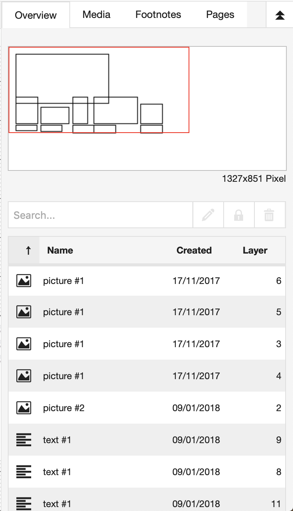
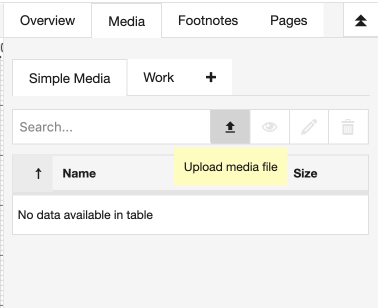

# Content manager

The content manager is located on the right size of the canvas.

* overview - all objects in the current weave
* media - media files used in this exposition 
* works - media files listed on your profile as works
* pages - a list of all the different pages (pages)
* footnotes - a list of rc [footnotes and popovers](#footnotes-and-popovers)

# Media management 

Media files can be found, uploaded, previewed and deleted in the
"Media"-tab on the right hand side. There are subtabs: __Simple Media__,
__Works__ and __"+"__, which allows the integration of external repositories,
such as the Media Archive of the Arts of the ZHdK (Madek).

## Simple Media 

The simple media, which can be found within the "Media"-tab on right
hand side of the editor. Images, videos, audio and other media that
have been added in tools onto the canvas will automatically show up in
simple media tab. You can click and drag files from the simple media
tab onto your canvas in order to create tools.

The list of media files can be sorted by type, name, creation date and
size and you can search for a file name by using the search field.

Files that are listed in gray are in the process of being transcoded.

There four buttons on top of the list of files, from left to right:

- Upload a file
- Preview a file
- Edit meta-data of the file
- Permanently delete a file from the RC (use with care)

## Import Word documents using Simple Media upload.

It is possible to upload docx/odt/LaTeX documents and have the content automatically 
be turned into HTML tools and image tools. 

To convert a document, open the Simple Media Tab and upload it in the "document" section of the upload dialog. It may take a few moments to convert after the upload has reached 100%.

Once converted, the document will show up as a folder within your simple media. 
You can drag the elements from this folder to their final desired location in the exposition and resize them to the size you desire.

To ensure maximum compatibility with RC fonts and styling, 
text-editor specific styling is automatically filtered, but the inner structure of the text is maintained.
This includes: paragraphs, headers, bold, italics, footnotes, illustrations & tables.
Footnotes are also converted into RC Footnotes/Popovers. Afterwards, one can use raw CSS (also see below for more details) to add styling again, without the need to style each structural element individually. It may thus still be necessary to import certain elements by hand after the import.

The document is split at illustrations, or after a significant amount of text. 
This to avoid extremely long text tools, which result in problems between browsers 
and are harder to handle in the graphical editor. The splitting should also make it easier to restructure the document a bit to a more fitting layout to the RC. Because of the graphic and non-linear nature of RC expositions, a 1 on 1 import does not make so much sense.
If your documentation requires a more traditional text-based layout (think article/blog post), it may be better to use the text-based editor,
which also supports importing from external text editors.

### Important note regarding styling:

By default, RC has zero margin on all paragraphs, this will mean that there is no whitespace between paragraphs. To avoid this issue,
I recommend adding the following style to your [raw CSS](#page-settings---style "link to page settings docs") settings of your page where you import word content. 

`#container-weave .html-text-editor-content p {
    margin: 1em 0; /* set top and bottom margin to 1 */
}`

`#container-editor .html-text-editor-content p {
    margin: 1em 0; /* do the same for the editor */
}`

This makes sure paragraph margins are displayed correctly.

## Works

Like simple media, works that have been added through your "My Profile Page" can also be dragged and dropped onto the canvas. Read more about adding works to your RC profile [here](#add-work).

## Pages

Pages are managed in the __pages__ tab of the content manager. An RC exposition can consist of one or more pages. A new exposition starts with a single page, called "default page".

### Creating a page

New pages are by default *private*, they have to be explicitely added to the [table of content](#table-of-content "table of content") to be visible (or by making a [hyperlink](#hyperlinking) to the page in your own content). The order of pages cannot be changed in the pages list, but it can in the table of contents. The page will automatically change size based on the content.

### Entry page 

One can change the first page visible to the reader by changing the __entry page__. Go to the menu __options__ and choose __edit meta data__. Scroll down to __"entry page"__ (at the bottom of the dialog) and select the page you want as your start page for the reader. 
<!-- This should be in table of contents, it is completely out of place in meta-data -->

### Page settings

]

In the page settings dialog, you can change the meta data of the page and control the appearance.
It is opened by clicking the pencil button in the bar.

#### Page settings - Meta : title, description and iframe field

* __Page title__\
Set a title for the page. This title can be overriden in the [table of content](#table-of-content), so the reader sees a different one. This can be useful if you need to keep track of different versions of pages.

* __Description__\
The description is for personal reference and only visible to the author and collaborators on the exposition.

* __Iframe field__\
Replace the entire page by an external website by means of a URL.
There are a few requirements to the URL for this to work:

	* For reasons of security, the website needs to be configured to use a [TLS connection](https://en.wikipedia.org/wiki/HTTPS "https on wikipedia"). Links with TLS enabled can in most cases be identified by the __https://__ instead of __http://__ at the start.
	* You need to provide the full URL (inlude the https:// at the start).

	Please note that if a correct iFrame url is provided, the entire weave within the exposition is replaced by that website, so any tools and page styling present in the workspace will no longer be visible to the reader.

	If you want to combine external content with tools you should use the [embed tool](#embed-tool).

#### Page settings - Style

Here one can change:

* __margin__: If set, it will make the exposition as if is seen through a smaller window.
* __padding__: Padd extra space on the content itself (for example if you set top and left to 100, it will create extra space on the top and left). In other words, this makes the exposition canvas itself larger.
* __background__: change the color or set an image as background.
* __links__: change the default color for all hyperlinks within the page. One can set seperate colors for links the user visited.
* __footnote__: The color of footnote/popover links same as links, but then for links of footnotes/popovers.
* __raw css__: You can set user defined [CSS](https://www.w3schools.com/css/ "css tutorial") rules that are applied to the whole page.

### Deleting a page

The page can be deleted by clicking the trashcan icon next to the page title. Deleted pages cannot be recovered. Of course, if you want to make a page invisible to the reader it may be prefered to just remove it from the [table of content](#table-of-content "table of content").

