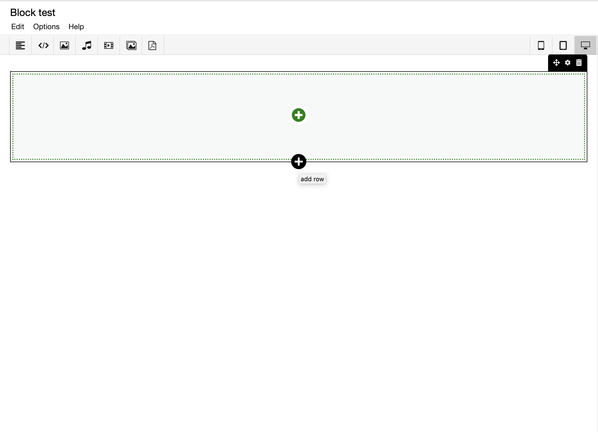

## Block Editor (will become available soon!)

The _block editor_ is a recent feature to the graphical editor of the
RC. It allows the author the same tools as the existing graphical
editor, but instead of positioning content absolutely (using 2d
coordinates), content is structured as a list of rows and columns. The
positioning of content is relative: the bottom of the previous tool
determines where the next one starts, like lego bricks. Because there
are no absolute positions, the display of the content can be optimized
for the screen size of the reader. This strategy is also known as
[responsive web
design](https://en.wikipedia.org/wiki/Responsive_web_design).

### When to use

The block editor is most suitable for:

* exposition content that needs to be readable on a phone
* expositions where the content forms a block:
  - text with inline media
  - text with media that should be next to a certain position in the text

The block editor is less suited for:

* diagrams
* maps
* timelines

Certain tools (Sync, Shape) for example, can only be used in graphical
pages, since they do not make much sense in a block page.

The __block editor__ provides functionality similar to __text-based editor__ 
(which is also responsive), but the
difference is that you can more easily create horizontal rows of
content and the editing is drag and drop, using the same tools as the normal editor.
This also means that both type of page can be used in a single exposition.

### Basic structure: rows and columns

A block page is organized as a list of boxes which are called
__rows__. A row is created by clicking the black __+__ at the bottom of the previous block.

You can then choose a certain column layout for this block:

Within each __row__, you can have one or more __columns__
of __cells__ dividing the content in that row. You can think of it as
a table, except that the number of columns is allowed to be different
for each row. Within a __column__ you can drag-and-drop any number of tools,
although it is probably a good idea not too have too many in one
column, since this will make it harder to change layout afterwards.

You can add tools by clicking the green "+" sign, or dragging them from the toolbar:

The default is 1 column in the row, in which you are basically just
editing a list of tools. When you create or drag and drop new tools in
the column, they will be added to bottom of that column.

You can change the layout, move or delete the row by using the black controls on the right top:

### Editing

You can move tools by dragging and dropping them from one cell to the
other.  Dropped tools will never replace tools, they will insert at
the bottom of the current cell.

### Viewing 

On screens that are very narrow, the content will automatically break
into a single list again, without objects next to each other.

### Future

It will become possible to make two versions of the same content, a 2d
graphic and a 1d block like layout. This way the exposition content can
automatically select the right format for the screen it is being
consumed on.
