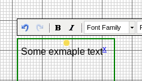
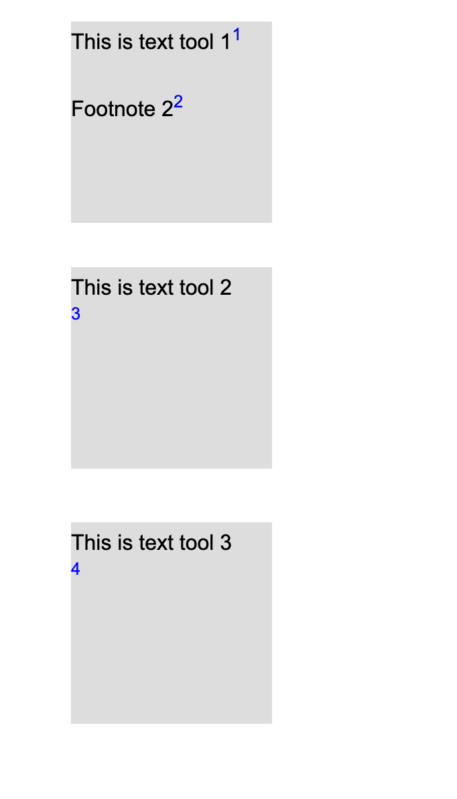

## Popovers

__Popovers__ are footnotes that pop up. They provide a way to present additional
content in your _graphical_ and _block_ pages without cluttering the page. The
popover appears when the reader clicks/hoovers over the popovers' activation
hyperlink. Instead of as hyperlink within text, you can also make them show up
on hoovering a particular image tool.

The content of a popup is edited in the same way as graphical pages.

**Naming**: Inside of the RC, __Popovers__ may still be refered to as
__Footnotes__ in certain places: there is no difference in functionality.

A common use for __Popovers__ was to make bibliographical references that pop up
in the text. however, the RC also has a dedicated [__reference
feature__](#references) for that now, that will also generate a bibliographical
list on the metadata page.

### Creating a popover

Popovers can be created in two ways:

1. As a hyperlink within text tools
2. Linked to an image tool

To create a popover within a text tool, open a __Text__ or __HTML tool__ and
select a piece of text. After this, click the hyperlink button </img>,  this will open a dialog: 

 

Now choose the second tab __"footnote"__ to create a new __popover__.

To link a __popover__ to an image tool, right click the image tool and select
__"add footnote"__.

### Customizing the popover properties

You can customize the popover by setting the following properties:

* The title of the popover.
* Whether the popover will be shown when the link is clicked or on mouseover
  ("View on").
* Where the popover will be displayed with reference to the link or the screen
  in case of the last option ("screen center").
* Whether the background (i.e. the rest of the exposition) will be darkened when
  the popover is being shown.
* The type of the popover. This can be:
  + A new popover.
  + The copy of an existing popover.
  + A simple text popover. A small text box appears which facilitates the
creation of popovers containing only a short amount of text. The text can be
entered here directly upon creation without the need to further edit the popover
and adjust its size. 

### Editing a Popover (footnote)

All popovers are listed in the "Popups" tab on the right hand side. If you click
one, the RC will automatically scroll to it's reference in the text or image
tool.

The list has the following actions:

<table>
<tr>
<th> Icon </th><th>Function</th>
<tr> <td> </img> </td><td> opens the popover workspace editor where you can edit thecontent of the popover </td> </tr>
<tr> <td> </img> </td> <td>opens a window which allows editing the title, size, and styling of the footnote.  </td> </tr>
<tr> <td> </img> </td><td> delete a footnote </td></tr> 
</table>

Within the popover editor, you can resize it by dragging its corner.

__"simple text"__ popovers are in fact automatically generated normal popovers
with your text inserted in a text tool. This has consequences if you want to
adjust the size of a __"simple text"__ popover as a whole, since you would also
need to change the size of the tool within that popover after resizing. To edit
a "simple text" popover internal tools, simply double click it in the popover
list.

### Changing the position or display settings of a footnote

If you need to change the screen position or display settings of an existing
footnote, the best way is:  

1. Go to the Footnote tab.
2. Click the footnote you want to change.
3. Click Edit Settings ("pen") icon.
4. Go to the options tab.

### Auto-Numbered Footnotes

Instead of using text as footnote links it is also possible to use numbered
links. The numbers will be filled in and adjusted automatically. In order to
create auto-numbered footnotes create a footnote in the text or HTML tool as
described above but without selecting any text. An "x" will be inserted where
the cursor is placed. This "x" will be replaced by the correct number when the
text is displayed. 

The numbering starts at 1 and encompasses all text and HTML objects on the
weave. Numbering is performed by object and proceeds from the top and left to
the bottom and right of the page. 

Be aware that automatic numbering does not depend on creation order, it only
depends on x and y position of the tools. This means that if the notes (1,2,3
etc..) are in a vertical column, for example:

<figure>
<figcaption>Footnote numbering in correctly vertically-aligned tools</figcaption>
</figure>

When the tools are lined up like this, footnotes are correctly numbered.
However, if one of the text tools containing an automatic footnote in a column
is just a bit (even 1 pixel) to the left, like so (exaggeration):
 
<figure>
<figcaption>Incorrect auto-numbering in non-aligned tools</figcaption>
</figure>

Then RC will automatically number the notes in 2 first, then 1, then 3. In this
case, it is very important to have the text tools exactly at the same x position
(through right click -> style tab you can check this most easily).

### Pictures 

It is also possible to use images as links to footnotes. When clicking on the
image or moving over it with the mouse cursor the popover will be show. In order
to use an image as a footnote click the menu icon on the bottom right of the
image (or right click the image) in order to open the context menu. Click the
item "add footnote" from the context menu and fill in the appearing dialog
window. 

## References 

The reference feature allows you to build a bibliography for your exposition. It is available for both _graphical_ and _block_ pages.

### Creating a reference

You can create a new reference by going to the Ref tab, which is located on the
right-hand side of the workspace editor. Click the + button to create a new
reference. A dialog will open with a form to enter the reference data.

Alternatively you can also import references from external managers (for
example: Zotero, Menderley & Jabref). The format used is
[BibTeX](https://www.bibtex.com/). You can also import multiple reference items
in one go.

The RC currently supports the following reference types:

- Book
- Chapter (of a book)
- Journal (article)
- Website
- Master Thesis
- Phd Thesis
- Proceedings
- Video
- Score
- Artwork
- Recording
- Exposition
- Misc

Each item will have different fields. Fields marked with * are required. In case
none of the types fit, you may choose to use Misc, which stands for
miscellaneous.

### Inserting a hyperlink to reference in bibliography

In the HTML tool, there is a button which allows you to insert a direct link to
a reference in your bibliography. The reference will both show on hover and when
the user clicks, one can view the full bibliography.

By default, this type of link is constructed from the last name of the first
author and the year. You can customize the text of the link by selecting it and
typing over it, for example to include a page number. The links will use the
default hyperlink color, that can be customized in the __Page__ settings page.

### Viewing the references

References are listen on the META page of an expostion, at the bottom. 

