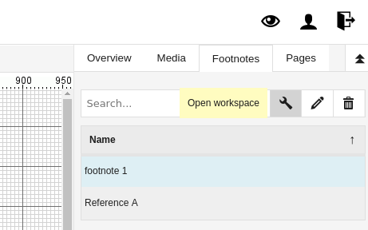
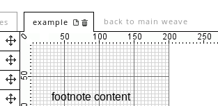
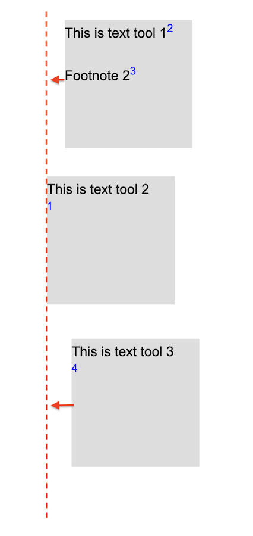

# Graphical Editor - Footnotes and Popovers

It is possible to create footnotes and popover weaves in the text,
HTML and picture tools.  The terms "footnote" and "popover" are used
almost interchangeably here. Footnote, however, refers rather to the
textual concept of a footnote, i.e. a particular use of the
functionality explained in this section, whereas popover is used when
referring specifically to the appearing popover window.  (There is a
tutorial video explaining the footnote workflow on the
[RC Video Tutorials page](https://www.researchcatalogue.net/view/273532/273533))
These are displayed when the RC user reading the exposition clicks the
footnote link or, depending on the settings, when moving the
mouse pointer over the link. This functionality makes it possible to
create footnotes in texts, but also create popovers of any size
containing RC objects of any type. There are a number of different
ways of creating footnotes.

## Creating a Simple Text Footnote

In order to create a footnote in the text or HTML tool one selects some text, which will be the footnote link and clicks the "Insert/Edit Link or Footnote" menu item (see image).

A new footnote can be created by using the left tab in the appearing
dialog window. In this window one can set:

* The title of the footnote.
* Whether the popover will be shown when the link is clicked or on
  mouseover ("View on").
* Where the popover will be displayed with reference to the link or
  the screen in case of the last option ("screen center").
* Whether the background (i.e. the rest of the exposition) will be
  darkened when the popover is being shown.
* The type of the popover. This can be:
  + A new popover.
  + The copy of an existing popover.
  + A simple text popover. A small text box appears which facilitates the creation of footnotes and other popovers containing only a short amount of text. The text can be entered here directly upon creation without the need to further edit the popover and adjust its size. 

Finally, click "Add Footnote" to confirm and create the footnote, which will subsequently appear in the list of footnotes on the right side of the screen. 

## Editing a Footnote

All footnotes are listed in the "Footnotes" tab on the right hand side.

There are three icons displayed on the top of the list. The first icon
opens the footnote workspace editor where you can edit the content of
the footnote, the second icon opens a window which allows editing the
title, size, and styling of the footnote. One can leave the footnote
weave editor by clicking the link "back to main weave" displayed to the left
of the main tab. (see image).

__"simple text"__ footnotes are in fact automatically generated normal footnotes with your text inserted in a text tool. This has consequences if you want to adjust the size of a __"simple text"__ footnote as a whole, since you would also need to change the size of the tool within that footnote after resizing. To edit a "simple text" footnote internal tools, simply double click it in the footnote list.

When you are done editing: you can return to your main weave through the link in the top of the editor.

### Changing the position or display settings of a footnote

If you need to change the screen position or display settings of an existing footnote, the best way is:  

1. Go to the Footnote tab.
2. Click the footnote you want to change.
3. Click Edit Settings ("pen") icon.
4. Go to the options tab.

### Auto-Numbered Footnotes

Instead of using text as footnote links it is also possible to use numbered links. The numbers will be filled in and adjusted automatically. In order to create auto-numbered footnotes create a footnote in the text or HTML tool as described above but without selecting any text. An "x" will be inserted where the cursor is placed. This "x" will be replaced by the correct number when the text is displayed. 

The numbering starts at 1 and encompasses all text and HTML objects on the weave. Numbering is performed by object and proceeds from the top and left to the bottom and right of the page. 

Be aware that automatic numbering does not depend on creation order, it only depends on x and y position of the tools. This means that if the notes (1,2,3 etc..) are in a vertical column, for example:

<figure>
<figcaption>Footnote numbering in correctly vertically-aligned tools</figcaption>
</figure>

When the tools are lined up like this, footnotes are correctly numbered. However, if one of the text tools containing an automatic footnote in a column is just a bit (even 1 pixel) to the left, like so (exaggeration):
 
<figure>
<figcaption>Incorrect auto-numbering in non-aligned tools</figcaption>
</figure>

Then RC will automatically number the notes in 2 first, then 1, then 3. In this case, it is very important to have the text tools exactly at the same x position (through right click -> style tab you can check this most easily).

### Pictures 

It is also possible to use images as links to footnotes. When clicking on the image or moving over it with the mouse cursor the popover will be show. In order to use an image as a footnote click the menu icon on the bottom right of the image (or right click the image) in order to open the context menu. Click the item "add footnote" from the context menu and fill in the appearing dialog window. 

