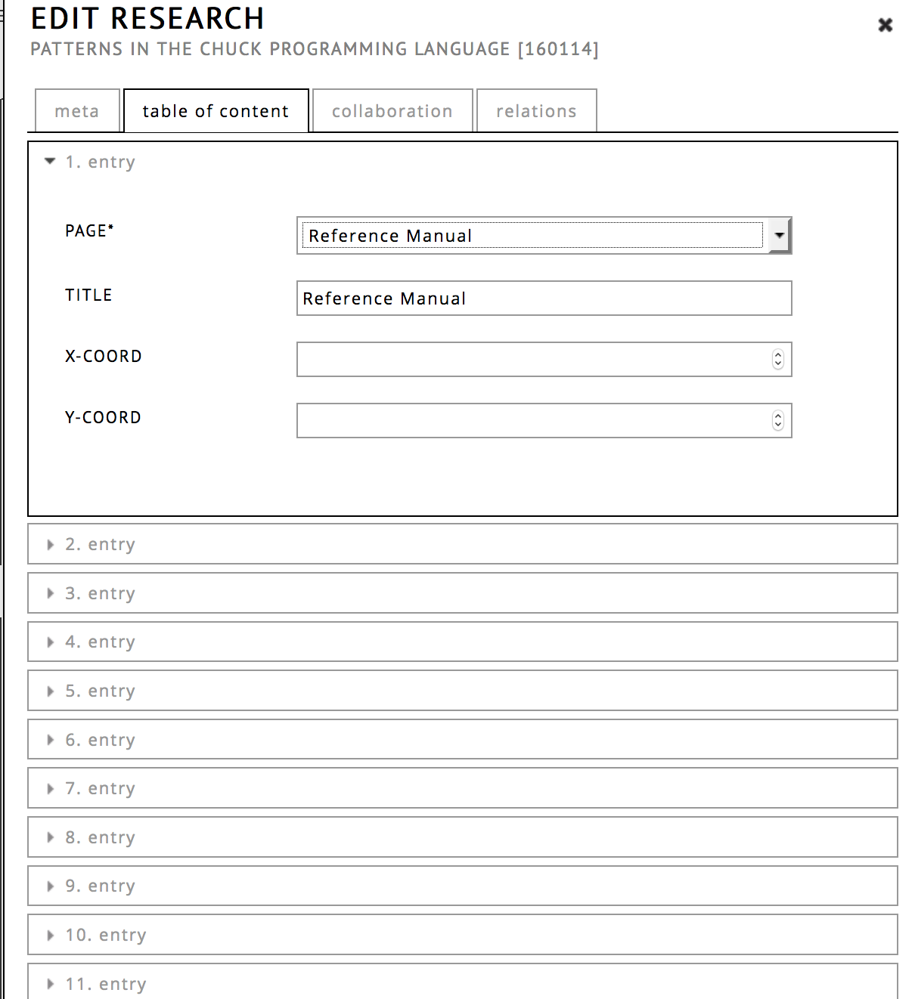

# Graphical Expositions - Table of Content

See the [video tutorial](https://www.researchcatalogue.net/view/273532/273533/54/759) on this topic.

The table of content is designed to facilitate the navigation through
an exposition. Both pages and locations within a page can be added in the table of content.
In order to edit the table of content, go to the __"Options"__ menu > __"Edit Table of Content"__. 

To make a new entry, click on the index number and select the page (or "weave") from the drop down menu and click submit.

There are two optional fields:

* __Title__\
Specify a custom name for this entry to be used within the contents menu.
If left empty, it uses the title from the editor.

* __X-COORD & Y-COORD__\
you can use this to create an entry that has an offset, which immediately opens the page on a specific location within the exposition. The X,Y values correspond to an offset in pixels. The Y offset is measured from the top. Instead of looking these values up by hand, you may also use [__commands -> show current position__](#set-default-position-show-current-position).

*Tip: you can easily reorder the table of contents entries by clicking and dragging the boxes.*

### Static navigation bar

At the bottom of the __table of content__ dialog, there is an option __static menu bar__ to display the navigation bar continuously (instead of it automatically hiding).

### TOC alignment

Choose wether the links in the content menu should be displayed *horizontally* or *vertically*.

## Hyperlinking

See the [video tutorial](https://www.researchcatalogue.net/view/273532/273533) on this topic.

It is possible to create hyperlinks between pages (or "weaves") of an
exposition and within a single page. This process exists of two steps: 
fetch the link and creating the hyperlink.

In order to fetch a link to a different page within your exposition:
  
1. open the page you want to link __to__ in the editor
   (through the page tab on the right hand side).
2. *(optional)* scroll the page to the position where you want the link to point to.
3. go to __options->show current position__

This will display a URL of the target page with the current scroll location. Copy the URL
into the clipboard (Ctrl-C/Cmd-C). 
 
Now to turn a piece of text into a hyperlink:  

1. Create or open a [Text](#text-tool) or [HTML tool](#HTML-tool) and select a word or sentence that should become the link.
2. Now click the hyperlink button (it looks like a chain link) and a dialog will be displayed.

3. Paste the link in the __link URL__ field and click __add link__.

### Dialog options:

Within the hyperlink dialog there are a couple of options:

* __Link URL__ : here you can type or paste a link 
* __Target__ : control wether the link will open in a new screen or not.
* __Title__ : change the title of the link
* __Class__ : set the class of the link (this is rarely used)

## Overview

Within the "Commands" tab on the right-hand side of the editor there
is a checkbox labeled "Overview." Clicking the checkbox will open
and close a tab on the right-hand side of
the editor. It contains both a map and a list of all objects in the exposition.

The overview map outlines all tools on the page, their size and position. By moving the red rectangle, one can jump to a specific position on the page.

Below the overview map, there is a list of all objects. If you click one of these tools, you go directly to that tools location. This can also be very useful when trying to find tools that have somehow become hidden, for example if another tool has been placed on top.

# Graphical Editor - Menus

## Edit menu

__Trivial copy paste functions:__

* cut - ctrl + K
* copy - ctrl + C
* paste - ctrl + V
* duplicate - ctrl + D
* delete - delete (Apple: fn + backspace)
(ctrl = cmd on Mac computers)

__Order functions:__

* bring to front
* bring to back

These options change the order of objects if they overlap. Order can be important if you have tools with controls: for example, an audio player that is behind a text tool would need to be in front to allow the user to click the play button on it.

__Locking:__

* lock 
* unlock

Locking an object means it cannot be changed or moved in any way (until it is unlocked). This feature can also be used if only part of the exposition is to be moved (by locking the objects you do not want to move). 

## Options menu

### Edit metadata

Here you can edit the Title, Abstract and Entry Page of the exposition.

### Show tool borders

When this option is turned on, you will be able to see all borders of all tools (green dashed line) in the editor.
This can be helpful searching for empty tools.

### Edit table of content

Here you can set the contents of the "contents menu" that the reader uses to navigate between pages and position in your exposition.

See [table of content](#table-of-content).

### Grid options

* Snap to grid

Objects will only move in grid-size steps

* Show Grid

Show/hide the grid

* Grid size

Change the size of the grid

### Set default position

Change the initial position that the reader starts at in the weave, to the current location of the editor view.

### Show current position

This provides the X,Y offset of the editor and a position link.
X,Y can be used in the Table of content.
The position link in Hyperlinking, or simply to share a specific position through a position link.

### Restore deleted tools

Restore recently deleted tools.

### Restore deleted footnotes

Restore recently deleted tool.

## Help menu

Get help!

* this guide
* the forum
* the video tutorials

## Send Collaboration Message

When you are collaborating on an exposition, you can use the command
"send collaboration message" to communicate with your collaborators.

