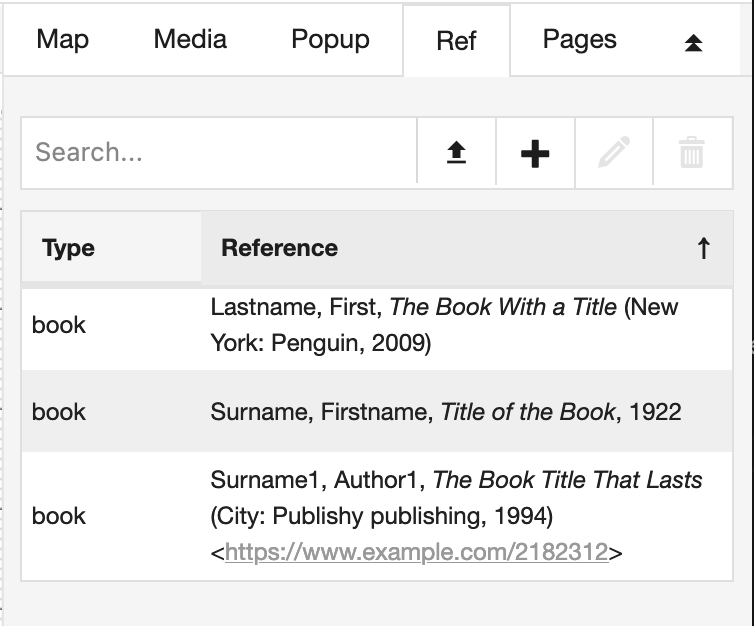

# References

The reference feature helps you build a bibliography for your exposition.
The RC currently supports the following types:

- Book
- Chapter (of a book)
- Journal (article)
- Website
- Master Thesis
- Phd Thesis
- Proceedings
- Video
- Score
- Artwork
- Recording
- Exposition
- Misc

Each item will have different fields. Fields marked with * are required.
In case none of the types fit, you may choose to use Misc, which stands for miscellaneous.

## Creating a reference

You can create a new reference by going to the Ref tab, which is located on the right-hand side of the workspace editor. 
Click the + button to create a new reference. A dialog will open with a form to enter the reference data.

## Viewing the references

References are listen on the META page of an expostion, at the bottom. 

## Import 

You can import your references from other systems using BibTeX format. This is supported by systems like Zotero, Menderley & JabRef.

You can create and manage your references under the Ref tab. This will be displayed at the bottom of the META page of an exposition.
The RC mainly follows the MHRA style of bibliography, with some additions where relavant.
You can also insert links to references in your HTML tools, using the "*" button.

