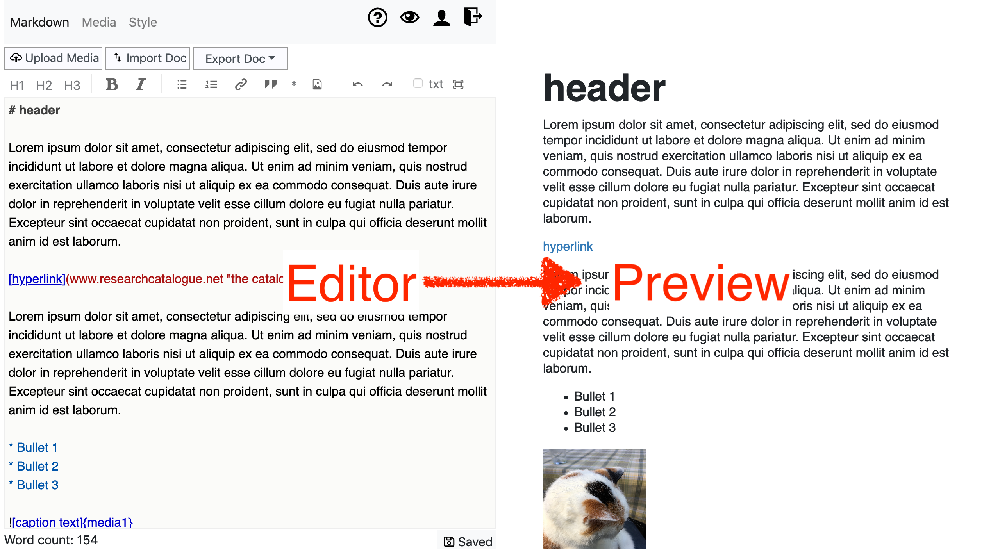
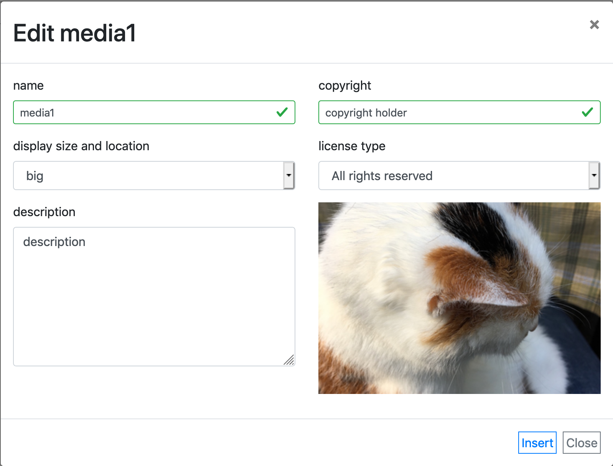

# Text based editor

First time user of the text editor? <a href="#introduction">click here</a>.
  
## Overview

Click any element in the image to jump to the relevant section:

<map name="image-map"> <area alt="Upload media files" title="Upload media files" href="#upload-media" coords="101,68,2,46" shape="rect">
    <area alt="Import external format (Word docx, Open office odt, Plain txt)" title="Import external format (Word docx, Open office odt, Plain txt)" href="#import-export" coords="107,51,189,70" shape="rect">
    <area alt="Editor (using Markdown)" title="Editor (using Markdown)" href="#editor" coords="496,530,7,97" shape="rect">
    <area alt="(Live) preview of the exposition" title="(Live) preview of the exposition" href="#preview" coords="497,1,1000,545" shape="rect">
    <area alt="Export to other formats (Pdf, odt, docx etc.)" title="Export to other formats (Pdf, odt, docx etc.)" href="#import-export" coords="289,71,193,44" shape="rect">
    <area alt="Media list (edit metadata/display)" title="Media list (edit metadata/display)" href="#media-list" coords="75,5,123,40" shape="rect">
    <area alt="Style tab" title="Style tab" href="#edit-style" coords="126,8,168,41" shape="rect">
    <area alt="Markdown" title="Markdown" href="#markdown" coords="0,5,72,41" shape="rect">
    <area alt="Toolbar" title="Toolbar" href="#toolbar" coords="7,73,481,94" shape="rect">
    <area alt="Help / Preview / Profile / Logout " title="Help / Preview / Profile / Logout " href="#menu" coords="365,5,488,34" shape="rect">
    <area alt="Saving" title="Saving" href="#saving" coords="434,534,492,548" shape="rect">
</map>

    
* <a href="#markdown">markdown</a> <a href="#editor">editor</a>  
    *write and edit your text* 
* <a href="#preview">preview</a>  
    *preview the result.* 
* <a href="#media-list">media-list</a>  
    *add/remove/edit media.*  
* <a href="#import-export">import/export</a>
    *import&export to various text formats*
* <a href="#edit-style">style editor</a>   
    *change the styling (font-size etc..) using CSS*  
* <a href="#upload-media">Upload media</a>    
    *Upload media files (image, video, pdf) and insert in your exposition*  
   
## Introduction  

The text-based editor is aimed at creating
[responsive](http://https://nl.wikipedia.org/wiki/Responsive_webdesign)
RC expositions. Despite the "text" in the name, expositions made with
this editor can also contain images, video, audio or PDF. "Text based"
refers to the method of editing: through plain text. Because of this
plain text input, text-based expositions can be easily imported or
edited in external editors. The consequence is that editing the visual
layout is less direct as in the graphical based editor. The structure of 
the exposition is expressed by using Markdown, the display of which can be 
customized through style sheets (css). 

 
On desktop, the editor splits the screen in two: you can write your text on the left side <a href="#editor">editor</a> while the result is shown as a <a href="#preview">preview</a> on the right hand side. It is also possible to <a href="#import-export">import</a> the text from external formats like Word and Open Office. Formatting (__bold__,*italic* etc...) is added using <a href="#markdown">markdown</a> notation.
 
If you want to insert [media](#introduction "video, audio, image or PDF"), you can add these through the <a href="#upload-media">__"upload media"__ button  </a>. When the upload has finished, the media edit dialog will automatically open, allowing you to edit and insert it.

Finally, the look of your text and media can be controlled through the media list and the style editor.

## Editor

The left hand side is where you can edit your text. The editor uses [Markdown](#markdown "link to markdown docs"), which is a lightweight, human-friendly [markup language](https://en.wikipedia.org/wiki/Lightweight_markup_language). Because Markdown is expressed as plain text, you cannot directly change the styling of the text (font-size, color etc.. are edited in [style](#edit-style) ), but you can express the structure/markup of your text. See [Markdown](#markdown "more about markdown") for a brief overview.

By default the editor uses colors to show the Markdown elements in your text, but you can also choose "plain txt" which allows your browsers spellchecker to work. [^1].

[^1]: It is not possible to have both at the same time.

## Previews

Here you can see a preview of your exposition.

Because text based expositions are responsive (react to the size of the window), the result may change based on the width of the screen. For a full view preview, use the eye button in the toolbar. 

### Upload media

To add new media, click upload media. After the upload finishes, the media edit dialog opens. This allow you to edit its metadata, size and to insert the media at the current cursor position.

If you want to insert previously used media, you can use the "media button" in the [toolbar](#toolbar).

## Media list

All media that you uploaded will appear in the "media list", where they can be edited or deleted.

### Editing media 

From within the media-list, if you click [__edit__], you will be able to change the __name__, __metadata__ and display of a media file.

* name (also used for the tag)
* change the way the files is displayed (size, float left/right)
* add copyright info
* choose a license
* add description
    
Using the buttons in the list itself:
* remove the object from your exposition
* insert the object in the current position in the text.

## Insert media

Media is represented on the editor side using a !{*media-name*} tag. 
The easiest way of inserting such a media tag is throught the [insert media toolbar button](#insert-toolbar-button), which shows a list of available media that can be inserted. Double click any item to insert.

You can also write the media tags directly, for example: to insert a media named "myFile", you can directly write !{myFile}. 
This !{myFile} tag will be the location in your text where myFile will be inserted.

A __caption text__ can also be included, to get a caption you write ![my caption text]{myFile}.
The caption text is displayed underneath the media.

## Import & export

You can import documents from text editors like Word (.docx), Libre/Open Office (.odt), HTML and several other formats. Not all styling is supported but images, footnotes, tables and most other structural features of the text are.

## Edit style

Text based expositions are styled using CSS (Cascading Style Sheets), which is a standard way of styling web documents.
The CSS of an exposition can be edited by going to the __style__ tab.
If you are not familiar with CSS, there is a good introduction here: <https://www.w3schools.com/css/>.

The structure of inserted media is as follows. You can use the outside class (rc-media-123455) to style an individual media element.

<code>

	<figure id="media-1">
	
		<figcaption>
			Caption text, which is taken from the tag -> ![caption text]{media1}
		</figcaption>
	</figure>

</code>

Most templates will provide some basic formatting already, that you can adjust to your needs.

## Toolbar

From left to right:

* H1, H2 & H3 - insert [header](#headers) formatting
* B / I - insert [__bold__ (strong) and italic (_emphasis_)](#strong-emphasis)
*  - [Unordered list / bullet point](#lists) formatting
*  - [Ordered list / Numbered list](#lists) formatting
*  - Insert [hyperlink](#links) formatting
*  - Quotation
* __\*__ -  Insert [footnote](#footnotes) notation
*  - Insert Media from media list
*  - Undo/Redo
* txt - Switch to plain text mode (browser can provide spellchecker in this mode)
*  - Fullscreen mode (hides preview)

## Markdown

Markdown is a human-friendly way of writing HTML webpages without using code. 
Markdown is written as plain text (like you would write on a typewriter), 
that is translated into HTML for you.

By surrounding your words with a few special characters you can inform markdown which styling you want it to use.  

<a id="strong-emphasis">

For example:  
*italic* = `*italic*`   
__bold__ = `__bold__`   

Instead of typing these characters, you can also select a piece of text and push the desired __style button__ on top of the editor. This will insert the correct Markdown notation for you.

## Paragraphs 

When text is separated by an empty line, it creates a paragraph.
Newlines are normally removed, unless you specifically force them by:

* putting two spaces at the end of a line
* putting an `\` character at the end of a line

Here are some examples to demonstrate:

__a)__

<pre>
a paragraph

another paragraph
</pre>

_results in:_

a paragraph

another paragraph

__b)__

<pre>
This text 
will be joined together
</pre>

_results in:_

This text
will be joined together

__c)__

<pre>
This line has two spaces at the end__
and it thus keeps the newline.
</pre>

_results in:_

This line has two spaces at the end  
and it thus keeps the newline.

__d)__

<pre> 
The same for the backslash\
also does the trick!
</pre>

_results in:_
 
The same for the backslash\
also does the trick!

  
## Headers 
Headers are defined by using one or more \"#\" in front of the header name:

`# header 1`  
`## header 2` 
`### header 3`  

There are six levels of headers. Header level # and ## are automatically included in the __contents__ menu, for easy navigation for the reader. 

An alternative way of writing headers is by putting ===== or --- below you header text.

`Header 1`  
`========` 

`Header 2`  
`----------`

## Lists
 
To get a bullet point list, write * before each item. Each item is seperated by a newline. A whiteline should preclude the first item.
Thus, when you write:  

    * my first point
    * another throught
    * yet another thought

it will result in  

* a list
* which has
* three items

To get ordered lists, write a number and a point, 1. , 2. , 3. 

  	1. one
    2. two 
    3. three

## Links  
Hyperlinks are written in the following manner:
`[linktext](http://example.com)`    
which results in:   
[linktext](http://example.com)  

You can also use create internal links using a *hashtag* (#):
`[link](#your-anchor-id)`

The anchor itself is written like this:
``

## Footnotes (text based)

The easiest way of inserting a footnote is using the footnote button: [ __\*__ ]. 
Footnotes consist of two parts, the reference, written like so:

`[^1]`

Then you define the footnote content at the bottom of your text with:

`[^1]: This is my footnote.`

It's content is automatically moved to the bottom of the text. 
The footnote content is automatically moved to the bottom of the resulting text.

 
## Quotation

A quotation is inserted by indenting your text with 4 spaces or 1 tab, like so:
<pre>
`    quotation`
`    more quotation`
</pre>

Quotations are not automatically formatted (they keep their newlines).

## Tables (markdown)

Tables are written like this:

<pre>
| Name    | Age | Species |
|---------|-----|---------|
| Harry   | 23  | Human   |
| Gerhard | 77  | Parrot  |
| Judith  | 6   | Cat     |
</pre>

| Name    | Age | Species |
|---------|-----|---------|
| Harry   | 23  | Human   |
| Gerhard | 77  | Parrot  |
| Judith  | 6   | Cat     |

You may also use [HTML tables](https://www.w3schools.com/html/html_tables.asp).
There are also online tools that help you generate [either](https://www.tablesgenerator.com/markdown_tables) of [these](https://www.google.com/search?sxsrf=ACYBGNRHvQviaPEVsRaoYNH4RBmxEvCZaQ%3A1574157215715&source=hp&ei=n7vTXe-VKdHCkwWAn5rYBA&q=convert+excel+to+html+table&oq=convert+excel+to+html+table&gs_l=psy-ab.3..0l5j0i203j0i22i30l4.1154.7184..7368...3.0..0.72.1472.30......0....1..gws-wiz.......35i39.6l0ze9Qpl6I&ved=0ahUKEwiv4aTNgPblAhVR4aQKHYCPBksQ4dUDCAU&uact=5).

