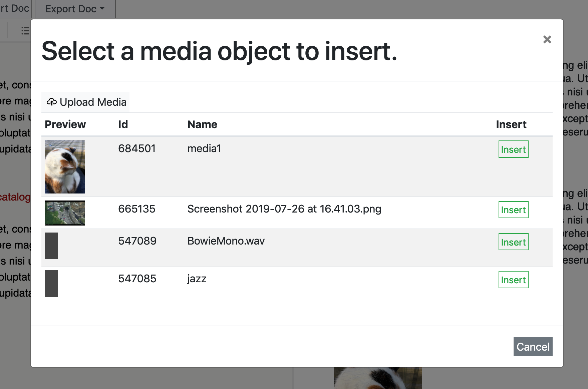

# Text based editor

First time user of the text editor? <a href="#introduction">click here</a>.
  
## Overview

Click any element in the image to jump to the relevant section.

<object data="images/editor-overview-elm.png" width="1000" height="549" class="overview-map" usemap="#image-map">
</object>

<map name="image-map">
    <area target="" alt="Upload media files" title="Upload media files" href="#upload-media" coords="101,68,2,46" shape="rect">
    <area target="" alt="Import external format (Word docx, Open office odt, Plain txt)" title="Import external format (Word docx, Open office odt, Plain txt)" href="#import-export" coords="107,51,189,70" shape="rect">
    <area target="" alt="Editor (using Markdown)" title="Editor (using Markdown)" href="#editor" coords="496,530,7,97" shape="rect">
    <area target="" alt="(Live) preview of the exposition" title="(Live) preview of the exposition" href="#preview" coords="497,1,1000,545" shape="rect">
    <area target="" alt="Export to other formats (Pdf, odt, docx etc.)" title="Export to other formats (Pdf, odt, docx etc.)" href="#import-export" coords="289,71,193,44" shape="rect">
    <area target="" alt="Media list (edit metadata/display)" title="Media list (edit metadata/display)" href="#media-list" coords="75,5,123,40" shape="rect">
    <area target="" alt="Style tab" title="Style tab" href="#style-tab" coords="126,8,168,41" shape="rect">
    <area target="" alt="Markdown" title="Markdown" href="#markdown" coords="0,5,72,41" shape="rect">
    <area target="" alt="Toolbar" title="Toolbar" href="#toolbar" coords="7,73,481,94" shape="rect">
    <area target="" alt="Help / Preview / Profile / Logout " title="Help / Preview / Profile / Logout " href="#menu" coords="365,5,488,34" shape="rect">
    <area target="" alt="Saving" title="Saving" href="#saving" coords="434,534,492,548" shape="rect">
</map>

    
* <a href="#markdown">markdown</a> <a href="#editor">editor</a>  
    *write and edit your text* 
* <a href="#preview">preview</a>  
    *preview the result.* 
* <a href="#media-list">media-list</a>  
    *add/remove/edit media.*  
* <a href="#import-export">import/export</a>
    *import&export to various text formats*
* <a href="#style">style editor</a>   
    *change the styling (font-size etc..) using CSS*  
* <a href="#upload-media">Upload media</a>    
    *Upload media files (image, video, pdf) and insert in your exposition*  
   
## Introduction  

The text-based exposition editor is aimed at creating [responsive](http://https://nl.wikipedia.org/wiki/Responsive_webdesign) RC expositions. Despite the name, the result can still contain images, video, audio and pdf. The name refers to the method of editing them: through the writing of plain text. Because of the plain text input, text-based expositions can easily be imported or edited in external editors. The trade-off is that editing the visual layout is less direct as in the graphical based editor.
 
The editor splits the screen in two: you can write your text on the left side <a href="#editor">editor</a> while the result is shown as a <a href="#preview">preview</a> on the right hand side. It is also possible to <a href="#import-export">import</a> the text from external formats like Word and Open Office. Formatting (__bold__,*italic* etc...) is added using <a href="#markdown">markdown</a> notation.
 
If you want to insert [media](#introduction "video, audio, image or PDF"), you can add these through the <a href="#upload-media">__"upload media"__ button  </a>, when the upload has finished the media edit dialog will automatically open, which allows you to set the properties and insert the media in the current cursor position.  

Finally, the look of your text and media can be controlled through the media list and the style editor.

## Editor

The left hand side is where you can edit your text. The format used is <a href="#markdown">markdown</a>, which is a plain text format (like with a typewriter). The editor automatically detects paragraphs.  
 
For styling not supported by markdown, you can use HTML, since HTML tags are also allowed within Markdown (with the exception of scripts, for security reasons).

## Preview

Here you can see a preview of your exposition.

Note, that because text based expositions are responsive (react to the size of the window), the result may change based on the width of the screen. For a full view preview, use the eye button in the toolbar.

## Media list

Video, audio, images and pdf can be placed in your expositions. They are represented on the editor side with the notation \
__"! {name}"__\
 which is replaced with the actual media item in the rendered exposition.

Note: you do not have to type the ! { name }  yourself, when you upload something or insert media through the media list, the correct placeholder is inserted for you.

### Upload media

To add new media, click upload media. After the upload finishes, the media edit dialog opens. This allow you to edit its metadata, size and to insert the media at the current cursor position.

If you want to insert previously used media, you can use the "picture button" in the toolbar.

### Editing media 

In the **media list** you can edit media, its metadata and the way it is displayed.

* name (also used for the tag)
* change the way the files is displayed (size, float left/right)
* add copyright info
* choose a license
* add description
    
Using the buttons in the list itself:
* remove the object from your exposition
* insert the object in the current position in the text.

## Import & export

You can import documents from text editors like Word (.docx), Libre/Open Office (.odt), HTML and several other formats. Not all styling is supported but images, footnotes, tables and most other structural features of the text are.

## Edit style

For users that know CSS, edit style opens a CSS editor. Most templates will provide some basic formatting already, that you can adjust to your needs.

## Toolbar

From left to right:

* H1, H2 & H3 - insert [header](#headers) formatting
* B / I - insert [__bold__ (strong) and italic (_emphasis_)](#strong-emphasis)
*  - [Unordered list / bullet point](#lists) formatting
*  - [Ordered list / Numbered list](#lists) formatting
*  - Insert [hyperlink](#links) formatting
*  - Quotation
* __\*__ -  Insert [footnote](#footnotes) notation
*  - Insert Media from media list
*  - Undo/Redo
* txt - Switch to plain text mode (browser can provide spellchecker in this mode)
*  - Fullscreen mode (hides preview)

## Markdown

Markdown is a human-friendly way of writing HTML webpages without using code. 
Markdown is written as plain text (like you would write on a typewriter), 
that is translated into HTML for you.

By surrounding your words with a few special characters you can inform markdown which styling you want it to use.  

<a id="strong-emphasis">

For example:  
*italic* = `*italic*`   
__bold__ = `__bold__`   

Instead of typing these characters, you can also select a piece of text and push the desired __style button__ on top of the editor. This will insert the correct Markdown notation for you.

## Paragraphs 

Paragraphs are recognized by markdown by whitelines.

Now that I've skipped a line, this is a second paragraph.  
TIP: You can force a linebreak by leaving 2 spaces at the end of a line.
  
## Headers 
Headers are defined by using one or more \"#\" in front of the header name:

`# header 1`  
`## header 2` 
`### header 3`  

There are six levels of headers. Header level # and ## are automatically included in the __contents__ menu, for easy navigation for the reader. 

An alternative way of writing headers is by putting ===== or --- below you header text.

`Header 1`
`========` 

`Header 2`
`----------`

## Lists
 
To get a bullet point list, write * before each item. Each item is seperated by a newline. A whiteline should preclude the first item.
Thus, when you write:  

    * my first point
    * another throught
    * yet another thought

it will result in  

* a list
* which has
* three items

To get ordered lists, write a number and a point, 1. , 2. , 3. 

  	1. one
    2. two 
    3. three

## Links  
Hyperlinks are written in the following manner:
`[linktext](http://example.com)`    
which results in:   
[linktext](http://example.com)  

## Footnotes (text based)

The easiest way of inserting a footnote is using the footnote button: [ __\*__ ]. 
Footnotes consist of two parts, the reference, written like so:

`[^1]`

Then you define the footnote content at the bottom of your text with:

`[^1]: This is my footnote.`

It's content is automatically moved to the bottom of the text. 
The footnote content is automatically moved to the bottom of the resulting text.

 
## Quotation

A quotation is inserted by indenting your text with 4 spaces or 1 tab, like so:

`    quotation`
`    more quotation`

Quotations are not automatically formatted (they keep their newlines).

## Tables (markdown)

Tables are written like this:

<pre>
| Name    | Age | Species |
|---------|-----|---------|
| Harry   | 23  | Human   |
| Gerhard | 77  | Parrot  |
| Judith  | 6   | Cat     |
</pre>

| Name    | Age | Species |
|---------|-----|---------|
| Harry   | 23  | Human   |
| Gerhard | 77  | Parrot  |
| Judith  | 6   | Cat     |

You may also use [HTML tables](https://www.w3schools.com/html/html_tables.asp).
There are also online tools that help you generate [either](https://www.tablesgenerator.com/markdown_tables) of [these](https://www.google.com/search?sxsrf=ACYBGNRHvQviaPEVsRaoYNH4RBmxEvCZaQ%3A1574157215715&source=hp&ei=n7vTXe-VKdHCkwWAn5rYBA&q=convert+excel+to+html+table&oq=convert+excel+to+html+table&gs_l=psy-ab.3..0l5j0i203j0i22i30l4.1154.7184..7368...3.0..0.72.1472.30......0....1..gws-wiz.......35i39.6l0ze9Qpl6I&ved=0ahUKEwiv4aTNgPblAhVR4aQKHYCPBksQ4dUDCAU&uact=5).

