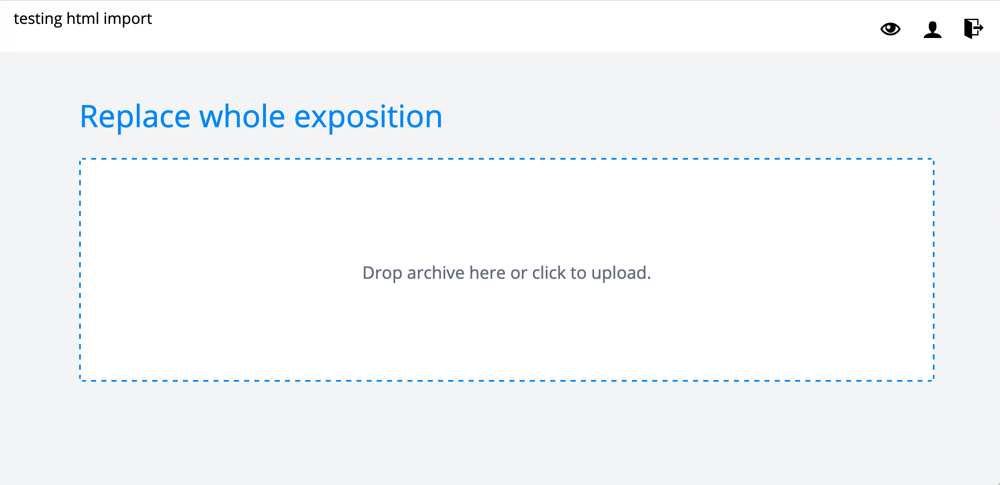

# HTML Import

It is possible to import a website of static HTML into the RC. This
feature is aimed at users that are familiar with HTML and want to use
their own editor.

For security reasons, JavaScript is not supported, but CSS files,
` <video> <audio>` tags can be used. The folder containing your
HTML files are to be uploaded as a zip file (.zip).

Important: at this moment, the existing RC Journals do not accept
submissions imported as HTML, because they do not fit in existing
reviewing/editing workflows. If you are planning to submit your
exposition to one of the journals in the RC, one should use the
graphical or the text based editor.

The workflow is:

1. Click [ Create Exposition ] on your profile page.
2. Select "html based" as the editor, fill in necessary metadata and click submit.

3. You will now enter an upload screen, where you can select your zip.

4. Wait for upload to finish

	When the upload finished and there is no error, you can view the
	exposition by hitting the preview button (eye in the top right
	corner). Otherwise you will have to fix the errors and try again.

### Requirements for HTML expositions

There are a few requirements to the zip that is uploaded:

* The root folder needs to contain a file named index.html, this will
  be the page where the exposition opens.
* All other HTML files in the root folder will be added to the table
  of contents.
* Do not nest folders into folders.
* You can use .html .css and various media formats, mp4, mp3 etc..
  The RC will automatically transcode the video and audio to a web compatible format.
* JavaScript is currently not supported for security reasons, if
  present, import will fail.
* The character encoding of the .html files should be UTF-8

### Updating

It is not possible to update single files within the expostion, to
update you have to replace your old version with a new zip.
