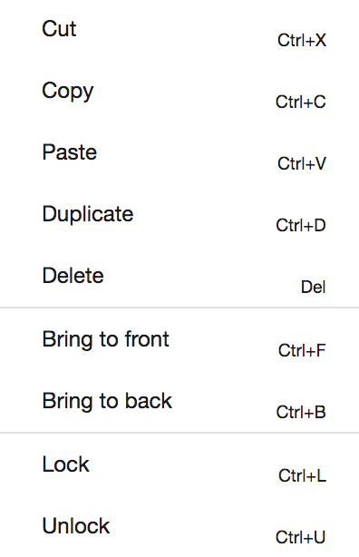

# Menus

## Edit menu

__Trivial copy paste functions:__

* cut - ctrl + K
* copy - ctrl + C
* paste - ctrl + V
* duplicate - ctrl + D
* delete - delete (Apple: fn + backspace)
(ctrl = cmd on Mac computers)

__Order functions:__

* bring to front
* bring to back

These options change the order of objects if they overlap. Order can be important if you have tools with controls: for example, an audio player that is behind a text tool would need to be in front to allow the user to click the play button on it.

__Locking:__

* lock 
* unlock

Locking an object means it cannot be changed or moved in any way (until it is unlocked). This feature can also be used if only part of the exposition is to be moved (by locking the objects you do not want to move). 

## Options menu

### Edit metadata

Here you can edit the Title, Abstract and Entry Page of the exposition.

### Edit table of content

Here you can set the contents of the "contents menu" that the reader uses to navigate between pages and position in your exposition.

See [table of content](#table-of-content).

### Grid options

* Snap to grid

Objects will only move in grid-size steps

* Show Grid

Show/hide the grid

* Grid size

Change the size of the grid

### Set default position

Change the initial position that the reader starts at in the weave, to the current location of the editor view.

### Show current position

This provides the X,Y offset of the editor and a position link.
X,Y can be used in the Table of content.
The position link in Hyperlinking, or simply to share a specific position through a position link.

### Restore deleted tools

Restore recently deleted tools.

### Restore deleted footnotes

Restore recently deleted tool.

## Help menu

Get help!

* this guide
* the forum
* the video tutorials

## Send Collaboration Message

When you are collaborating on an exposition, you can use the command
"send collaboration message" to communicate with your collaborators.

