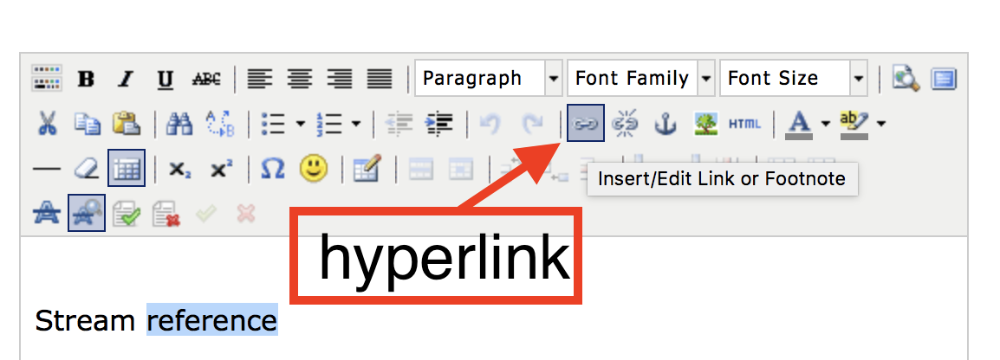

<!-- TODO: Insert links to other parts of the documentation -->

# Navigation

## Navigation bar

When one moves the mouse cursor to the top of an exposition, a menu bar
appears. 

  

The navigation bar contains, from left to right:

* __Content__ This contains the table of contents and links to the authors. Please see the help section on [table of contents](#table-of-content).

* __Navigation__ Navigation is a graphical map of all the exposition's
content on the current weave. You can click it to jump to a location.

* __Abstract__ Abstract, this can be changed by clicking title in the editor or ☰ > __edit details__ on your profile.

* __Title / Meta__ By moving the mouse pointer the title of
your research, a little window with metadata will appear. The link
(URL) of the current page is shown, including the current scrolling
location. This URL can thus be used to generate the [hyperlink](#hyperlinks) for
internal linking. You can also use this link to cite a specific
location.

* __Reviewing__
Reviewing is connected to the note tool (the yellow "post-it" notes)
and is intended for the communication between the author(s) and the
reviewer during the reviewing-process. This option is only available for expositions that have not been published yet. Notes can also be used for approving expositions in educational contexts.
 
There are a couple of functions available:
 
	- hide notes 			(hide all notes)
	- show open notes 		(show only notes that are open)
	- show resolved notes 	(show the resolved notes)
	- add new note 			(open a note tool)
	- previous note         (jump to previous note)
	- next note             (jump to next note)

### Comments

Shows the latest and previous comments on your exposition from the RC
community.

### Terms of use

This displays the terms of as set by the Society for Artistic Research (SAR).

## Table of Content

See the [video tutorial](https://www.researchcatalogue.net/view/273532/273533/54/759) on this topic.

The table of content is designed to facilitate the navigation through
an exposition. In order to edit the table of content and add entries,
click on the __title of your exposition__ in the editor (one can also open
this window by going to the exposition on the profile page and
clicking "edit details"). This opens a dialogue window titled "Edit
Research." The second tab ("table of content") of this window contains
a series of entries. 

To make a new entry select the page (or "weave")
that this item in the table of content is supposed to link to from the
pull down menu and enter a title for this entry to be displayed in the
table of content. Moreover one can choose a specific position within
the selected page. The "X-Coord" is the distance in pixels from the
left margin of the exposition and the "Y-Coord" is the distance in
pixels from the top margin (See the section on "Commands" for more
information on obtaining position information.) The table of content
thus not only allows structuring expositions by creating a series of
weaves, but also by using various locations within one weave. Also note that pages that unless a page is entered in the table of content, the reader cannot reach them. Pages are not automatically added to the table of content.

## Hyperlinking

See the [video tutorial](https://www.researchcatalogue.net/view/273532/273533) on this topic.

It is possible to create hyperlinks between pages (or "weaves") of an
exposition and within a single page. This process exists of two steps: 
fetch the link and creating the hyperlink.

In order to fetch a link to a different page within your exposition:
  
1. select the target weave in the editor. 
2. select the tab where you want to link to.
3. *(optional)* scroll the page to the position where you want the link to point to.
4. click "Commands" on the left hand side and click on "show current
position."  

This will display a URL of the target page with the current scroll location. Copy the URL
into the clipboard (Ctrl-C/Cmd-C). Note that you can also use this URL outside of the RC, as long as the exposition is public.
 
Now to turn a piece of text into a hyperlink:  

1. Create or open a [Text](#text-tool) or [HTML tool](#HTML-tool) and select a word or sentence that should become the link.
2. Now click the hyperlink button (it looks like a chain link) and a dialog will be displayed.

3. Paste the link in the __link URL__ field and click __add link__.

### Dialog options:

Within the hyperlink dialog there are a couple of options:

* __Link URL__ : here you can type or paste a link 
* __Target__ : control wether the link will open in a new screen or not.
* __Title__ : change the title of the link
* __Class__ : set the class of the link (this is rarely used)

## Overview

Within the "Commands" tab on the right-hand side of the editor there
is a checkbox labeled "Overview." Clicking the checkbox will open
and close a tab on the right-hand side of
the editor. It contains both a map and a list of all objects in the exposition.

The overview map outlines all tools on the page, their size and position. By moving the red rectangle, one can jump to a specific position on the page.

Below the overview map, there is a list of all objects. If you click one of these tools, you go directly to that tools location. This can also be very useful when trying to find tools that have somehow become hidden, for example if another tool has been placed on top.
