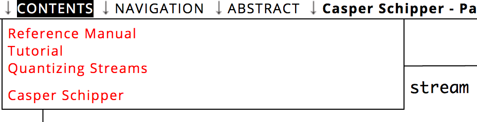

<!-- TODO: Insert links to other parts of the documentation -->

# Navigation

## Menu Bar Navigation

When one moves the mouse cursor to the top of an exposition a menu bar
appears. The menu bar displays (from left to right):

* __Contents__, which can be freely designed by the author (see [table of content](#table-of-content)). In most expositions this contains a list of the pages.
* __Navigation__ displays a schematic map/overview of the current page. It outlines all used tools on the page, their size and position. By clicking inside the map, you can jump to another position on the page. Your current position within the exposition is shown as a red rectangle.
* __Abstract__ the abstract of this exposition
* __The title__ of the exposition and the name of its author(s). One can also hoover over this title to receive an exact link to this location on the page. 

## Table of Content

See the [video tutorial](https://www.researchcatalogue.net/view/273532/273533/54/759) on this topic.

The table of content is designed to facilitate the navigation through
an exposition. In order to edit the table of content and add entries,
click on the __title of your exposition__ in the editor (one can also open
this window by going to the exposition on the profile page and
clicking "edit details"). This opens a dialogue window titled "Edit
Research." The second tab ("table of content") of this window contains
a series of entries. 

To make a new entry select the page (or "weave")
that this item in the table of content is supposed to link to from the
pull down menu and enter a title for this entry to be displayed in the
table of content. Moreover one can choose a specific position within
the selected page. The "X-Coord" is the distance in pixels from the
left margin of the exposition and the "Y-Coord" is the distance in
pixels from the top margin (See the section on "Commands" for more
information on obtaining position information.) The table of content
thus not only allows structuring expositions by creating a series of
weaves, but also by using various locations within one weave. Also note that pages that unless a page is entered in the table of content, the reader cannot reach them. Pages are not automatically added to the table of content.

## Hyperlinking

See the [video tutorial](https://www.researchcatalogue.net/view/273532/273533) on this topic.

It is possible to create hyperlinks between pages (or "weaves") of an
exposition and within a single page. This process exists of two steps: 
fetch the link and creating the hyperlink.

In order to fetch a link to a different page within your exposition:
  
1. select the target weave in the editor. 
2. select the tab where you want to link to.
3. *(optional)* scroll the page to the position where you want the link to point to.
4. click "Commands" on the left hand side and click on "show current
position."  

This will display a URL of the target page with the current scroll location. Copy the URL
into the clipboard (Ctrl-C/Cmd-C). Note that you can also use this URL outside of the RC, as long as the exposition is public.
 
Now to turn a piece of text into a hyperlink:  

1. Create or open a [Text](#text-tool) or [HTML tool](#HTML-tool) and select a word or sentence that should become the link.
2. Now click the hyperlink button (it looks like a chain link) and a dialog will be displayed.
3. Paste the link in the __link URL__ field and click __add link__.

### Dialog options:

Within the hyperlink dialog there are a couple of options:

* __Link URL__ : here you can type or paste a link 
* __Target__ : control wether the link will open in a new screen or not.
* __Title__ : change the title of the link
* __Class__ : set the class of the link (this is rarely used)

## Overview

Within the "Commands" tab on the right-hand side of the editor there
is a checkbox labeled "Overview." Clicking the checkbox will open
andclose an a schematic overview on the right-hand side of
theeditor. The overview outlines all tools on the page, their size
andposition. By moving the red rectangle, which displays the
currentlyvisible part of the weave, one can navigate the page and
alter thecurrent selection.
