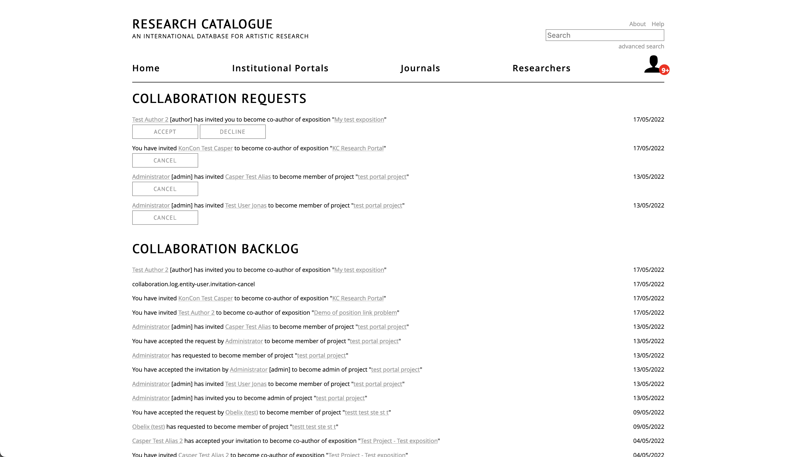

# Making expositions visible and working with others

By default, expositions are __private__: only visible to your account.
These are the three options to make something visible to others:

* [collaborate](#collaborating-on-research): invite individual RC
  users to view, comment or edit your exposition.
* [share](#share): make your research visible to other people, but you
  can still change the content or make it private again. Others will not be able to edit.
  By sharing, the exposition will appear on the front page, your public profile, and search results.
  You can also connect a shared exposition to a Group or Portal, this way it will appear there as well (as the other locations).
* [publishing](#publication): self-publish, or request publication
  within one of the portals. You cannot edit the content after publication.

An important feature of __publication__ in the RC, is
that it is __permanent__. This means that once an exposition is
published, content will be locked forever. The idea behind this is
that the content of published expositions can be safely referenced by
others without risk of linking to something that has changed or
disappeared.

## Collaborating on Research

The Research Catalogue allows you to work together on a research
exposition with one or more users. This is called collaboration.  
 
There are 3 types of collaborators:
  
- *co-author* : The collaborator is considered a co-author of the
  research and will be shown in the author list of the research
  exposition.
- *contributor* : This type of collaborator has the same rights but
  won't feature as co-author of your exposition. An example of a
  contributor might be a graphic designer helping with the layout of
  your exposition without having any involvement with the research
  itself.
- *supervisor* : The collaborator can view an exposition and leave comments. The
  supervisor will also be mentioned in the metadata.

### Adding a Collaborator

An author of an exposition can invite collaborators through the collaboration
tab of the exposition: click the __menu icon__ (1) and __'edit details'__ (2)
next to the research on your profile. If you are already in the workspace
editor, you can also use __options__ > __edit details__ to open the same menu.

Choose __'collaboration'__, search for the user you want to cooperate
with and add the collaborator by clicking on their name.

The users that were added will show up as a list below the field. After clicking
submit, collaborators will receive an invitation from you in their collaboration
page. In the backlog you can easily find all your past collaboration
interactions, including links to the expositons & groups that you have been
invited to.

### Removing a Collaborator

If you want to remove a collaborator, click the "x" behind their name in the field they were added. 

Note: If a user's name in the list is enclosed in brackets ( [ name ]
), it means that the invitation is sent successfully, but has not been
yet accepted by the receiver.

## Realtime collaboration

For pages created with the graphical editor, you will see the edits of the others directly as they are made, in the other editors (block, html or text-based) you will have to refresh your browser tab to see changes. When a tool is being edited by another user, it will get a blue border.
When a page is being edited by another user, it will be highlighted in blue.

### Communication with Collaborators

While collaborating on an exposition, there are several ways of
communicating with each other:

* __chat__ In the graphical exposition editor, you can chat with your collaborators.

* __Using the note tool__ Notes are the RC equivalent of yellow paper notes.
	You can simply drag one from the toolbar onto the
	exposition workspace. See also the note tool help.

* __Send collaboration message__ You can send a direct text message to
	your collaborator using the *Send collaboration message* found
	under the __commands___ tab.

* __Posting a comment__ In expositions where you are not a
	collaborator, you can still leave comments by going to the top bar
	of the exposition and clicking the __Comments__.

<!-- TODO: Insert links to other parts of the documentation -->

Instead of collaborating with RC users you can also
[__publish__](#publish) an exposition or [__share__](#share) share it
with groups of people. The difference is when an exposition is
__shared__, content can still be changed, and the mode of sharing can
be changed at a later point.

## Share
 
__Share__ option can used to control visibility of works and
expositions for groups of people. By default, your expositions are
__private__, changing the mode allows others to see your work. Unlike
__publishing__, you will still be able to change the content of an
exposition when it is shared. Share settings can not be changed while
the exposition is in review.

The share option can be found under the object menu () of
each object on your profile.

There are four modes of sharing:

* __private__ (__default__) : only visible to you or the
  [collaborators](#collaborating-on-research "collaboration") on that
  specific object.
* __only RC users__ : visible to users with an RC account.
* __limited to portal__: visible only to members of a certain portal
  within RC. Clicking a portal in the list below, toggles visibity of
  your exposition for members of that portal. If required, you can
  also select multiple.
* __public__ : visible to anyone on the internet.

Independent of the above choices there is a check box:

* __link share__ : The object is accessible through a "secret"
  link. Only people that have the link can view the object. This is
  useful for sharing with readers without an RC account, by turning
  the option on and mailing them the link.
  
A common use is to keep the exposition private but share the link with
a few persons, via e-mail for example. Note that even if you tick
the link share box, you still need to apply this change by using the
"submit" button. Remember to copy the link first.

Link share can be combined with any of the other sharing modes (private,
RC users, limited to portal, public). An exposition can for example be
shared within a portal but simultaneously be accessible through the "secret" link.

  

## Publication

__Publication__, is permanent. This means that once an exposition is
published, all content will be locked. The idea behind this is that
the content of published expositions can be safely referenced by
others without risk of linking to something that has changed or
disappeared. You can self-publish an exposition, or request
publication with one of the portals. Please consult the portal pages:
([institutions](https://www.researchcatalogue.net/portal/institutions)
or [journals](https://www.researchcatalogue.net/portal/journals)) to
see what requirements there are for publication there.

### Self-Publish

Self-publishing makes an exposition __no longer editable__ and
publicly visible. On publication you will get a (free)
[DOI](https://en.wikipedia.org/wiki/Digital_object_identifier). By
design, publishing an exposition is not reversible (so others can use
the exposition link as a reference).

### Submit for review

Expositions can also be submitted to portals (such as journals) for
review and publication. Most of the institutional portals will only
accept requests from within the institution that is associated with
it. In case you want to submit to an institutional portal, be sure to
check their instructions regarding submissions:
([institutions](https://www.researchcatalogue.net/portal/institutions)
or [journals](https://www.researchcatalogue.net/portal/journals)).

To request review within a portal, click ☰ -> submit for review. You
will be prompted to select to which portal you want to submit. After
submitting, the exposition will show "in review" status.

While the exposition is "in review" state it can no longer be
edited. The portal admin or editor will contact you regarding the
reviewing process. The portal admin can unlock the exposition by
putting it "in revision", or rejecting the publication request. In the
first case you or the admin can lock it again, in the second case you
will have to resubmit it using the normal method.

After the portal admin accepts the publication request, you will
receive a message and the content of the exposition will be
premanently locked.

## Connect to Portal

A shared exposition can be connected to a portal. Connecting shared exposition will result in the exposition being listed on the portal page, without locking the content. The important difference with publication is, that connected expositions can still be changed after the connection has been made.

To connect an exposition, the main author will have to use the ☰ -> "connect to" option to request connection.

There are two conditions that need to be met before a request can be made:

- The main author has to be a member of the portal.
- The exposition cannot be private (it has to be at least shared within the portal, or public).

The portal admin will receive a notification and has to
confirm the connection [(information for portal-admins)](#connection-requests).

Once the connection has been approved by the portal admin, the connection will
be shown in the expositions metadata and the exposition may appear on the
portal page and portal feeds. Connected works may for example
accompany a published exposition or represent a connected event. They
have to be at least shared within the portal.
