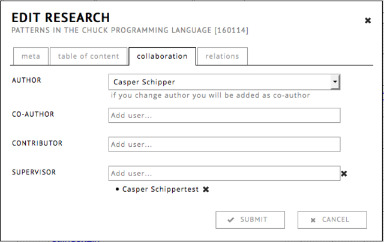
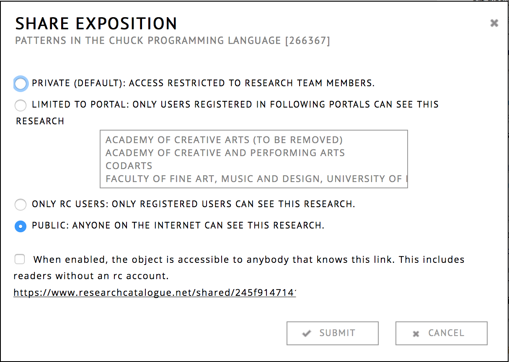

# Making expositions visible and working with others

By default, expositions are __private__: only visible to your account.
These are the three options to make something visible to others:

* [collaborate](#collaborating-on-research): invite individual RC
  users to view, comment or edit your exposition.
* [share](#share): make your research visible to other people, but you
  can still change the content or make it private again. Others will not be able to edit.
* [publishing](#publication): self-publish, or request publication
  within one of the portals. You cannot edit the content after publication.

An important feature of __publication__ in the RC, is
that it is __permanent__. This means that once an exposition is
published, content will be locked forever. The idea behind this, is
that the content of published expositions can be safely referenced by
others, without risk of linking to something that has changed or
dissapeared.

## Collaborating on Research

The Research Catalogue allows you to work together on a research
exposition with mulltiple users. This is called collaboration.
  
There are 3 types of collaborators:
  
- *co-author* : the collaborator is considered a co-author of the
  research and will be shown in the author list of the research
  exposition.
- *contributor* : this type of collaborator has the same rights but
  won't feature as co-author of your exposition. An example of a
  contributor might be a graphical designer helping with the layout of
  your exposition without having any involvement with the research
  itself.
- *supervisor* : can view an exposition and leave comments. The
  supervisor will also be mentioned in the metadata.

### Adding a Collaborator

An author of an exposition can invite collaborators through the
collaboration tab of the exposition: click the __menu icon__ (1) and
__'edit details'__ (2) next to the research on your profile. If you
are already in the workspace editor, you can also click on the title
of your research at the top of the editor.

Choose __'collaboration'__, search for the user you want to cooperate
with and add her or him by clicking on their name.

The users that were added will show up as a list below the
field. After clicking submit, collaborators will receive an invitation
from you in their message-box which they can accept or decline. When
accepting the invitation, the collaborator will have access to your
exposition workspace and he will be able to edit it.

### Removing a Collaborator

If you want to remove a collaborator, click the "x" behind their name
in the field they were added. If you remove a supervisor, the
supervisor will receive a request to remove them (they have to approve
the removal).

Note: If a users name in the list is enclosed in brackets ( [ name ]
), it means that the invitation is sent successfully, but has not been
accepted yet by the receiver.

### Communication with Collaborators

While collaborating on an exposition, there are several ways of
communicating with each other

* __Using the note tool__ Notes are the RC equivalent of yellow post
	it notes. You can simply drag one from the toolbar onto the
	exposition workspace. See also the note tool help.

* __Send collaboration message__ You can send a direct text message to
	your collaborator using the *Send collaboration message* found
	under the __commands___ tab.

* __Posting a comment__ In expositions where you are not a
	collaborator, you can still leave comments by going to the top bar
	of the exposition and clicking the __Comments__.

<!-- TODO: Insert links to other parts of the documentation -->

Instead of collaborating with RC users you can also
[__publish__](#publish) an exposition or [__share__](#share) share it
with groups of people. The difference is when an exposition is
__shared__, content can still be changed, and the mode of sharing can
be changed at a later point.

## Share
 
__Share__ option can used to control visibility of works and
expositions for groups of people. By default, your expositions
are __private__, changing the mode allows others to see your
work. Unlike __publishing__, you will still be able to change the
content of an exposition when it is shared.

The share option can be found under the object menu () of
each object on your profile.

There are four modes of sharing:

* __private__ (__default__) : only visible to you or the
  [collaborators](#collaborating-on-research "collaboration") on that
  specific object.
* __only RC users__ : visible to users with an RC account.
* __limited to portal__: visible only to members of a certain portal
  within RC. Clicking a portal in the list below, toggles visibity of
  your exposition for members of that portal. If required, you can
  also select multiple.
* __public__ : visible to anyone on the internet.

Independent of the above choices there is a check box:

* __link share__ : The object is accessible through a "secret"
  link. Only people that have the link can view the object. This is
  useful for sharing with readers without an RC account, by turning
  the option on and mailing them the link.

Link share can be combined with any of the other sharing modes
(private, RC users, limited to portal, public). An exposition can for
example be shared within a portal but simultaniously be accessible
through the "secret" link.

  

## Publication

__Publication__, is permanent. This means that once an exposition is
published, all content will be locked. The idea behind this, is that
the content of published expositions can be safely referenced by
others, without risk of linking to something that has changed or
dissapeared. You can self-publish an exposition, or request
publication with one of the portals. Please consult the portal pages:
([institutions](https://www.researchcatalogue.net/portal/institutions)
or [journals](https://www.researchcatalogue.net/portal/journals)) to
see what requirements there are for publication there.

### Self-Publish

Self-publishing makes an exposition __no longer editable__ and
publicly visible. On publication you will get a (free)
[DOI](https://en.wikipedia.org/wiki/Digital_object_identifier). By
design, publishing an exposition is not reversible (so others can use
the exposition link as a reference).

### Submit for Publication

Expositions can also be submitted to portals (such as journals) for
publication. Most of the institutional portals will only accept
requests from within the institution that is associated with it, in
case you want to submit to one of those, be sure to check their
instructions regarding submissions:
([institutions](https://www.researchcatalogue.net/portal/institutions)
or [journals](https://www.researchcatalogue.net/portal/journals)).

To request publication within a portal, click ☰ -> submit for
publication.  You can then select "submit for unlimited publication"
and choose the portal to which the request is to be sent. After
submitting, the exposition will show "in review" status.

While the exposition is "in review" state it can no longer be
edited. The portal admin or editor will contact you regarding the
reviewing process. The portal admin can unlock the exposition by
putting it "in revision", or rejecting the publication request. In the
first case you or the admin can lock it again, in the second case you
will have to resubmit it using the normal method.

After the portal admin accepts the publication request, you will
receive a message and the content of the exposition will be
premanently locked.

### Connect to Portal

An exposition can be connected to a portal without being published by
the portal. The portal admin will receive a notification and has to
confirm the connection. Once the connection has been approved it will
be shown in the object's metadata and the object may appear on the
portal page and portal feeds. Connected works may for example
accompany a published exposition or represent a connected event. They
have to be at least shared within the portal, private expositions
cannot be connected to a portal.
