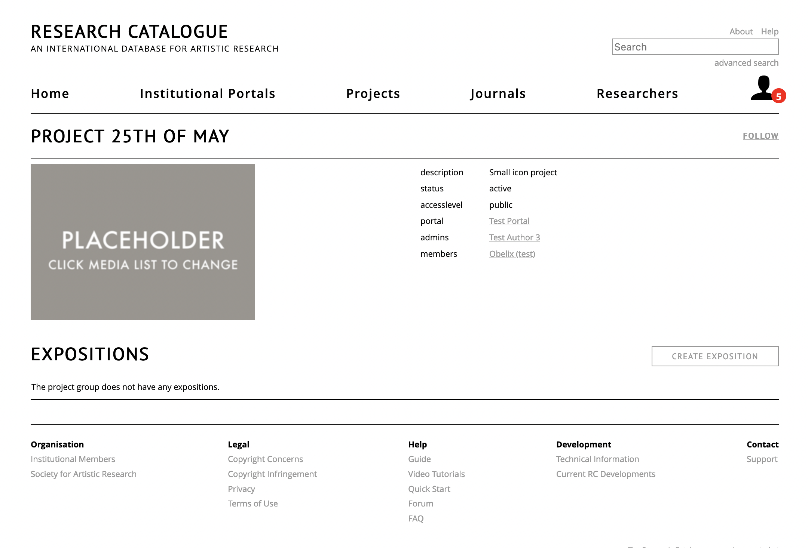

# Groups

__Groups__ are a way of having a shared space for expositions with multiple users,
for example for use in a class, research project or workshop. As a member of the
group, you get access to the group's overview page, which shows all users and
expositions connected to the group as well as general information. As a member,
you can create (your own) expositions within the group, that will be directly
visible to all the group's members.

The group may also have one or more admins (administrators). The group's admins
have the ability to manage the members, expositions and edit the description and
other metadata. They can also set collaborations for the expositions that are
connected to the group. In some sense the group is a mini-portal within the portal.

The group's visibility to the outside world can be controlled: it can be private
where only its members have access to it, or it can be shared in the portal or
made completely public. 

User groups are created by the portal admin(s). The public groups of a portal
can be found on the [portal feed
page](https://www.researchcatalogue.net/portal/institutions). Private groups of
which you are a member appear on your profile page.

## Using the Group as a Member

There are two ways to become a member of a group:

1. The group's admin invites you. You can accept the request in the
   [collaboration]("RC collaboration section"
   https://www.researchcatalogue.net/collaboration/list) section. 
2. You visit a public group page and request membership. In this case the admin
   will have to accept you before you get access.

Only a full user account can become part of a group. Once you are a member you
can \[visit the group\] from your own [profile page]("my profile page"
https://www.researchcatalogue.net/profile). If you want to create an exposition
within the group, you can do so by clicking the "create exposition" button on
the groups page. Alternatively, you can request one of your expositions to be
connected to the group. To do this, scroll to the exposition on your profile,
click ☰ -> __"Connect to"__ menu. *Note: you can only request a exposition to be
connected to the groups of which you are a member.*

## Roles within Groups

There are two roles within the group:

1. __Members__ (as described in the previous section):
    * Can view the project page and all expositions within it.
    * Can create expositions within the group.
    * Can send a request to connect a exposition from them to a project.
2. __Admins__:
    * Can view the project page and all expositions within it.
    * Invite other users to the group.
    * Accept/reject exposition connection requests.
    * Change visibility of the group.

A group can have any number of admins/members. Users can request membership to a
group by visiting the group page and click "request to become a member". 

Admins will be notified when a connection has been requested, or when a user
indicated they want to become member of the group. The exposition connections
can be accepted within the connections page of the Group. You can access this on
the group's page and clicking manage connections.

When an admin invites a user to become admin or member, the invited user will
have to confirm membership first in __collaboration__.

## Group Visibility

The group visibility can be changed by the group admin or portal admin.

- __private__: visible only to its members and the portal admin 
- __visible within the portal__: only members of the portal can see it
- __public__: visible to all

Expositions connected to the group can be seen by all members (even if they are
otherwise private). The visibility of expositions of non-members of the group
are controlled by each individual exposition share or publication status. 

If a group is public, other visitors will only see expositions that are
explicitely made public. This means there is the possibility to have private
expositions that are only visible to members of the group but not to anybody
else.

## Admin Role, Managing Group Information and Members

A group page has a title, description, status, preview image and member list.
Group pages can be found on the portal feed page or on your profile. When you
are admin of the group, you can change the metadata by clicking edit details on
the group page.

## Creating a Group

A group can be created, removed and edited by the portal admin under the group
header in the administration interface: [admin-groups](#admin-groups).

