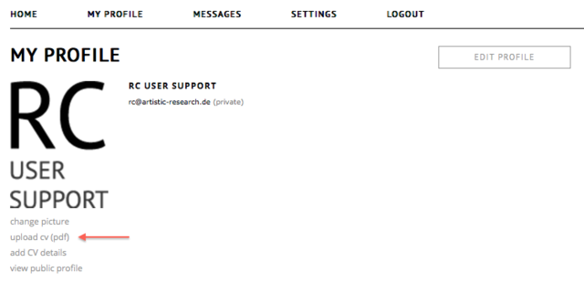
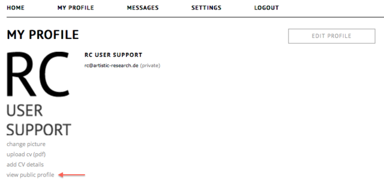

# Profile

the RC allows you to create a detailed public profile and gives you the opportunity to structure your objects in groups. Your profile where you create different types of objects and present yourself and your research content.

## upload CV (PDF)

Next to the presentations of your artistic works and objects in the RC, it is possible to upload your own CV as PDF. In it, you can e.g. present your academic background or your list of publications without adding everything to your profile page.

## view public profile
You can switch between your profile's editing mode (private) and your profile as the general public sees it. Click on '__my profile__' for the editing mode and - below your image - click '__view public profile__' to hide all controls, grouping options and private research.

## degrees
You can also add your __degrees__ to your profile. Enter the name, the level, the dates and the institution of your degree and link it via the __relations-tab__ to projects, expositions or works that you created in support for your degree.

## add CV details
Here you can add a short text biography/CV, that other RC users will see when they visit your profile.

## add grouping

__add grouping__ gives you the opportunity to create custom groups. You can combine objects of one theme you‘re working on or group objects of the same type - it's up to you. To add a new group press __add grouping__ and type the name of the group you want to add. You can sort your objects via drag and drop and place them into a different order or into different groups, even. Click and drag a grouping to change the order of the groups. On the right of a group, press __edit__ to edit the name of the group. Only custom groups can be deleted. If you have only one filled group, the group title will not be shown on your public profile. Empty groups will also not be shown, but be kept for future use.

 

## create exposition

create exposition is equivalent to the previous 'add research' command. On click, you will be able to create your own online page for your research.
It is also possible to import expositions from your archive. Note that only expositions exported from the RC can be imported.

## add work

A __work__ is completed, autarchic creation. You can add your work's metadata, also in the __enhanced meta__. Here you can indicate the place of your work, the country or the material, technique or the format. It can be either a single file, or a collection of files.

For collaborations, you can choose between co-authors, contributors and supervisors. For full supervision functionality (leaving notes etc...), it is prefered to embed the work in an exposition.
A new feature is the RELATIONS-TAB. Here you can choose to relate a work to other objects.

## add project 

A __project__ is a container within which works or expositions may be produced. It may or may not be funded. Using the RELATIONS-TAB, those works or expositions can be linked to the project.

In case your project belongs to a degree, you can add ECTS-points.

## visibility of groups

You can decide if you want to have a group in your public profile visible or not.

The visibilty is ON by default. To switch it off click on the little circle on the right side of the long underline of the groups name. If the circle is thin, the group will not be shown on your public profile.

## consult this exposition

The button __consult this exposition__ connects you to the entry page of your exposition. 
This is the same as the __preview__ version in the workspace.

object menu, also known as hamburger menu ☰

To access the menu, click on the ☰ symbol, located in the bottom right corner of an object (expositions or works). Some options are only available to the author of the object.

* __Change layout__ Change the size of an object on the profile.

* __Edit workspace__ Go to the workspace editor of this exposition.

* __Edit details__ Change the meta data of your exposition, and control collaboration with other users.

* __Share__ Change who can see and access this item.

* __Self-publish__ Turn an exposition into a fixed state.

* __Add to shortcut__ Add a compact link to this object on the top of your list. 

Please note that publishing is a one-way action, once published one can not  unpublish. If you want to keep the option of removing an exposition, do not use this option.

* __Submit__ for publication Submit an exposition to a portal for publication.

* __Add__ to shortcut Make a shortcut add the top of your profile.

* __Connect__ to portal Send a connection request to a portal.

* __Export__ Export an exposition for further distribution.

* __Delete__ Delete an exposition or work from the catalogue.

[back to top](#profile)

## change layout

This dialogue gives you the option of choosing the size of an object in your profile.

Depending on the size, the abstract and additional informations may be reduced or even hidden. Sizing objects differently allows to focus a reader's attention to important objects as well as improving the overall readability of your profile.

Four layout-templates are possible: 

1. tall and across both columns

2. tall but only one column wide

3. short and only one column wide, the smalles possible size

4. short and across both columns

 

 

 
