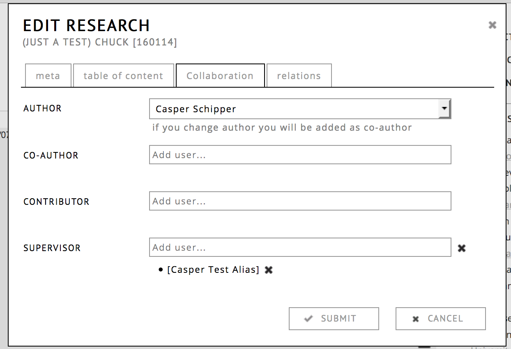

# Administration: Reviewing process

## Introduction

This is a tutorial to describe how an RC Portal can be used for publication workflows. It is aimed at portal administrators.
The process typically consists of 4 stages: 

* setting up accounts
* writing the content by the author(s), possibly in collaboration with other RC users.
* reviewing of the exposition by reviewers
* publication 

## Setting up accounts

The author can create an account for him/her self, by clicking REGISTER on the research catalogue homepage. The other option is that the portal admin creates the account from the __administration > user__ page and e-mails the login info to the user. Either way, be aware that the author needs to have a "full account", which means that they have the right to create content. The option for this can be found on the third tab (__roles__) of the [users edit page](#user-page "user edit page"). 

For this right, it is necessary that the author signs the SAR license agreement. The upgrading of accounts can either be done by RC user support or the portal admin. When a portal admin upgrades an account from limited to full, the responsiblity to make sure that the agreement is signed by this user lies with them. Please forward the signed agreement to RC user support.

## Writing the exposition, collaboration

The first stage is the writing of the *exposition* itself. It is important to note that it has to be an exposition, a work on its own cannot enter a review workflow on the RC. Works can however be part of the exposition to be published. The author does not need to be a member of the portal user list in order to make a publication request to it.

During the writing stage, it is common that the work in progress is shared with one or more other readers or collaborators, who can use the notes system to leave feedback. There are three types of collaboration roles:

- supervisor (no edit permissions, but can leave notes)
- co author (full edit permissions)
- contributor (full edit permissions, not mentioned in meta-data)

The author can invite RC users to these roles by going to edit details or clicking on the title of their exposition in the workspace editor and choosing "collaboration". They will receive an invitation (in messages) that has to be accepted before they can start to collaborate.

## Requisting publication

Once the writing is sufficiently progressed, the next step is that the author uses the ☰ menu from their profile page to __publish__ his/her work. This will open a dialog where he/she can choose to which portal the work should be published. A dialog will open requesting the author weither the exposition should be published "limited to portal" or "unlimited to portal". Limited to portal means that when the exposition is published, it is only visible to members of the portal.

Important: the choice by the author is only a suggestion, in the end, it will be the portal admin that  decides in which way (limited or unlimited) an exposition is published.

Once the author has done this step, no further changes can be made to the exposition by the author. It will be listed on their profile under the status "in review".

The portal admin will receive a message from the RC that a new work is ready for review. It will also be available under the “review” section in the administration part of the RC.

### Reviewing, assigning reviewers

The most common next step is to assign reviewers to this research. However, for a person to be available as reviewer, they first have to:

1. have an RC account 
2. added to the reviewer pool of the portal.

Reviewers do not require to have a full RC account, it is enough to be a limited RC user. 

Once the reviewers have an RC account, they than have to be added to the reviewer pool of the portal. This can be done by going to the __Portal__ page of the administration pages and then choosing edit. Under the ROLES tab, RC users can be added as reviewers for that particular portal. Please note that only users that are already present as an RC user can be added as reviewer, so it may be necessary to first create the account and then add them as reviewer.

Once a reviewer is part of the review pool, they can be added to the research exposition. To do this, go to __review__ tab of the __administration__ part of the RC, and click the edit page. Here you can add (or remove) reviewers to the research. Reviewers can be either added single blind (they cannot see each other), or double blind (they cannot see the author's name).

The reviewers will see a list of expositions that they are reviewers of on top of their "my profile" page. Within the exposition they can use the "REVIEW" menu to leave notes to themselves, which are only visible to them and the portal administrator. Typically further communication between the portal admin and the reviewer takes place through the messaging system or by e-mail.

## Final publication or rejection

Once the review process has been completed, the portal can choose to either publish or dismiss the exposition. If the exposition is dismissed, this means that the editing rights are returned to the author. The author can resubmit the same exposition later, at which point the review process starts again.

If the exposition is accepted, the exposition will be frozen permanently from further changes. Depending on the portal settings at this point also a DOI will be deposited through cross-ref. Please note that publishing is meant as a one way step, unpublishing is to be used only as a very last resort measure. If one does not expect to have a research be their till the end of time, it should not be published.

Immediately after publication the exposition will show up on the RC frontpage and visible to any visitor to the RC website (so also non-RC users). If this is not desired, one can also choose to publish an exposition "limited to the portal", this means only members of the portal can see the exposition.

