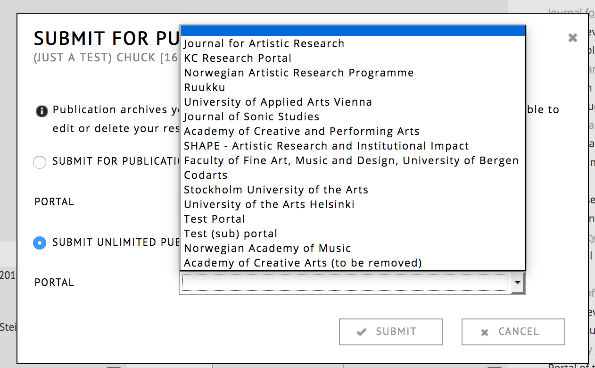
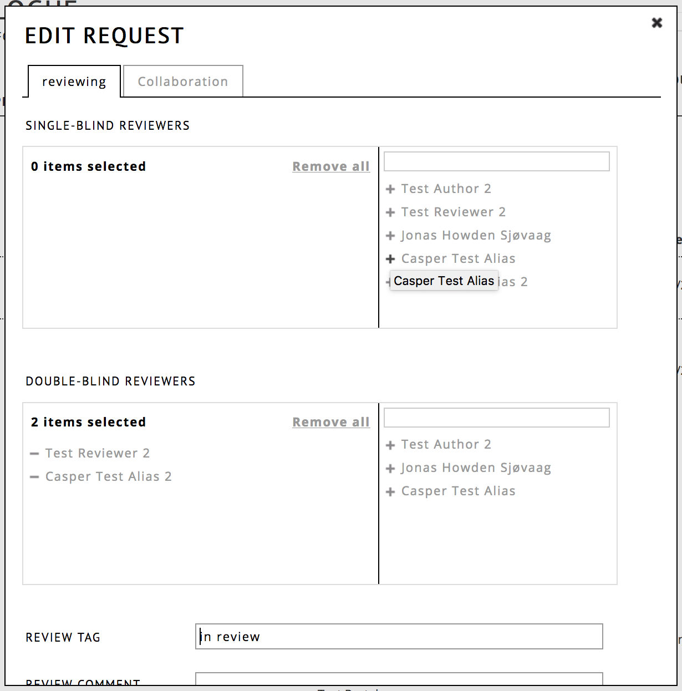

# Administration: Reviewing process

## Introduction

This is a tutorial to describe how an RC Portal can be used for publication workflows. It is aimed at portal administrators.
The process typically consists of 4 stages: 

* setting up accounts
* writing the content by the author(s), possibly in collaboration with other RC users.
* reviewing of the exposition by reviewers
* publication 

## Setting up accounts

There are two ways of setting up accounts: 

1. The author can create an account for him/her self, by clicking [REGISTER](https://www.researchcatalogue.net/portal/register "Registration on the Research Catalogue") on the research catalogue homepage. After filling in the form the author will immediatly get a basic account. To gain a full account, which has the right to create content, the author will be requisted to send a proof of identity and signed SAR agreement letter. 

2. The portal admin creates the account(s) for the author(s). This option is common when a large number of users need be created at once. In this case, the responsibility of identification and making sure that the SAR agreement letter is signed lies with the portal administrator creating the account(s). The agreement letter can be found on basecamp or requirested through RC support. Please send the signed agreement letters to RC user support.

The administrator can create accounts by going to the __[admin section](https://www.researchcatalogue.net/admin)__ and opening the __user__ page. Click __+__ at the right top corner of the screen. After creating the account, the username (which is an email address) and password can be sent through email. Be sure that in the roles tab, the "basic account" option is turned __off__. This means the user will have a full account and is able to create content.

For safety, admins creating user accounts should:

- Use a unique password for each new user.
- Make the password sufficiently random (current standard is at least 12 characters).

## Writing the exposition, collaboration

The next stage is the writing of the *exposition* itself. It is important to note that it has to be an *exposition*, a *work* object on its own cannot enter a review workflow on the RC. *Works* can however be embedded as part of an exposition to be reviewed & published. The author does not need to be a member of the portal user list in order to make a publication request to it.

During the writing stage, it is common that the exposition in progress is shared with one or more other readers or collaborators. These collaborators can use the notes system to leave feedback. There are three types of collaboration roles:

- supervisor (no edit permissions, but can leave notes)
- co author (full edit permissions)
- contributor (full edit permissions, but not mentioned in meta-data)

The author can invite RC users to these roles by going to edit details or clicking on the title of their exposition in the workspace editor and choosing "collaboration". The collaborators will receive an invitation (in RC messages) that has to be accepted before they can start to collaborate.

## Requesting publication

Once the writing is sufficiently progressed, the next step is that the author sents a request to publish the exposition. This is done through the ☰ menu, which is located on the "my profile" in the right bottom corner of the exposition summary. This will open a dialog where he/she can choose to which portal the exposition should be published. Within this dialog the author can also indicate weither the exposition should be published "limited to portal" or "unlimited to portal". Limited to portal means that when the exposition is published, it is only visible to members of the portal.

Important: the choice by the author is only a suggestion, in the end, it will be the portal admin that  decides in which way (limited or unlimited) an exposition is published.

Once the author has done this step, no further changes can be made to the exposition by the author. It will be listed on their profile under the status "in review". 

The portal admin will receive a message from the RC that a new work is ready for review. It will also be available under the “review” section in the __[admin section](https://www.researchcatalogue.net/admin)__.

If the author needs to make changes to an exposition, the publication request has to be declined by the portal administrator. He/she can also do this under __administration > review__ and clicking the __X__ next to the research title.

### Reviewing, assigning reviewers

The most common next step is to assign reviewers to this research. However, for a person to be available as reviewer, they first have to:

1. have an RC account 
2. added to the reviewer pool of the portal.

The reviewer role does not require a full RC account, it is enough to be a limited RC user. 

For the second requirement, the user has to be added to the reviewer pool of the portal. This can be done by going to the __Portal__ page of the __[admin section](https://www.researchcatalogue.net/admin)__ and then choosing edit. Under the ROLES tab, RC users can be added as reviewers for that particular portal. 

Once a reviewer is part of the review pool, they can be added to the research exposition. To do this, go to __review__ tab of the __administration__ part of the RC, and click the edit page. Here you can add (or remove) reviewers to the research. Reviewers can be either added single blind (they cannot see each other), or double blind (they cannot see the author's name).

The reviewers will see a list of expositions that they are reviewers of on top of their "my profile" page. Within the exposition they can use the "REVIEW" menu to leave notes to themselves, which are only visible to them and the portal administrator. Typically further communication between the portal admin and the reviewer takes place through the messaging system or by e-mail.

## Final publication or rejection

Once the review process has been completed, the portal can choose to either publish or dismiss the exposition. If the exposition is dismissed, this means that the editing rights are returned to the author. The author can resubmit the same exposition later, at which point the review process starts again.

If the exposition is accepted, the exposition will be frozen permanently from further changes. Depending on the portal settings at this point also a DOI will be deposited through cross-ref. Please note that publishing is meant as a one way step, unpublishing is to be used only as a very last resort measure. If one does not expect to have a research be their till the end of time, it should not be published.

Immediately after publication the exposition will show up on the RC frontpage and visible to any visitor to the RC website (so also non-RC users). If this is not desired, one can also choose to publish an exposition "limited to the portal", this means only members of the portal can see the exposition.

