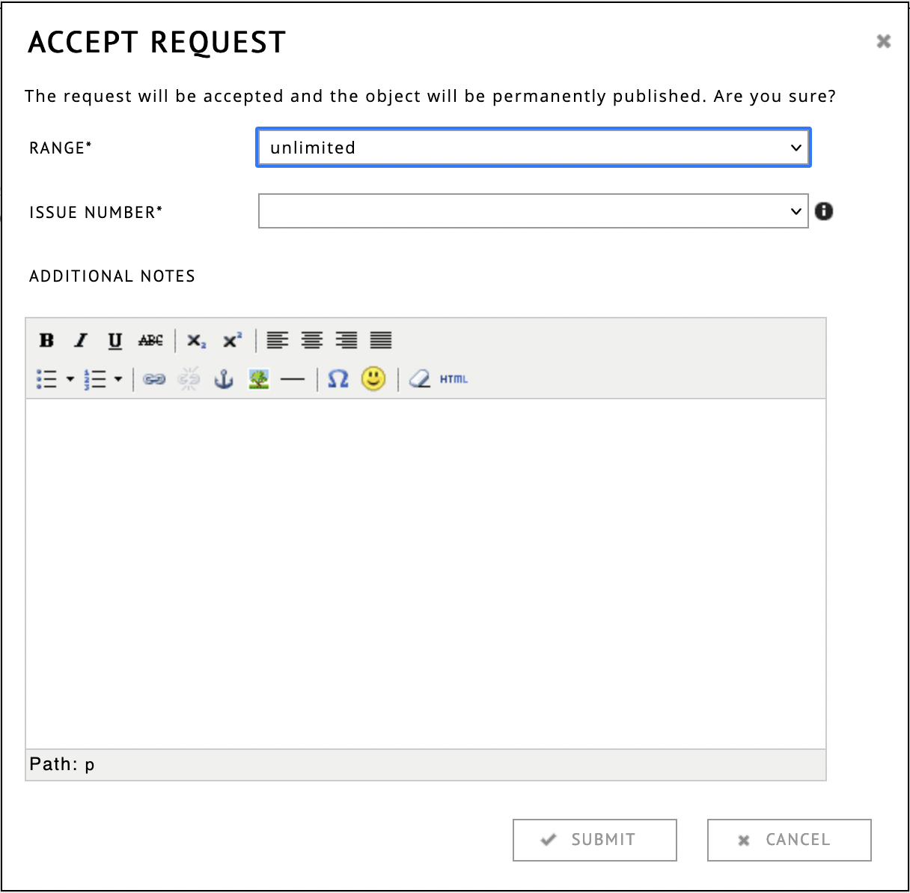

# Portal Admin Guide

This portal admin guide consists of two parts:

1. A tutorial for new portal admins
2. Reference manual of all adminstration pages in more detail

## Tutorial for new portal admins

### What is a Portal?

A portal allows institutions to have their own dedicated section within the Research Catalogue. A portal allows institutions to organize, display, and share their research outputs and projects. An important property of a portal is that it is autonomous, it is the portal institution that decides which research it wants to make visible in it, not SAR. Institutions may use the portal's reviewing functionality to conduct their own review procedure for publications. The policies for format, reviewing and publication are decided by the portal.

The contents of a portal is build from the expositions that are published in the portal or connected to it. The portal admin is the user that can control which expositions are part of the portal.

### Purpose of a Portal

* Showcase research externally: either by publishing as journal or provide a platform to highlight the research projects of an institution’s faculty, researchers, and students to the external visitors.

* Increase internal visibility: by making research outputs accessible within the portal, the portal helps increase the visibility of the institution's research efforts to its members.

* Preserve Research: the portal serves as a digital archive that preserves the institution’s research outputs for future reference and use.

For more information on portal partnership and its benefits:
<https://societyforartisticresearch.org/rc/portal-partnership/>.

### Portal pages

The portals can be accessed through the front page of the RC, in three categories:

* [Institutional portals](https://www.researchcatalogue.net/portal/institutions)
* [Journals](https://www.researchcatalogue.net/portal/journals)
* [Projects](https://www.researchcatalogue.net/portal/projects)

 These categories only differentiate the function of the portal, in terms of
 user interface they all work in the same manner. By default, the portal pages
 (or portal feeds) will display the institutional information, recent
 publication and research groups of the portal. However, once a portal has
 grown, more customized structures are also possible, using the feeds option,
 for example. To keep things simple however, we will start with the basics.

### Functionalities of a portal

A portal in the research catalogue provides the following functionalities:

* Portal admins can create and manage users. 

* Research may be submitted, reviewed and published in the portal. Within educational environments, examination work may be submitted, assessed and archived using similar mechanisms.

* Work-in-progress can be shared with other portal members or presented to external visitors by "connecting to" a group or to the portal as a whole.

* Researchers and expositions can be organized into research groups.

### Internal versus external portal

Content of a portal may be visible internally (only visible to members), externally (visible to all) or archived (hidden, only visible to admins). If desired, SAR allows institutions to create separate portals for either of these to keep them more separate. 

### Portal workflow tutorial

The basic workflow of a portal consists of the following:

* setup: creating accounts for users
* writing: creation of exposition(s) by the author(s)
* submitting: the author submits the exposition to the portal
* review: the admin assigns reviewers and they will review the exposition
* publication: expositions becomes visible within or outside of the portal

__admin account password__

As an admin account has special abilities, it is very important that you use a strong password for your
portal admin account, as admininstration rights should not come in the wrong hands. You can change your password under __settings__. It is recommended to use a password manager (most browsers have this built-in) or a secure method like EFF's [dice based generator](https://www.eff.org/dice).

### Creating new users within the portal

<!-- Insert screenshot of user page -->

Users are created and managed in the "Users" tab of the portal adminstration:  
<https://www.researchcatalogue.net/admin/user/list>

To create a user, click __create user__ at the right top corner of the screen. 

This will open a dialog where you can enter the name, email and password for the new user.

If you type the name of a user that already exists under that name in the RC, it will show up below the field, if you click the name and then continue to the next field, the RC will show a pop-up prompting if you want to add this user to your portal. Double accounts should be avoided.  

It is recommended to use a throwaway (random) password and ask the new user to set a proper password themselves by using the [reset link](https://www.researchcatalogue.net/portal/forgotten-password). 

If your institution already uses a single sign on system (MS Teams, Feide), it is also possible to provide a single sign on connection to the RC, please consult SAR for this option.

When a portal admin creates a user, it is important that the admin is sure that the name and email belongs to a real person (for example by linking it with an institutional email account). In case of copyright or other legal problems surrounding an account created by a portal, the portal admin should be able to provide contact information to this person. 

#### Adding Existing Users to your Portal

It is also possible for existing RC users to request membership to a portal on their own account, by clicking "edit portals" on their profile page:

The portal admin can accept (or reject, in case the request was made in error) such request through messages.

#### Roles 

A new account can be made as a __basic account__ or a __full account__. A basic account cannot create or publish conten. Basic accounts may be useful in case of creating external reviewers or supervisors.

To give an account the ability to create expositions, you have to __disable__ the "basic account" option like so:

1. click "edit" next to the user
2. open the "roles" tab
3. deselect basic user:

### Writing the Exposition, Collaboration

The next stage is the writing of the *exposition* itself, by the author.

During the writing stage, it is common that the exposition in progress is shared with one or more other readers or collaborators. These collaborators can use the review notes system to leave feedback. There are three types of collaboration roles:

- supervisor (no edit permissions, but can leave notes)
- co author (full edit permissions)
- contributor (full edit permissions, but not mentioned in meta-data)

See <https://guide.researchcatalogue.net/#collaborating-on-research> for more.

It is also possible that an author makes the in-progress exposition content visible to specific groups of users, before publication. This is done by using the [share option](#share "share options in the RC"). Since sharing in this manner is not an official publication, shared expositions can be unshared (made private again), and will appear on the author's profile and __not__ in the portal feed.

### Publication or "connecting to" a portal to make expositions visible

There are two methods of making an exposition part of a portal. The most commonly used is __publication__, which follows a controlled, peer reviewed journal-like methodology. The exposition contents are locked during periods of review and reviewers have an overview page in the RC of expositions they need to review. The goal of such a workflow is a static online publication with a DOI in the portal that cannot be edited again.

The RC also allows for a more informal connection to the portal, this is known as __"connecting to"__ a portal, where the exposition is connected to the portal, becomes visible in its feed, but its contents remains editable. No review workflow is provided, and the author can still change content of such an exposition (or even remove it altogether) after the connection has been made. The "connecting to" workflow is described [here](#connecting-to-tutorial).

Below is a diagram of review, "connecting to" and sharing of expositions:

### Reviewing and publication

<!-- Show reviewing page -->

We will now describe the review and publication workflow of a portal.

The first step is that the author submits the exposition for review by a portal.
This is done through the ☰ menu, which is located on the ["my profile"](www.researchcatalogue.net/profile "profile page") in the
right bottom corner of the exposition summary. This will open a dialog where a
portal can be chosen.

Once the author has submitted the exposition, no further changes can be made to the exposition by the author. It will be listed on their profile under the status "in review". The share status and thus visibility will remain unchanged. 

The portal admin will receive a message from the RC that a new exposition is ready for review. It will also be available under the “reviewing” section in the __[admin section](https://www.researchcatalogue.net/admin/reviewing/list)__, where the whole reviewing procedure will be managed by the portal admin.

The RC automatically creates a snapshot of the exposition when the author submits the exposition for review. This allows to trace between different versions of the exposition later.

If the review request was sent by accident or to the wrong portal, the publication request can be declined by the portal
administrator. The admin can also do this under __administration > reviewing__ and clicking the __X__ next to the research title. This
will also open the exposition for editing again.

#### Reviewing, Assigning Reviewers

The next step is to assign reviewers to the exposition. 
For a person to be available as reviewer, they have to:

1. have an RC account 
2. added to the reviewer pool of the portal.

You can do so both in one go, by using "create reviewer" button on the portal ["users" list](https://www.researchcatalogue.net/admin/user/list). This will also work for users that have already an account in the RC. The reviewer role does not require a full RC account, a basic account suffices.

For the second requirement, the user has to be added to the reviewer pool of the portal. This can be done by going to the __Portal__ page of the __[admin section](https://www.researchcatalogue.net/admin)__ and then choosing edit. Under the ROLES tab, RC users can be added as reviewers for that particular portal. 

Once a reviewer is part of the review pool, they can be added to the research exposition. To do this, go to __review__ tab of the __administration__ part of the RC, and click the edit page. Here you can add (or remove) reviewers to the research. Reviewers can be either added single blind (they cannot see each other), or double blind (they cannot see the author's name).

The reviewers will see a list of expositions that they are reviewers of on top of their "my profile" page or [https://www.researchcatalogue.net/review](https://www.researchcatalogue.net/review). 

Within the exposition they can use the "REVIEW" menu to leave notes to themselves, which are only visible to them and the portal administrator. Typically further communication between the portal admin and the reviewer takes place through the messaging system or by e-mail.

### Optional revision of exposition content 

As stated before, the exposition content is locked for the author(s) during the review process, only the portal admin can edit.  

If the author needs to revise the content, it is possible to temporarily open
an exposition for editing by clicking the "in revision" button . This will open a dialog where you can put
the exposition "in revision". During revision, the exposition will remain listed
in the reviewing page. Once the author is done, they can either resubmit
themselves from their profile page, or the administrator can use the button in
the "reviewing" page to change the status back to "in review", and the exposition content is locked again.

### Final Publication or Rejection

<!-- Show accept reject buttons and dialog of accepting -->

Once the review process has been completed, the portal can choose to
either publish or dismiss the exposition. If the exposition is
dismissed, this means that the editing rights are returned to the
author. The author can resubmit the same exposition later, at which
point the review process starts again. Instead of rejecting, one can
also put the exposition ["in revision"](#in-revision "in revision
documentation"), which means the author can make changes, while the
exposition is still listed on the "reviewing" tab of administration.

If the exposition is accepted, the exposition will be frozen
permanently from further changes. You will need to select a range and
an issue for the exposition to be published in.

The range controls to who the exposition will be visible:

| **range**         | **who can see it?**              |
|-------------------|----------------------------------|
| Limited to portal | Members of the portal can see it |
| Unlimited         | All visitors                     |
| Archived          | Portal admins                    |

*Tip: When your portal publishes its very first exposition, you will
first want to create a new issue in the
[issue](https://www.researchcatalogue.net/admin/issue/list "link to
admin issue page") page, since all expositions need to be part of an
issue. The issue's range should match that of the exposition. The
default range of an issue is unlimited.*

Issues can be used both as a grouping "master research" "research project" etc.
or for periodicals like journal issues. This is up to the portal to decide. 

Depending on the portal settings at this point also a DOI will be
deposited through Crossref. 

### Unpublishing

The list of expositions of a portal can be found under [expositions](
https://www.researchcatalogue.net/admin/research/list).
Please note that publishing is meant as a
one-way step, unpublishing is to be used only as a very last resort.

If one already expects the exposition will be removed in
the future, it should not be published. In that case one could better
return the exposition to the author(s) and have them share it using
the standard sharing options of the RC.

Immediately after publication the exposition will show up on the RC
frontpage (in the case its range is Unlimited). It is recommended
that keywords are added to publications, so they can more easily be
retrieved. Keywords can also be added after publication, on the
research list.

### Connecting an exposition to the portal

<!-- screenshot of connecting to portal -->

The key aspect of a typical exposition publication in an RC portal is that it results in a permanent online object.

However, sometimes, it is useful to make an exposition visible on the portal page while it is still being written.
For example, in the case of an ongoing research project, where results are being added in a continuous fashion.

In this case, the author can request an exposition to be "connected to".
The portal admin will be able to accept such a request by accepting it here:  
<https://www.researchcatalogue.net/admin/part-of-requests/list>
"Connecting to" a portal is only possible if the exposition has a minimum of visiblity. This means the exposition has to be __shared__ within the portal, or fully public.

### Portal feed

A portal feed that provides basic information about the institutions, recently edited content, publications and research groups within the RC portal.

<!-- ### Managing portal 

There is an exposition page within portals that allows portal admins to manager their previous publications, update metadata etc.. -->