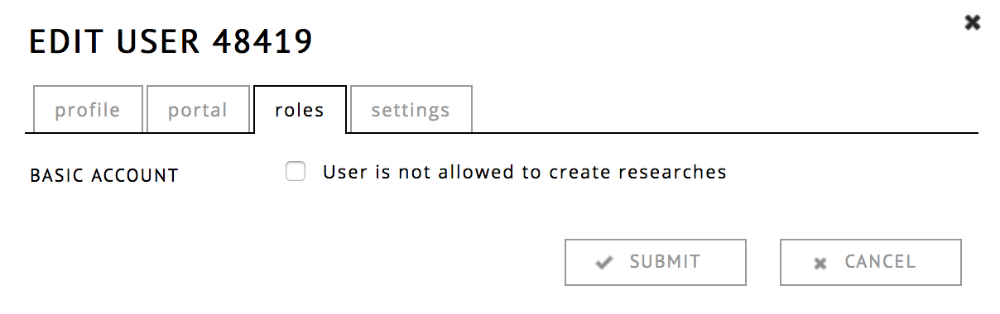
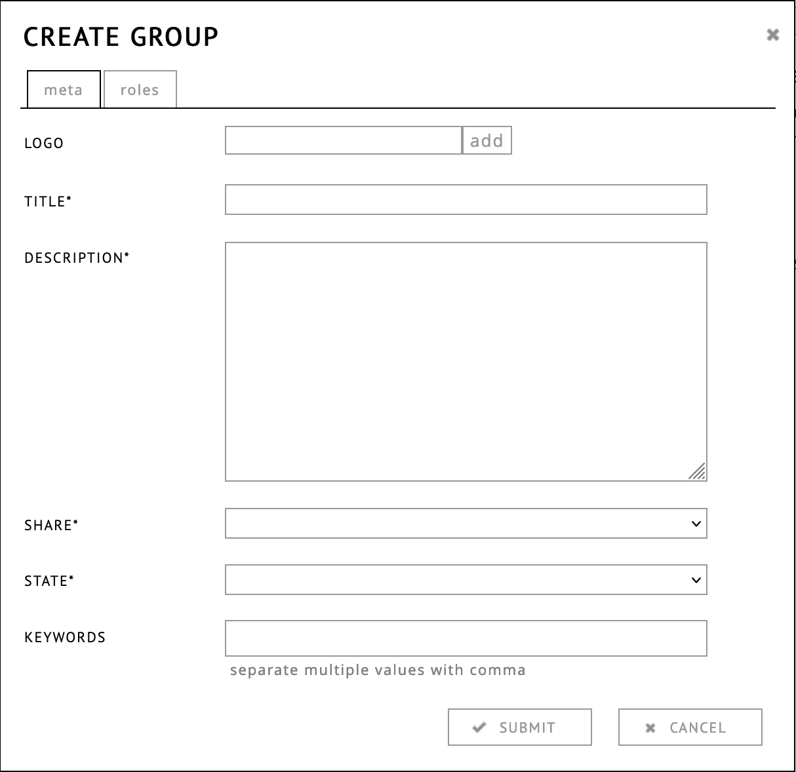

<!-- pandoc -s -f markdown_github -i admin.md -o admin.html -c style.css -->

# Administration reference guide

## Administration Main Page

To reach the administration functionalities of the RC website, click on __administration__, located in the top right corner. To return to your own profile, you can click on the Research Catalogue logo. Only portal admins have access to these pages.

There are 5 pages to manage content for portal admins:

* [__User__](#user-page "jump to user page documentation")   
  Adding, removing and editing user information to this portal

* [__Portal__](#portal-page "jump to portal page")  
  Portal settings, reviewers, sending portal mails

* [__Research__](#research-page "jump to research")  
  Management of connected expositions

* [__Connection Requests__](#connection-requests "connection requests")  
  Management of connection requests

* [__Reviewing__](#reviewing-admin "reviewing")  
  Review process of expositions and objects that are waiting to be published

* [__Groups__](#admin_groups "groups") 

#### Multiple Portals:
If you are an admin in multiple portals, you can switch between them in the top right corner of the site, through the drop down menu.

## User Page

 

| Action         | Icon                                                |
| -------------- | --------------------------------------------------- |
| Add a user     |     		   |
| Edit a user    |             |
| Remove a user  |           |
| Login as a user|          |

### Add / Edit A User Dialog

Important: when you type a new user name, the RC tries to find if the user exists already. If it does, the RC will show a dialog requesting if you want to add the existing user to the portal instead of creating a new account. It is highly discouraged for a single person to have two accounts on the RC, so normally admins are expected to simply add this existing account.

### Profile

Change the name, alias, email and password (optional).
An administrator can also change these fields without having to change the password (by leaving the field empty).

### Portal

This controls to which portals a user is added. A user can be added to multiple portals at once. Portals which are selected are marked by a gray background.

### Roles

When the option is turned on, the user cannot create any content. This is the default when a user has registered an account by themselves. Limited users can still become supervisors, read expositions or added as reviewers. To allow users to create expositions, works and applications, you have to turn this option OFF. 

### Settings

Here you can set which emails the user should receive.

### Log in as a user
The admins can log in as another user, for example to help resolve issues with a specific account. While logged in as another user, you will see a red bar on the top of your window that shows who you are and enables you to switch back to your own account. This feature is useful while helping somebody with issues specific to their account.

Keep in mind: you become this user in all the tabs of your browser window, so you would temporarly loose some of you admin permissions while navigating as this user.

## Portal page

The portal tab shows you which users are administrators on the portal.
It has 3 actions:

| Action              | Icon                                                |
| --------------------| --------------------------------------------------- |
| Portal mail         |            |
| Edit portal settings|             |
| Delete a portal     |           |

### Portal mail

* __testmode__ only sends a test mail to your account
* __type__ (default/digest/announcement) announcement can be scheduled
* __target__ who is going to receive the mail
* __content__ enter the text here

For advanced layout, you can use the HTML button. Images need to be small and embedded as URI 

Note that for RC wide mailings, one should <u>__always__</u> use the __JAR Template__ and type = __Announcement__ setting. This makes the mailing include an unsubscribe link, that is required by EU law. All other combinations of settings will currently not include this link !

The JAR Template includes several standard fields (title, contact and a banner image), be sure to check that you are not adding duplicates in the email body text itself. One should always test before requesting it to be sent out.

The announcement option has to be scheduled at least 1 day in advance. The sending of the email will have to be approved by SAR. 

## Portal Edit Screen

### Common

Here you can edit the basic information of the portal, which is displayed on the RC's internal page.
You can also replace this internal page with an external page if desired. See [external link option](#external-portal-page "further info")  

__View text__ allows you to change the template that is used in the navigation bar of expositions: this is the quotation information the reader sees when they move their mouse to the top of the screen.
available placeholders: 

- __$author__ *the main authors*
- __$title__ *title*
- __$portal__ *the portal*
- __$edition__ *issue*
- __$published__ *publish year*
- __$url__ *the current position url: if the url is opened it will restore the current scroll position*
- __$now__ *date that the reader is accessing this*

### Roles

Here you can edit the various roles of the portal:

* Admins
* Reviewers (see [reviewing](#reviewing "jump to reviewing"))
* Contact persons (use this field to add persons that have an rc account)
* Contact persons (use this for people without an rc account)

### Templates

Portal admins can select any of their Text based expositions to be available as templates for users within their portal. This allows users to start with a predifined CSS sheet or even content. 

<a id="submissions">

### Portal Settings

Here you can set which objects can be submitted to the portal.

#### allow

* __listing in 'portals' section.__  
* __listing in 'projects' section.__
* __listing in 'journals' section.__ 
	 These options will make the portal/journal/project visible on the RC frontpage.
	 <strong>
Important: this option can only be set by superadmins, please contact<a href="mailto:info@societyforartisticresearch.org"> SAR </a> if you want your portal to become visible!
</strong>
* __linking to external portal page instead of rc profile page.__ <a id="external-portal-page">
	If selected, the portal link on the RC frontpage, will directly link to the website of the portal (the one provided in the URL* field), instead of the internal RC page.
* __listing in 'member of' dialog.__    
    Weither users can request membership of a portal themselves. If a user request membership, the portal admin will still receive a confirmation request.
* __creation of application programs.__  
    This enables the application module, it should only be selected after an agreement with SAR has been made about using the Application Module.

### allow connection of

* __Researches can be connected to this portal.__      
	This allows Expositions to be connected to a portal.
* __Projects can be connected to this portal.__     
	Projects no longer exist, most portals can ignore the setting.
* __Degrees can be connected to this portal.__     
	Degrees no longer exist, portals can ignore the setting.
* __Works can be connected to this portal.__   
	If set, users can request works for be connected to a portal.

### allow publishing

* __Researches can be submitted to this portal.__    
	Allows users to request publication of their exposition within your portal.
* __Accept submission of expositions with embedded external content.__    
	Allows users to submit expositions with embedded external content.
* __Allow limited research publication to this portal.__    
	Allows users to request limited publication to a portal.
* __Accept submission of html based expositions__.  Allows users to
	submit using the HTML based editor. Since the HTML-based expositions cannot be
	directly edited in the RC, editing content will have to
	happen outside of the RC. The default is to have this option turned off.
* __Degrees can be submitted to this portal.__  
	Degrees no longer exist, only for legacy reasons.
* __Applications can be submitted to this portal.__    
	This setting is only used in combination with the application module, 
	should be discussed with SAR.

## Research page
Here you can manage all research connected to the portal. Expositions are sorted per issue. Those without a publishing date, have not been published yet. There are a number of actions available:

| Action    | Icon                                                         |
| --------- | ------------------------------------------------------------ |
| Edit      |        |
| Unpublish |   |
| Comment   |     |
| Block     |       |

### Unpublishing an exposition
The unpublishing of expositions is not encuraged. Published expositions are supposed to be a permament reference, never to be deleted or changed. If an exposition is to be continuously changed or temporary, it is better to not publish, but simply set its sharing settings to __public__.  When unpublishing an exposition make sure with the author of the exposition that there are no connected works that have been deleted since, otherwise it may be impossible to reconstruct the publication. 

## Connection Requests
It is possible for users to connect a work or exposition to a portal. The works that have been accepted by an admin of the portal will be listed here.

A connected exposition will appear on the Portal's landing page, and the metadata of the exposition will now mention that is connected to the portal. They will also appear when searching for expositions within the portal.

Requests can be accepted with: __V__ or rejected with: __X__.

Once research is connected, the portal admin can add an __Editor__ role to the expositions.
The editor is than able to change the content within the exposition.

They can also add __Supervisor__ role, which can only read the exposition.

## Reviewing (admin) 
The reviewing page allows managment of expositions that have been applied for publication by the author. Reviewers or editors can be assigned to these works. When a reviewer is added they will automatically recieve a notification from RC that they have been added. Reviewers can leave notes only visible to themselves (so not to other reviewers) and the portal admin(s). 

Actions that are available:

| Action        | Icon                                                         | Description                                                            |
| ---------     | ------------------------------------------------------------ | -------------------------                                              |
| edit          |               | Add reviewers and/or editors                                           |
| accept        |             | [__Accept__](#publication-dialog "publication dialog") publication request |
| reject        |             | Reject publication request                                             |
| change status |           | Put exposition [__in revision__](#in-revision "in revision")           |
| export        |             | Export the exposition as zip                                           |
	

### In revision

It is possible to put an exposition "in revision", this means the author can change the content again, but the exposition remains in the list on the reviewing page (so the admin can keep track of the progress).

You will be able to include a message to author, so they are informed that they can edit the exposition again.

During revision, reviewers will not be able to access the exposition. They will regain access when the status is changed back to "in review". This to ensure that no reviewer is reading an exposition that is currently being edited. Reviewers' comments ("yellow sticky notes") will be invisible to the author; notes from the portal admin and editors will be visible to the author.

Either the author can resubmit the exposition using the hamburger menu, or the portal admin can change the status using the change status action button:  

### Publication dialog

When a publication request is accepted, the portal admin can choose to which issue it belongs and if the publication should be local to the portal (limited publication) or public (the whole world). Issues can be created using the [issue page](#issue-page "the issue page documentation").
You can also write a custom message to the author.

## Issue page

The [Issue page](https://www.researchcatalogue.net/admin/issue/list "issue page on the RC") is an overview page within the RC that shows all published expositions that are part of an issue.

An Issue page consists of the title and description of the issue itself and a gridded preview of all the expositions (title, author, abstract and a thumbnail). This page is responsive so is easy to read on a phone as well.

Issues names are managed on this [here](https://www.researchcatalogue.net/admin/issue/list "issue list page"). 

In the __issue section__ (between "portal" and "research") of the administration interface, the number, title and description of issues can be edited.

For the reader, issues can be found through the portals front page.

<a id="admin-groups">

## Groups 

On the group [overview
page](https://www.researchcatalogue.net/admin/project/list) portal admins can
create, edit and remove groups. A group can only be deleted if it no longer has
users or expositions connected to it. 

# Using JSON feeds

The search functionality of the RC allows you to export metadata of the portal in JSON format. You can construct a normal query by going to advanced search from the front page, and select JSON as the output. The results are always pages with a maximum of 250 results per page.

Here is an example query, to show the 25 most recent publications in the RC:
<https://www.researchcatalogue.net/portal/search-result?fulltext=&title=&autocomplete=&keyword=&portal=&statusprogress=0&statuspublished=0&statuspublished=1&includelimited=0&includeprivate=0&type_research=research&resulttype=research&modifiedafter=&modifiedbefore=&format=json&limit=25&page=0>

The JSON has the following format:
__id__ : this is the RC ID, which can also be used to construct links, since it will never change.

__type__ : exposition / work / 

__title__ : the full title of the exposition

__thumb__ : (optional) a thumbnail image of the exposition, as provided by the author

__default-page__ : the first page of the exposition

__keywords__ : open keywords added by the author or admin, note that this is not a protected vocabulary.

__created__ : date of creation of the exposition DD/MM/YYYY

__status__ : 
	- in progress : still being edited, can also be deleted
	- published : a permanent exposition, will not be edited or removed

__doi__ :
	if published, most expsoitions will have a DOI.

__published in__:
	This shows in which portal(s) the exposition is published in 

__license__: 
	
* all-rights-reserved
* CC-BY 
* CC-BY-ND 
* CC-BY-SA
* CC-NC-BY-SA 
* CC-NC-BY-ND 
* Public Domain 

see details in [licences](#licenses)

__issue__:
	Portals in the RC always publish their expositions as part of Issues. For journals these can mean __issue__ as in journal issue, however, other portals also use it to distinguish between different variaties of research (student, staff, 3rd cycle etc..)

__author__:
	Internal RC ID (can be used to construct author profile link: `https://www.researchcatalogue.net/profile/?person=[id]` )
	This user will also be the owner (the user that can publish, delete and rename the exposition and controls who is ).

__coauthor__:
	The other authors of the exposition.

