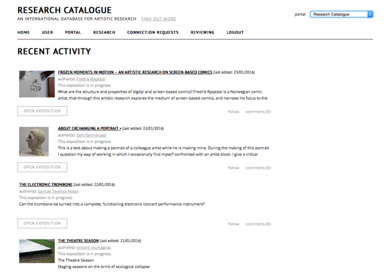
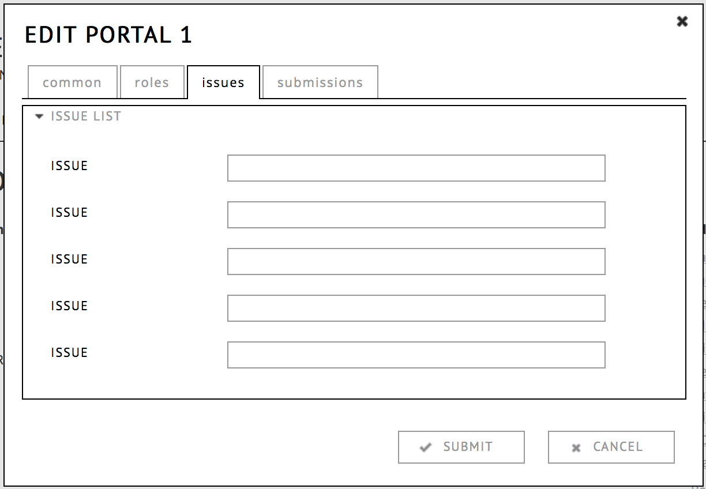
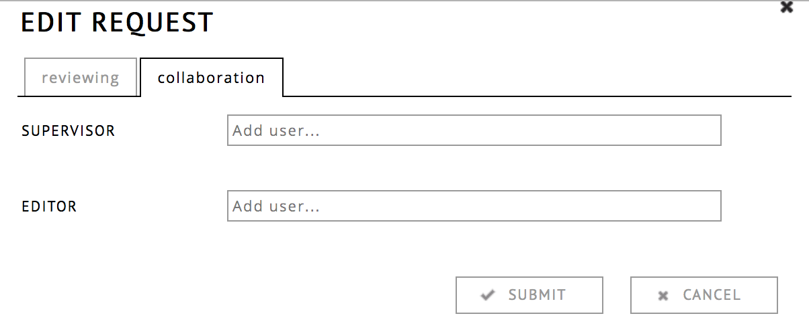

<!-- pandoc -s -f markdown_github -i admin.md -o admin.html -c style.css -->

# Administration Guide

## Administration Main Page

To reach the administration functionalities of the RC website, click on __administration__, located in the top right corner. To return to your own profile, you can click on the Research Catalogue logo. Only portal admins have access to these pages.

There are 5 pages to manage content for portal admins:
* [__User__](#user-page "jump to user page documentation")   
  Adding, removing and editing user information to this portal

* [__Portal__](#portal-page "jump to portal page")
  Portal settings, reviewers, sending portal mails

* [__Research__](#research-page "jump to research")  
  Management of connected expositions

* [__Connection Requests__](#connection-requests "connection requests")
  Management of connection requests

* [__Reviewing__](#reviewing "reviewing")
  Review process of expositions and objects that are waiting to be published

#### Multiple Portals:
If you are an admin in multiple portals, you can switch between them in the top right corner of the site, through the drop down menu.

## User Page

 

| Action         | Icon                                                |
| -------------- | --------------------------------------------------- |
| Add a user     |     		   |
| Edit a user    |             |
| Remove a user  |           |
| Login as a user|          |

### Add / Edit A User Dialog

### Profile

Change the name, alias, email and password (optional).
An administrator can also change these fields without having to change the password (by leaving the field empty).

### Portal

This controls to which portals a user is added. A user can be added to multiple portals at once. Portals which are selected are marked by a gray background.

### Roles

When the option is turned on, the user cannot create any content. The can still become supervisors or read expositions.

### Settings

Here you can set which emails the user should receive.

### Log in as a user
The admins can log in as another user, for example to help resolve issues with a specific account. While logged in as another user, you will see a red bar on the top of your window that shows who you are and enables you to switch back to your own account. This feature is useful while helping somebody with issues specific to their account.

Keep in mind: you become this user in all the tabs of your browser window, so you would temporarly loose some of you admin permissions while navigating as this user.

## Portal page

The portal tab shows you which users are administrators on the portal.
It has 3 actions:

| Action              | Icon                                                |
| --------------------| --------------------------------------------------- |
| Portal mail         |            |
| Edit portal settings|             |
| Delete a portal     |           |

### Portal mail

* __testmode__ only sends a test mail to your account
* __type__ (default/digest/anouncement) currently not used
* __target__ who is going to receive the mail
* __content__ enter the text here

For advanced layout, you can use the HTML button. Please note that it is not recommended to use URI encoded images in email, since some email clients do not like this. Better practice is to have the images hosted somewhere externally and link form there using a <xmp>  </xmp> tag.

## Portal Edit Screen

### Common

Here you can edit the basic information of the portal.
View text allows you to change the template that is used to display expositions on the portal page:
available placeholders: $author, $title, $portal, $edition, $published, $url, $now.

### Roles

Here you can edit the various roles of the portal:

* Admins
* Reviewers (see [reviewing](#reviewing "jump to reviewing"))
* Contact persons (use this field to add persons that have an rc account)
* Contact persons (use this for people without an rc account)

### Issues

Here you can set the title of the issues (as in journal issues), one can use these in Reviewing.

### Submissions

Here you can set which objects can be submitted to the portal.

## Research page
Here you can manage all research connected to the portal. Expositions are sorted per issue. Those without a publishing date, have not been published yet. There are a number of actions available:

| Action    | Icon                                                         |
| --------- | ------------------------------------------------------------ |
| Edit      |        |
| Unpublish |   |
| Comment   |     |
| Block     |       |

### Unpublishing an exposition
The unpublishing of expositions is not encuraged. Published expositions are supposed to be a permament reference, never to be deleted or changed. If an exposition is to be continuously changed or temporary, it is better to not publish, but simply set its sharing settings to __public__.  When unpublishing an exposition make sure with the author of the exposition that there are no connected works that have been deleted since, otherwise it may be impossible to reconstruct the publication. 

## Connection Requests
It is possible for users to connect a work or exposition to a portal. The works that have been accepted by an admin of the portal will be listed here.
Requests can simply be accepted __V__ or rejected __X__.

## Reviewing
The reviewing page allows managment of expositions that have been applied for publication by the author. Reviewers can be assigned to these works. There are two styles of reviewing: single blind or double blind. Single blind means that the author cannot see the reviewers. Double blind means that the reviewers cannot see each other. 

Please note that within the KonCon portal, supervisor notes can be seen by reviewers.

Review tag and comment can be used by the admin to organize the current in review documents.

It is also possible to change supervisors in the collaboration tab. Please note that only the admin can change collaborators, the author cannot change anything during review.

;

Once the reviewing process is complete, there are three scopes in which the research can be published:

| Publish               | Visibility                             |
| --------------------- | -------------------------------------- | 
| Restricted to portal  | Only visible to members of the portal  |
| Limited               | Only visible to members of the RC      |
| Unlimited             | Visible to everyone                    |

If you reject a request for publication, it is possible to edit the standard message that is sent to the author of the exposition.

