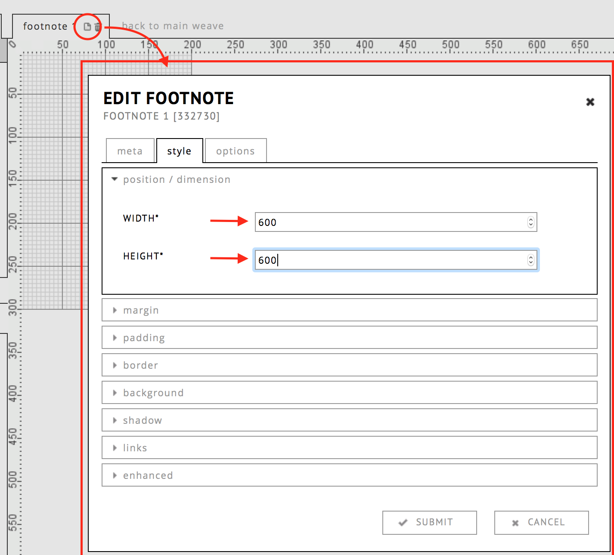
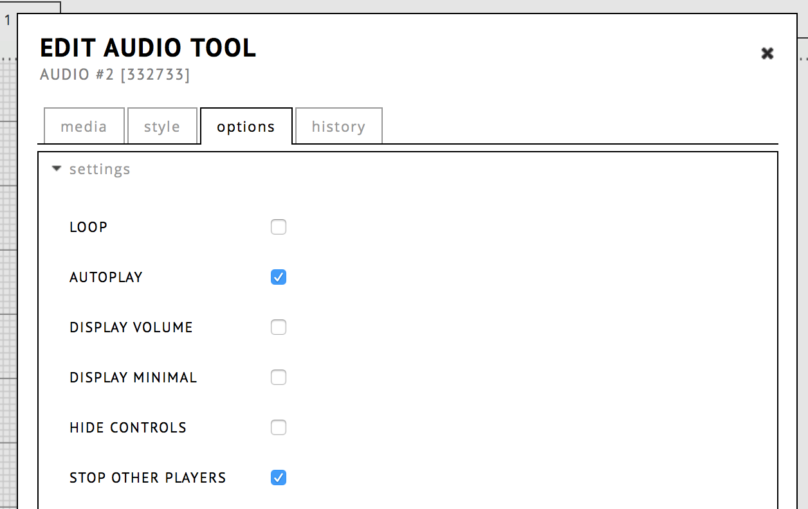

<!-- 
	pandoc -s Tutorial-popup-with-score-and-audio.md -o footnote.html  -c style.css 
-->

# Footnote with score and audio

## Step 1: Creating the footnote

a) Open a text or HTML tool and select a piece of text (can also be a number). 

b) Click the chain icon to open the hyperlink/footnote tool.

## Step 2: Changing the size of the footnote

a) If you have a big footnote, it is best to always display it in the center. 

	TIP: do not set Picture Tools to "open as popup on click" inside of a footnote, since the footnote itself is a pop up.

## Step 3: Fill the footnote with content

a) Go to the Footnotes tab on the left side of the editor.

b) Click the small page icon to change the size of the Footnote.  
A good size is 600x600, since it will fit a 13" screen (common).

c) Add a picture tool with the score page (drag it from the Tools bar).  
If your score source is a pdf, it is probably easier to make a screenshot.  
It is also possible to display a pdf inside of the footnote, see the footnote tool.  
Make sure the tools are not going over the edge of the footnote's borders, this would result in scrollbars.

d) Add an audio player below the picture tool. It can be nice to set the audio tool to immediately start playing (autoplay). 

	To avoid audio mixing up, turn on the "stop other players option" as well.

 

